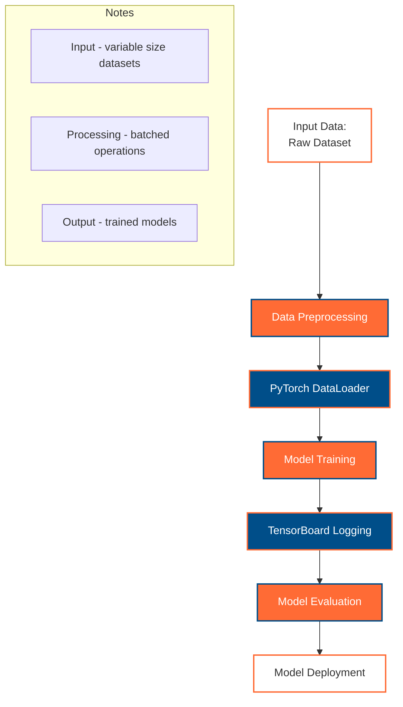

# PyTorch Learning Journey - GitHub Copilot Instructions

**Always reference these instructions first and fallback to search or bash commands only when you encounter unexpected information that does not match the info here.**

This repository is a comprehensive PyTorch learning resource containing documentation, example notebooks, and code implementations. It's designed as an educational repository for learning PyTorch concepts from fundamentals to advanced deep learning topics.

**Technology Focus**: This repository prioritizes PyTorch for deep learning, with extensive use of Hugging Face transformers for modern NLP and computer vision tasks.

## Working Effectively

### Bootstrap the Environment
Execute these commands in order to set up a fully functional development environment:

1. **Verify Python version** (should be Python 3.8+):
   ```bash
   python --version
   ```

2. **Install PyTorch and core dependencies** - NEVER CANCEL: Takes 3-5 minutes. Set timeout to 400+ seconds:
   ```bash
   pip install torch torchvision torchaudio --index-url https://download.pytorch.org/whl/cpu
   ```

3. **Install Hugging Face transformers and datasets** - NEVER CANCEL: Takes 2-3 minutes. Set timeout to 300+ seconds:
   ```bash
   pip install transformers datasets tokenizers
   ```

4. **Install additional ML and visualization libraries** - NEVER CANCEL: Takes 2-3 minutes. Set timeout to 300+ seconds:
   ```bash
   pip install numpy pandas matplotlib seaborn scikit-learn jupyter notebook tensorboard
   ```

5. **Verify PyTorch installation** (should complete in under 10 seconds):
   ```bash
   python -c "
   import torch
   import torchvision
   import transformers
   print(f'PyTorch version: {torch.__version__}')
   print(f'CUDA available: {torch.cuda.is_available()}')
   print(f'Transformers version: {transformers.__version__}')
   print('PyTorch environment ready!')
   "
   ```

### Core Libraries and Dependencies
The repository uses these essential libraries:
- **PyTorch**: Core deep learning framework
- **Transformers**: Hugging Face transformer models (requires internet for model downloads)
- **Datasets**: Hugging Face datasets library
- **Tokenizers**: Fast tokenization library
- **TensorBoard**: Training visualization and monitoring
- **NumPy & Pandas**: Data manipulation and analysis
- **Matplotlib & Seaborn**: Data visualization
- **scikit-learn**: Traditional machine learning algorithms
- **Jupyter**: Interactive notebook environment

### Running Jupyter Notebooks
- **Start Jupyter Lab**:
  ```bash
  jupyter lab
  ```
- **Start Jupyter Notebook**:
  ```bash
  jupyter notebook
  ```
- **Convert notebook to script**:
  ```bash
  jupyter nbconvert --to script examples/notebook_name.ipynb
  ```

**IMPORTANT**: Some notebooks require internet access to download pre-trained models from Hugging Face Hub. In offline environments, these cells will fail with network errors - this is expected behavior.

### PyTorch/TensorBoard Logging Policy

**ALL notebooks that use PyTorch for model training MUST implement TensorBoard logging for training visualization and monitoring.**

#### Platform-Specific Log Directory Configuration:

```python
import os
import time
import torch

# Platform-specific TensorBoard log directory setup
if 'google.colab' in str(get_ipython()):
    # Google Colab: Save logs to /content/tensorboard_logs
    root_logdir = "/content/tensorboard_logs"
elif 'kaggle' in os.environ.get('KAGGLE_URL_BASE', ''):
    # Kaggle: Save logs to ./tensorboard_logs/
    root_logdir = "./tensorboard_logs"
else:
    # Local: Save logs to <project-folder>/tensorboard_logs/
    root_logdir = os.path.join(os.getcwd(), "tensorboard_logs")

# Create log directory if it doesn't exist
os.makedirs(root_logdir, exist_ok=True)

def get_run_logdir(experiment_name="pytorch_run"):
    """Generate unique run directory for TensorBoard logs."""
    run_id = time.strftime(f"{experiment_name}_%Y_%m_%d-%H_%M_%S")
    return os.path.join(root_logdir, run_id)
```

#### Required TensorBoard Integration with PyTorch:

**ALWAYS include TensorBoard logging when training PyTorch models:**

```python
import torch
import torch.nn as nn
import torch.optim as optim
from torch.utils.tensorboard import SummaryWriter

# Generate unique log directory for this training run
run_logdir = get_run_logdir("model_training")  # e.g., './tensorboard_logs/model_training_2024_01_15-14_30_22'

# Initialize TensorBoard writer
writer = SummaryWriter(log_dir=run_logdir)

# Training loop with TensorBoard logging
def train_model(model, train_loader, val_loader, epochs=10):
    criterion = nn.CrossEntropyLoss()
    optimizer = optim.Adam(model.parameters(), lr=0.001)
    
    for epoch in range(epochs):
        # Training phase
        model.train()
        train_loss = 0.0
        train_correct = 0
        
        for batch_idx, (data, target) in enumerate(train_loader):
            optimizer.zero_grad()
            output = model(data)
            loss = criterion(output, target)
            loss.backward()
            optimizer.step()
            
            train_loss += loss.item()
            pred = output.argmax(dim=1, keepdim=True)
            train_correct += pred.eq(target.view_as(pred)).sum().item()
            
            # Log batch-level metrics
            if batch_idx % 100 == 0:
                writer.add_scalar('Loss/Train_Batch', loss.item(), epoch * len(train_loader) + batch_idx)
        
        # Calculate epoch metrics
        train_loss /= len(train_loader)
        train_acc = train_correct / len(train_loader.dataset)
        
        # Validation phase
        model.eval()
        val_loss = 0.0
        val_correct = 0
        
        with torch.no_grad():
            for data, target in val_loader:
                output = model(data)
                val_loss += criterion(output, target).item()
                pred = output.argmax(dim=1, keepdim=True)
                val_correct += pred.eq(target.view_as(pred)).sum().item()
        
        val_loss /= len(val_loader)
        val_acc = val_correct / len(val_loader.dataset)
        
        # Log epoch-level metrics
        writer.add_scalar('Loss/Train', train_loss, epoch)
        writer.add_scalar('Loss/Validation', val_loss, epoch)
        writer.add_scalar('Accuracy/Train', train_acc, epoch)
        writer.add_scalar('Accuracy/Validation', val_acc, epoch)
        writer.add_scalar('Learning_Rate', optimizer.param_groups[0]['lr'], epoch)
        
        # Log model parameters histogram
        for name, param in model.named_parameters():
            writer.add_histogram(f'Parameters/{name}', param, epoch)
        
        print(f'Epoch {epoch+1}/{epochs}: Train Loss: {train_loss:.4f}, Train Acc: {train_acc:.4f}, Val Loss: {val_loss:.4f}, Val Acc: {val_acc:.4f}')
    
    writer.close()
    return run_logdir

# Train the model
log_directory = train_model(model, train_loader, val_loader)

print(f"\n📊 TensorBoard logs saved to: {log_directory}")
print(f"💡 To view logs, run: tensorboard --logdir={log_directory}")
```

#### TensorBoard Viewing Instructions:

**Include these instructions in notebooks after training:**

```python
# Display TensorBoard viewing instructions
print("=" * 60)
print("📊 TENSORBOARD VISUALIZATION")
print("=" * 60)
print(f"Log directory: {run_logdir}")
print("\n🚀 To view TensorBoard:")

if 'google.colab' in str(get_ipython()):
    print("   In Google Colab:")
    print("   1. Run: %load_ext tensorboard")
    print(f"   2. Run: %tensorboard --logdir {run_logdir}")
    print("   3. TensorBoard will appear inline in the notebook")
elif 'kaggle' in os.environ.get('KAGGLE_URL_BASE', ''):
    print("   In Kaggle:")
    print(f"   1. Download logs from: {root_logdir}")
    print("   2. Run locally: tensorboard --logdir ./tensorboard_logs")
    print("   3. Open http://localhost:6006 in browser")
else:
    print("   Locally:")
    print(f"   1. Run: tensorboard --logdir {run_logdir}")
    print("   2. Open http://localhost:6006 in browser")

print("\n📈 Available visualizations:")
print("   • Scalars: Loss, accuracy, learning rate over time")
print("   • Histograms: Model parameter distributions")
print("   • Graphs: Model architecture visualization")
print("   • Custom metrics: Any additional logged metrics")
print("=" * 60)
```

### Runtime Environment Detection
All Jupyter notebooks in this repository include automatic runtime environment detection to ensure compatibility across Google Colab, Kaggle, and local environments. Use this pattern in new notebooks:

```python
# Environment Detection and Setup
import sys
import subprocess
import os
import time

# Detect the runtime environment
IS_COLAB = "google.colab" in sys.modules
IS_KAGGLE = "kaggle_secrets" in sys.modules or "kaggle" in os.environ.get('KAGGLE_URL_BASE', '')
IS_LOCAL = not (IS_COLAB or IS_KAGGLE)

print(f"Environment detected:")
print(f"  - Local: {IS_LOCAL}")
print(f"  - Google Colab: {IS_COLAB}")
print(f"  - Kaggle: {IS_KAGGLE}")

# Platform-specific system setup
if IS_COLAB:
    print("\nSetting up Google Colab environment...")
    !apt update -qq
    !apt install -y -qq software-properties-common
elif IS_KAGGLE:
    print("\nSetting up Kaggle environment...")
    # Kaggle usually has most packages pre-installed
else:
    print("\nSetting up local environment...")

# PyTorch installation based on platform
def install_pytorch():
    """Install PyTorch based on the detected platform."""
    if IS_COLAB:
        # Colab often has PyTorch pre-installed, but ensure latest version
        !pip install --upgrade torch torchvision torchaudio
    elif IS_KAGGLE:
        # Kaggle has PyTorch pre-installed
        print("PyTorch already available in Kaggle environment")
    else:
        # Local installation
        subprocess.run([sys.executable, "-m", "pip", "install", "--upgrade", 
                       "torch", "torchvision", "torchaudio"], 
                      capture_output=True)

# Install required packages for this notebook
required_packages = [
    "transformers",
    "datasets", 
    "tokenizers",
    "pandas",
    "matplotlib",
    "seaborn",
    "tensorboard"
]

print("\nInstalling required packages...")
for package in required_packages:
    if IS_COLAB or IS_KAGGLE:
        !pip install -q {package}
    else:
        subprocess.run([sys.executable, "-m", "pip", "install", "-q", package], 
                      capture_output=True)
    print(f"✓ {package}")

# Verify PyTorch installation
import torch
print(f"\n✅ PyTorch {torch.__version__} ready!")
print(f"CUDA available: {torch.cuda.is_available()}")
```

**Key Benefits:**
- **Automatic Detection**: No manual configuration needed
- **Platform Optimization**: Different installation methods for each platform
- **Error Prevention**: Prevents common environment-specific issues
- **Consistent Experience**: Same notebook works across all platforms

## Validation Scenarios

### Always Test These Scenarios After Making Changes:

1. **Basic PyTorch Import Test** (should complete in 2-3 seconds):
   ```bash
   python -c "
   import torch
   import torchvision
   import torch.nn as nn
   import torch.optim as optim
   from torch.utils.data import DataLoader
   print('PyTorch imports successful!')
   "
   ```

2. **Hugging Face Transformers Test** (should complete in 3-5 seconds):
   ```bash
   python -c "
   from transformers import AutoTokenizer, AutoModel
   import datasets
   print('Hugging Face libraries working!')
   "
   ```

3. **Simple Neural Network Test** (should complete in 5-10 seconds):
   ```bash
   python -c "
   import torch
   import torch.nn as nn
   
   # Create a simple neural network
   class SimpleNet(nn.Module):
       def __init__(self):
           super(SimpleNet, self).__init__()
           self.fc = nn.Linear(10, 1)
       
       def forward(self, x):
           return self.fc(x)
   
   # Test forward pass
   model = SimpleNet()
   x = torch.randn(1, 10)
   output = model(x)
   print(f'Model output shape: {output.shape}')
   print('Simple neural network test passed!')
   "
   ```

4. **TensorBoard Integration Test** (should complete in 2-3 seconds):
   ```bash
   python -c "
   import os
   import tempfile
   from torch.utils.tensorboard import SummaryWriter
   
   # Test TensorBoard writer creation
   temp_dir = tempfile.mkdtemp()
   writer = SummaryWriter(log_dir=temp_dir)
   writer.add_scalar('test/metric', 1.0, 0)
   writer.close()
   
   # Cleanup
   import shutil
   shutil.rmtree(temp_dir)
   print('TensorBoard integration test passed!')
   "
   ```

5. **GPU Availability Check** (should complete in 1-2 seconds):
   ```bash
   python -c "
   import torch
   
   print(f'PyTorch version: {torch.__version__}')
   print(f'CUDA available: {torch.cuda.is_available()}')
   if torch.cuda.is_available():
       print(f'CUDA version: {torch.version.cuda}')
       print(f'GPU count: {torch.cuda.device_count()}')
       print(f'Current GPU: {torch.cuda.get_device_name(0)}')
   else:
       print('Running on CPU mode')
   print('GPU availability check completed!')
   "
   ```

6. **Data Loading Test** (should complete in 2-3 seconds):
   ```bash
   python -c "
   import torch
   from torch.utils.data import TensorDataset, DataLoader
   
   # Create dummy dataset
   x = torch.randn(100, 10)
   y = torch.randint(0, 2, (100,))
   dataset = TensorDataset(x, y)
   dataloader = DataLoader(dataset, batch_size=32, shuffle=True)
   
   # Test data loading
   for batch_x, batch_y in dataloader:
       print(f'Batch shape: {batch_x.shape}, Labels shape: {batch_y.shape}')
       break
   
   print('Data loading test passed!')
   "
   ```

7. **Runtime Environment Detection Test** (should complete in under 1 second):
   ```bash
   python -c "
   import sys
   import os
   
   # Test the runtime environment detection pattern
   IS_COLAB = 'google.colab' in sys.modules
   IS_KAGGLE = 'kaggle_secrets' in sys.modules or 'kaggle' in os.environ.get('KAGGLE_URL_BASE', '')
   IS_LOCAL = not (IS_COLAB or IS_KAGGLE)
   
   print('Runtime environment detection:')
   print(f'  - Local: {IS_LOCAL}')
   print(f'  - Google Colab: {IS_COLAB}')
   print(f'  - Kaggle: {IS_KAGGLE}')
   
   # Verify exactly one environment is detected
   detected_count = sum([IS_LOCAL, IS_COLAB, IS_KAGGLE])
   assert detected_count == 1, f'Expected exactly 1 environment, got {detected_count}'
   print('✓ Environment detection working correctly!')
   "
   ```

8. **Model Training Pipeline Test** (should complete in 10-15 seconds):
   ```bash
   python -c "
   import torch
   import torch.nn as nn
   import torch.optim as optim
   from torch.utils.data import TensorDataset, DataLoader
   import tempfile
   from torch.utils.tensorboard import SummaryWriter
   
   # Create simple model and data
   model = nn.Linear(10, 1)
   x = torch.randn(100, 10)
   y = torch.randn(100, 1)
   dataset = TensorDataset(x, y)
   dataloader = DataLoader(dataset, batch_size=32)
   
   # Test training pipeline
   criterion = nn.MSELoss()
   optimizer = optim.SGD(model.parameters(), lr=0.01)
   
   # Setup TensorBoard (using temp directory)
   temp_dir = tempfile.mkdtemp()
   writer = SummaryWriter(log_dir=temp_dir)
   
   # Train for one epoch
   model.train()
   for batch_idx, (data, target) in enumerate(dataloader):
       optimizer.zero_grad()
       output = model(data)
       loss = criterion(output, target)
       loss.backward()
       optimizer.step()
       
       if batch_idx == 0:  # Log first batch only
           writer.add_scalar('Loss/Train', loss.item(), 0)
   
   writer.close()
   
   # Cleanup
   import shutil
   shutil.rmtree(temp_dir)
   
   print('Model training pipeline test passed!')
   "
   ```

**Manual Validation Requirement**: After any significant changes, run all eight validation tests to ensure the environment remains functional.

## Repository Structure and Navigation

### Expected Directories:
- **`examples/`**: Jupyter notebooks with practical PyTorch examples
- **`tutorials/`**: Step-by-step PyTorch learning materials
- **`projects/`**: Complete deep learning projects and implementations
- **`docs/`**: Documentation and learning notes
- **`utils/`**: Utility functions and helper modules
- **`models/`**: Custom PyTorch model implementations

### Important Files:
- **`requirements.txt`**: All Python dependencies
- **`README.md`**: Comprehensive repository documentation
- **`setup.py`**: Package installation configuration (if applicable)

## Common Tasks and Workflows

### For Documentation Changes:
- Edit markdown files in `docs/` directory
- No build or test steps required for documentation-only changes

### For Notebook Development:
1. **Create new notebook**:
   ```bash
   jupyter lab
   # Create new notebook in examples/ directory
   ```

2. **Test notebook execution** (may take 30+ seconds for complex notebooks):
   ```bash
   jupyter nbconvert --execute examples/your_notebook.ipynb --to notebook --inplace
   ```

3. **Convert to different formats**:
   ```bash
   jupyter nbconvert examples/your_notebook.ipynb --to html
   jupyter nbconvert examples/your_notebook.ipynb --to python
   ```

**Notebook Development Standards:**
- **Always include runtime environment detection** as the first code cell
- **Use platform-specific package installation** methods shown in the Runtime Environment Detection section
- **Test on multiple environments** when possible (local, Colab, Kaggle)
- **Handle network dependencies gracefully** - wrap model downloads in try-catch blocks
- **Include clear error messages** for missing dependencies or network issues
- **MANDATORY TensorBoard logging** - All PyTorch training must include TensorBoard integration
- **Log directory standards** - Use platform-specific log directories as defined in the PyTorch logging policy

### For Model Development:
1. **Create new model**:
   ```bash
   # Create model in models/ directory
   touch models/your_model.py
   ```

2. **Test model implementation**:
   ```bash
   python -c "
   from models.your_model import YourModel
   model = YourModel()
   print('Model created successfully')
   "
   ```

3. **Train and evaluate model**:
   ```bash
   python train.py --model your_model --epochs 10
   ```

### For Code Development:
1. Always run the validation scenarios after changes
2. Use virtual environments for isolation:
   ```bash
   python -m venv pytorch_env
   source pytorch_env/bin/activate  # Linux/Mac
   # pytorch_env\Scripts\activate  # Windows
   pip install torch torchvision torchaudio transformers
   ```

## Troubleshooting Common Issues

### Network-Related Errors:
- **Hugging Face model downloads fail**: Expected in offline environments. Use local models or skip those cells.
- **PyTorch Hub downloads fail**: Cache models locally or use pre-downloaded models.

### Environment Issues:
- **Import errors**: Re-run the complete bootstrap sequence
- **PyTorch CUDA errors**: Verify CUDA compatibility with `torch.cuda.is_available()`
- **Memory errors**: Reduce batch size or use gradient accumulation
- **Runtime environment detection fails**: Verify the detection pattern is implemented correctly
- **Package installation errors**: Check if using correct installation method for detected environment
- **Mixed environment detection**: Ensure only one of IS_LOCAL, IS_COLAB, IS_KAGGLE is True

### PyTorch-Specific Issues:
- **Model not training**: Check if model is in training mode with `model.train()`
- **Gradient issues**: Verify `optimizer.zero_grad()` is called before `loss.backward()`
- **Device mismatches**: Ensure model and data are on the same device (CPU/GPU)
- **Memory leaks**: Use `torch.no_grad()` for inference and clear unused variables
- **NaN losses**: Check learning rate, gradient clipping, and data normalization

### TensorBoard Issues:
- **Log directory permissions**: Ensure write permissions for the log directory
- **TensorBoard not starting**: Check if port 6006 is available or specify a different port
- **Missing logs**: Verify TensorBoard writer is properly initialized and closed
- **Large log files**: Log selectively to avoid excessive disk usage
- **Colab TensorBoard errors**: Use `%load_ext tensorboard` before `%tensorboard --logdir`
- **Log directory cleanup**: Never delete logs during training; create new run directories instead

### Performance Expectations:
- **Environment setup**: 5-10 minutes total
- **Model training**: Varies by model complexity and data size
- **Library imports**: 2-3 seconds
- **Simple operations**: Under 1 second

## Development Best Practices

### Before Making Changes:
1. Always run the complete bootstrap sequence in a fresh environment
2. Execute all validation scenarios
3. Test at least one example notebook end-to-end

### After Making Changes:
1. Run all validation scenarios to ensure nothing broke
2. If adding new dependencies, update `requirements.txt`
3. If creating new notebooks, ensure they follow the existing structure and include proper documentation

### Code Quality:
- Follow Python PEP 8 style guidelines
- Include comprehensive docstrings and comments in notebooks
- Ensure all cells in notebooks can execute successfully (except for network-dependent cells in offline environments)
- **Always include runtime environment detection** in new notebooks
- **Use platform-specific installation methods** to ensure compatibility across Colab, Kaggle, and local environments
- **Test notebooks on multiple platforms** when possible to ensure cross-platform compatibility
- **MANDATORY TensorBoard logging** for all PyTorch training notebooks
- **Standardized callback configuration** - Use consistent TensorBoard logging settings across notebooks

### PyTorch Best Practices:
- Use `torch.device` for device-agnostic code
- Implement proper data loaders with appropriate batch sizes
- Use model checkpointing for long training runs
- Implement early stopping to prevent overfitting
- Use learning rate schedulers for better convergence
- Profile code using PyTorch profiler for performance optimization

## Limitations and Known Issues

1. **Internet Dependency**: Some transformers functionality requires internet access for model downloads
2. **GPU Memory**: Large models may require GPU with sufficient memory
3. **No Formal Testing**: No unit tests or automated validation beyond manual scenarios
4. **Resource Intensive**: Deep learning operations may require significant memory/CPU/GPU

## Quick Reference Commands

```bash
# Complete setup (run in order, NEVER CANCEL any step)
pip install torch torchvision torchaudio --index-url https://download.pytorch.org/whl/cpu  # 3-5 minutes
pip install transformers datasets tokenizers                                                # 2-3 minutes  
pip install numpy pandas matplotlib seaborn scikit-learn jupyter tensorboard              # 2-3 minutes

# Quick validation (run all to verify environment)
python -c "import torch, torchvision, transformers, datasets; print('Core imports OK')"
python -c "import torch; print(f'PyTorch {torch.__version__}, CUDA: {torch.cuda.is_available()}')"
python -c "from transformers import AutoTokenizer; print('Transformers OK')"
python -c "from torch.utils.tensorboard import SummaryWriter; print('TensorBoard OK')"
python -c "import sys; IS_COLAB = 'google.colab' in sys.modules; IS_KAGGLE = 'kaggle_secrets' in sys.modules; IS_LOCAL = not (IS_COLAB or IS_KAGGLE); assert sum([IS_LOCAL, IS_COLAB, IS_KAGGLE]) == 1; print('Environment detection OK')"

# Test PyTorch functionality
python -c "
import torch
import torch.nn as nn

# Test simple model
model = nn.Linear(10, 1)
x = torch.randn(1, 10)
output = model(x)
print(f'Model test OK: {output.shape}')
"

# Start development environment
jupyter lab                                        # Interactive development
tensorboard --logdir ./tensorboard_logs          # View training logs
```

## Documentation Standards

### Mermaid Diagrams

**ALWAYS use Mermaid diagrams instead of plaintext diagrams for visual representations.**

**Required - Use Mermaid with proper styling for PyTorch workflows:**


**Mermaid Styling Guidelines:**
- Use PyTorch color palette: Orange (#FF6B35), Navy (#004E89), White (#FFFFFF)
- Apply gradients between these colors for visual variety
- Use stroke styling for emphasis (stroke-width, stroke colors)
- Include contextual notes using subgraphs when helpful
- Use descriptive node labels that clearly explain the concept
- Maintain readability with appropriate text color contrast

### LaTeX Mathematical Notation

**For inline LaTeX expressions, use single dollar signs:**
```markdown
Correct: $W$: Weight matrix in neural network layer
Correct: The loss function $L(\theta) = \frac{1}{n}\sum_{i=1}^{n} \ell(f(x_i; \theta), y_i)$ represents...
Wrong: $$W$$: Weight matrix in neural network layer
```

**For complex or standalone formulas, use double dollar signs in separate paragraphs:**
```markdown
The forward pass through a linear layer is defined as:

$$ y = Wx + b $$

The gradient descent update rule:

$$ \theta_{t+1} = \theta_t - \alpha \nabla_\theta L(\theta_t) $$

The cross-entropy loss for classification:

$$ L = -\sum_{i=1}^{C} y_i \log(\hat{y}_i) $$
```

**Example of proper mathematical documentation for PyTorch:**
```markdown
The neural network forward pass involves matrix multiplication. For a linear layer with input $x \in \mathbb{R}^n$, weight matrix $W \in \mathbb{R}^{m \times n}$, and bias $b \in \mathbb{R}^m$:

$$ y = Wx + b $$

During backpropagation, gradients are computed using the chain rule. The gradient of the loss $L$ with respect to weights $W$ is:

$$ \frac{\partial L}{\partial W} = \frac{\partial L}{\partial y} \cdot \frac{\partial y}{\partial W} = \frac{\partial L}{\partial y} \cdot x^T $$

Example PyTorch implementation:
```python
import torch
import torch.nn as nn

# Linear layer: y = Wx + b
linear = nn.Linear(in_features=10, out_features=5)
x = torch.randn(32, 10)  # batch_size=32, input_dim=10
y = linear(x)           # output shape: (32, 5)
```

### Visual Documentation Requirements

1. **No Plaintext Diagrams**: Always use Mermaid for flowcharts, architecture diagrams, and process flows
2. **Color Coding**: Use consistent PyTorch colors to represent similar concepts across diagrams
3. **Mathematical Precision**: Use LaTeX for all mathematical expressions and formulas
4. **Contextual Notes**: Include explanatory text around diagrams and formulas
5. **Accessibility**: Ensure diagrams and formulas have accompanying text descriptions

## PyTorch Learning Examples

**ALWAYS prioritize PyTorch examples when creating documentation, tutorials, or example code.**

### Common PyTorch Learning Patterns

Use these patterns as standard examples throughout the repository:

```python
# Basic Neural Network Pattern
import torch
import torch.nn as nn
import torch.optim as optim

class SimpleNN(nn.Module):
    def __init__(self, input_size, hidden_size, output_size):
        super(SimpleNN, self).__init__()
        self.fc1 = nn.Linear(input_size, hidden_size)
        self.relu = nn.ReLU()
        self.fc2 = nn.Linear(hidden_size, output_size)
    
    def forward(self, x):
        x = self.fc1(x)
        x = self.relu(x)
        x = self.fc2(x)
        return x

# Model instantiation
model = SimpleNN(input_size=784, hidden_size=128, output_size=10)
criterion = nn.CrossEntropyLoss()
optimizer = optim.Adam(model.parameters(), lr=0.001)
```

### Hugging Face Integration Examples

```python
# Basic Transformer Usage
from transformers import AutoTokenizer, AutoModel
import torch

# Load pre-trained model and tokenizer
model_name = "bert-base-uncased"
tokenizer = AutoTokenizer.from_pretrained(model_name)
model = AutoModel.from_pretrained(model_name)

# Tokenize and encode text
text = "PyTorch makes deep learning accessible"
inputs = tokenizer(text, return_tensors="pt", padding=True, truncation=True)

# Forward pass
with torch.no_grad():
    outputs = model(**inputs)
    embeddings = outputs.last_hidden_state

print(f"Input shape: {inputs['input_ids'].shape}")
print(f"Output shape: {embeddings.shape}")
```

### Training Loop Template

```python
# Standard PyTorch Training Loop
def train_model(model, train_loader, val_loader, epochs=10):
    device = torch.device("cuda" if torch.cuda.is_available() else "cpu")
    model.to(device)
    
    criterion = nn.CrossEntropyLoss()
    optimizer = optim.Adam(model.parameters(), lr=0.001)
    scheduler = optim.lr_scheduler.StepLR(optimizer, step_size=5, gamma=0.1)
    
    for epoch in range(epochs):
        # Training phase
        model.train()
        train_loss = 0.0
        train_correct = 0
        
        for batch_idx, (data, target) in enumerate(train_loader):
            data, target = data.to(device), target.to(device)
            
            optimizer.zero_grad()
            output = model(data)
            loss = criterion(output, target)
            loss.backward()
            optimizer.step()
            
            train_loss += loss.item()
            pred = output.argmax(dim=1)
            train_correct += pred.eq(target).sum().item()
        
        # Validation phase
        model.eval()
        val_loss = 0.0
        val_correct = 0
        
        with torch.no_grad():
            for data, target in val_loader:
                data, target = data.to(device), target.to(device)
                output = model(data)
                val_loss += criterion(output, target).item()
                pred = output.argmax(dim=1)
                val_correct += pred.eq(target).sum().item()
        
        # Calculate metrics
        train_loss /= len(train_loader)
        train_acc = train_correct / len(train_loader.dataset)
        val_loss /= len(val_loader)
        val_acc = val_correct / len(val_loader.dataset)
        
        scheduler.step()
        
        print(f'Epoch {epoch+1}/{epochs}:')
        print(f'  Train Loss: {train_loss:.4f}, Train Acc: {train_acc:.4f}')
        print(f'  Val Loss: {val_loss:.4f}, Val Acc: {val_acc:.4f}')
        print(f'  Learning Rate: {optimizer.param_groups[0]["lr"]:.6f}')

# Usage example
# train_model(model, train_loader, val_loader, epochs=20)
```

### Code Templates

**Standard model definition template:**
```python
import torch
import torch.nn as nn
import torch.nn.functional as F

class YourModel(nn.Module):
    """
    A custom PyTorch model for [specific task].
    
    Args:
        input_dim (int): Dimension of input features
        hidden_dim (int): Dimension of hidden layers
        output_dim (int): Dimension of output
        dropout_rate (float): Dropout rate for regularization
    
    Example:
        >>> model = YourModel(input_dim=784, hidden_dim=256, output_dim=10)
        >>> x = torch.randn(32, 784)  # batch_size=32
        >>> output = model(x)
        >>> print(output.shape)  # torch.Size([32, 10])
    """
    def __init__(self, input_dim, hidden_dim, output_dim, dropout_rate=0.1):
        super(YourModel, self).__init__()
        self.fc1 = nn.Linear(input_dim, hidden_dim)
        self.fc2 = nn.Linear(hidden_dim, hidden_dim)
        self.fc3 = nn.Linear(hidden_dim, output_dim)
        self.dropout = nn.Dropout(dropout_rate)
        self.relu = nn.ReLU()
    
    def forward(self, x):
        x = self.relu(self.fc1(x))
        x = self.dropout(x)
        x = self.relu(self.fc2(x))
        x = self.dropout(x)
        x = self.fc3(x)
        return x
```

**Standard dataset creation template:**
```python
from torch.utils.data import Dataset, DataLoader
import torch

class CustomDataset(Dataset):
    """
    Custom PyTorch Dataset for [specific data type].
    
    Args:
        data: Input data (numpy array or tensor)
        labels: Target labels (numpy array or tensor)
        transform: Optional data transformations
    
    Example:
        >>> import numpy as np
        >>> data = np.random.randn(1000, 784)
        >>> labels = np.random.randint(0, 10, 1000)
        >>> dataset = CustomDataset(data, labels)
        >>> dataloader = DataLoader(dataset, batch_size=32, shuffle=True)
    """
    def __init__(self, data, labels, transform=None):
        self.data = torch.FloatTensor(data)
        self.labels = torch.LongTensor(labels)
        self.transform = transform
    
    def __len__(self):
        return len(self.data)
    
    def __getitem__(self, idx):
        sample = self.data[idx]
        label = self.labels[idx]
        
        if self.transform:
            sample = self.transform(sample)
        
        return sample, label

# Create DataLoader
def create_dataloader(dataset, batch_size=32, shuffle=True, num_workers=0):
    """Create a PyTorch DataLoader with standard settings."""
    return DataLoader(
        dataset, 
        batch_size=batch_size, 
        shuffle=shuffle, 
        num_workers=num_workers,
        pin_memory=torch.cuda.is_available()
    )
```

Remember: This is an educational repository focused on learning PyTorch concepts. Always prioritize working examples, clear documentation, and educational value over complex optimizations.