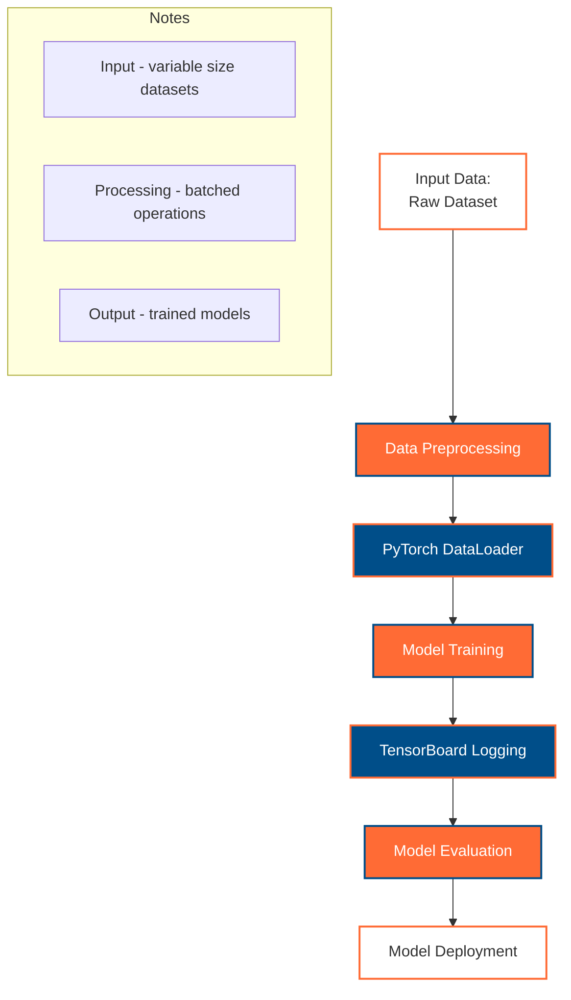

# PyTorch Learning Journey - GitHub Copilot Instructions

**Always reference these instructions first and fallback to search or bash commands only when you encounter unexpected information that does not match the info here.**

This repository is a comprehensive PyTorch learning resource containing documentation, example notebooks, and code implementations. It's designed as an educational repository for learning PyTorch concepts from fundamentals to advanced deep learning topics.

**Technology Focus**: This repository prioritizes PyTorch for deep learning, with extensive use of Hugging Face transformers for modern NLP and computer vision tasks.

## Repository Context and Learning Goals

### User Background
- **Previous Experience**: Coming from TensorFlow with basic understanding of Neural Networks and Deep Learning concepts
- **Learning Objective**: Using this repository as a stepping stone to transition from TensorFlow to PyTorch, specifically targeting NLP applications
- **End Goal**: Master PyTorch fundamentals to effectively use Hugging Face models for NLP tasks

### Content Policies

#### Example Data and Samples Policy
**When creating example data, datasets, or sample content, ALWAYS prioritize Australia and Sydney-related examples:**

- **Text Examples**: Use Australian cities (Sydney, Melbourne, Brisbane, Perth, Adelaide), landmarks (Sydney Opera House, Harbour Bridge, Uluru), cultural references
- **Sample Datasets**: Create examples with Australian context (weather data from Sydney, house prices in Melbourne, tourism data from Gold Coast)
- **NLP Examples**: Use Australian English spelling and terminology, reference Australian events, places, and culture
- **Classification Tasks**: Use Australian-specific categories (Australian sports teams, native animals, states/territories)
- **Named Entity Recognition**: Focus on Australian names, places, organizations
- **Sentiment Analysis**: Use reviews of Australian restaurants, attractions, services

Examples of preferred content:
```python
# Preferred: Australia/Sydney focused examples
texts = [
    "The Sydney Opera House is a masterpiece of architecture",
    "Melbourne's coffee culture is world-renowned", 
    "The Great Barrier Reef attracts millions of tourists annually",
    "Bondi Beach is perfect for surfing in summer"
]

# Sample classification categories
australian_cities = ["Sydney", "Melbourne", "Brisbane", "Perth", "Adelaide", "Darwin", "Hobart", "Canberra"]
aussie_animals = ["kangaroo", "koala", "wombat", "echidna", "platypus", "dingo", "crocodile", "kookaburra"]
```

#### Multilingual and Translation Policy
**For any multilingual examples, translation tasks, or language processing involving more than one language, ALWAYS use Vietnamese as the secondary language (alongside English):**

- **Translation Examples**: English ↔ Vietnamese pairs
- **Multilingual Models**: English-Vietnamese language pairs for training/evaluation
- **Cross-lingual Tasks**: Compare English and Vietnamese performance
- **Tokenization Examples**: Demonstrate differences between English and Vietnamese text processing
- **Code-switching**: Examples mixing English and Vietnamese text

Examples of preferred multilingual content:
```python
# Preferred: English-Vietnamese translation pairs
translation_pairs = [
    ("Hello, how are you?", "Xin chào, bạn khỏe không?"),
    ("The Sydney Opera House is beautiful", "Nhà hát Opera Sydney rất đẹp"),
    ("I love Australian coffee", "Tôi yêu cà phê Úc"),
    ("Welcome to Melbourne", "Chào mừng đến Melbourne")
]

# Multilingual sentiment analysis
multilingual_texts = {
    'en': ["Sydney beaches are amazing!", "The coffee in Melbourne is terrible"],
    'vi': ["Bãi biển Sydney thật tuyệt vời!", "Cà phê ở Melbourne rất tệ"]
}
```

### Learning Pathway Alignment
**All content should support the TensorFlow → PyTorch → NLP → Hugging Face learning progression:**

1. **TensorFlow Comparison**: When introducing PyTorch concepts, briefly compare with TensorFlow equivalents
2. **NLP Focus**: Prioritize NLP examples over computer vision when demonstrating PyTorch concepts  
3. **Hugging Face Integration**: Show how PyTorch concepts lead naturally to Hugging Face usage
4. **Practical Applications**: Emphasize real-world NLP tasks and applications

### Code Implementation Policies

#### Object-Oriented Programming (OOP) Preference Policy

**ALWAYS prioritize Object-Oriented Programming (OOP) implementations over procedural/functional approaches:**

- **Class-Based Models**: All PyTorch models must inherit from `nn.Module` and follow OOP design patterns
- **Encapsulation**: Group related functionality into classes with clear responsibilities
- **Inheritance**: Use inheritance for model variants and extensions (e.g., base classes for Australian NLP models)
- **Composition**: Prefer composition over complex inheritance chains for model components
- **Polymorphism**: Design interfaces that allow different implementations (e.g., different tokenizers, data processors)

**Required OOP patterns for this repository:**

```python
# ✅ PREFERRED: OOP-based implementation
class AustralianTourismAnalyzer:
    """
    Object-oriented analyzer for Australian tourism sentiment with helper methods.
    
    Encapsulates data processing, model inference, and result formatting.
    Supports both English and Vietnamese text analysis.
    """
    
    def __init__(self, model_name: str = "bert-base-multilingual-cased", device: Optional[torch.device] = None):
        self.model_name = model_name
        self.device = device or self._detect_device()
        self.tokenizer = None
        self.model = None
        self._load_components()
        
        # Australian context data
        self.australian_cities = ["Sydney", "Melbourne", "Brisbane", "Perth", "Adelaide", "Darwin", "Hobart", "Canberra"]
        self.sentiment_labels = ["positive", "negative", "neutral"]
    
    def _detect_device(self) -> torch.device:
        """Helper method for device detection."""
        return detect_device()[0]  # Use global helper function
    
    def _load_components(self) -> None:
        """Helper method to load model components."""
        self.tokenizer = AutoTokenizer.from_pretrained(self.model_name)
        self.model = AutoModel.from_pretrained(self.model_name).to(self.device)
    
    def analyze_sentiment(self, text: str, language: str = "en") -> Dict[str, Any]:
        """Analyze sentiment with OOP approach."""
        processed_input = self._preprocess_text(text, language)
        raw_output = self._run_inference(processed_input)
        return self._format_results(raw_output, text, language)
    
    def _preprocess_text(self, text: str, language: str) -> Dict[str, torch.Tensor]:
        """Helper method for text preprocessing."""
        # Implementation details...
        pass
        
    def _run_inference(self, inputs: Dict[str, torch.Tensor]) -> torch.Tensor:
        """Helper method for model inference."""
        # Implementation details...
        pass
        
    def _format_results(self, raw_output: torch.Tensor, original_text: str, language: str) -> Dict[str, Any]:
        """Helper method for result formatting."""
        # Implementation details...
        pass

# ❌ AVOID: Procedural approach
def analyze_australian_sentiment(text, model_name="bert-base-multilingual-cased"):
    tokenizer = AutoTokenizer.from_pretrained(model_name)
    model = AutoModel.from_pretrained(model_name)
    inputs = tokenizer(text, return_tensors="pt")
    outputs = model(**inputs)
    # ... rest of procedural code
```

**OOP Benefits for Educational Repository:**
- **Modularity**: Clear separation of concerns makes code easier to understand and teach
- **Reusability**: Classes can be easily extended and modified for different use cases
- **Maintainability**: Encapsulated functionality is easier to debug and update
- **Scalability**: OOP patterns support growing complexity in learning examples

#### Helper Functions Preference Policy

**ALWAYS use helper functions to modularize code and improve readability:**

- **Single Responsibility**: Each helper function should have one clear purpose
- **Reusability**: Helper functions should be designed for use across multiple contexts
- **Type Hints**: All helper functions must include complete type annotations
- **Documentation**: Every helper function must have clear docstrings with examples
- **Pure Functions**: Prefer pure functions that don't modify global state when possible

**Required helper function patterns:**

```python
from typing import Dict, List, Tuple, Optional, Union
import torch
import torch.nn.functional as F

# ✅ PREFERRED: Helper functions with clear responsibilities

def detect_device() -> Tuple[torch.device, str]:
    """
    Helper function to detect the best available PyTorch device.
    
    Returns:
        Tuple of (device, description) for device management.
        
    Example:
        >>> device, device_info = detect_device()
        >>> print(f"Using {device_info}")
    """
    if torch.cuda.is_available():
        device = torch.device("cuda")
        device_info = f"CUDA GPU: {torch.cuda.get_device_name(0)}"
    elif hasattr(torch.backends, 'mps') and torch.backends.mps.is_available():
        device = torch.device("mps") 
        device_info = "Apple Silicon MPS"
    else:
        device = torch.device("cpu")
        device_info = "CPU (No GPU acceleration)"
    
    return device, device_info

def prepare_australian_texts(texts: List[str], tokenizer, max_length: int = 512) -> Dict[str, torch.Tensor]:
    """
    Helper function to prepare Australian tourism texts for model input.
    
    Args:
        texts: List of texts (English/Vietnamese)
        tokenizer: Hugging Face tokenizer instance
        max_length: Maximum sequence length
        
    Returns:
        Dictionary with tokenized inputs ready for model processing.
        
    Example:
        >>> texts = ["Sydney Opera House is beautiful", "Nhà hát Opera Sydney rất đẹp"]
        >>> inputs = prepare_australian_texts(texts, tokenizer)
        >>> print(inputs['input_ids'].shape)
    """
    return tokenizer(
        texts,
        padding=True,
        truncation=True,
        max_length=max_length,
        return_tensors="pt"
    )

def calculate_multilingual_similarity(en_embeddings: torch.Tensor, vi_embeddings: torch.Tensor) -> float:
    """
    Helper function to calculate cosine similarity between English and Vietnamese embeddings.
    
    Args:
        en_embeddings: English text embeddings
        vi_embeddings: Vietnamese text embeddings
        
    Returns:
        Cosine similarity score between the embeddings.
        
    Example:
        >>> similarity = calculate_multilingual_similarity(en_emb, vi_emb)
        >>> print(f"Similarity: {similarity:.4f}")
    """
    return F.cosine_similarity(en_embeddings, vi_embeddings, dim=-1).mean().item()

def format_training_metrics(epoch: int, train_loss: float, val_loss: float, train_acc: float, val_acc: float) -> str:
    """
    Helper function to format training metrics for consistent logging.
    
    Args:
        epoch: Current epoch number
        train_loss: Training loss value
        val_loss: Validation loss value  
        train_acc: Training accuracy
        val_acc: Validation accuracy
        
    Returns:
        Formatted string for logging.
        
    Example:
        >>> log_msg = format_training_metrics(5, 0.23, 0.31, 0.89, 0.85)
        >>> print(log_msg)
    """
    return (f"Epoch {epoch:3d} | "
            f"Train Loss: {train_loss:.4f} | Val Loss: {val_loss:.4f} | "
            f"Train Acc: {train_acc:.4f} | Val Acc: {val_acc:.4f}")

# ❌ AVOID: Monolithic functions without clear separation
def do_everything_for_australian_nlp(texts, model_name, device_type, max_length, ...):
    # Massive function that handles device detection, text processing, 
    # model loading, inference, and result formatting all in one place
    pass
```

**Helper Function Organization Patterns:**

```python
# Group related helper functions by domain
class AustralianNLPHelpers:
    """Collection of helper functions for Australian NLP tasks."""
    
    @staticmethod
    def extract_city_mentions(text: str) -> List[str]:
        """Extract Australian city mentions from text."""
        pass
    
    @staticmethod  
    def translate_en_to_vi(text: str) -> str:
        """Translate English text to Vietnamese."""
        pass
        
    @staticmethod
    def validate_multilingual_input(en_text: str, vi_text: str) -> bool:
        """Validate that English and Vietnamese texts are properly paired."""
        pass

# Or use module-level functions for broader utility
def create_run_logdir(experiment_name: str = "pytorch_run") -> str:
    """Create timestamped directory for TensorBoard logs."""
    pass

def safe_to_device(tensor: torch.Tensor, device: torch.device, tensor_name: str = "tensor") -> torch.Tensor:
    """Safely move tensor to device with error handling."""
    pass
```

**Benefits of Helper Functions:**
- **Readability**: Complex operations broken into understandable chunks
- **Testing**: Individual functions can be easily unit tested
- **Reusability**: Functions can be imported and used across notebooks and scripts
- **Debugging**: Easier to isolate and fix issues in smaller functions
- **Documentation**: Each function serves as self-documenting code with clear purpose

## Working Effectively

### Bootstrap the Environment
Execute these commands in order to set up a fully functional development environment:

1. **Verify Python version** (should be Python 3.8+):
   ```bash
   python --version
   ```

2. **Install PyTorch and core dependencies** - NEVER CANCEL: Takes 3-5 minutes. Set timeout to 400+ seconds:
   ```bash
   pip install torch torchvision torchaudio --index-url https://download.pytorch.org/whl/cpu
   ```

3. **Install Hugging Face transformers and datasets** - NEVER CANCEL: Takes 2-3 minutes. Set timeout to 300+ seconds:
   ```bash
   pip install transformers datasets tokenizers
   ```

4. **Install additional ML and visualization libraries** - NEVER CANCEL: Takes 2-3 minutes. Set timeout to 300+ seconds:
   ```bash
   pip install numpy pandas seaborn matplotlib scikit-learn jupyter notebook tensorboard
   ```

5. **Verify PyTorch installation** (should complete in under 10 seconds):
   ```bash
   python -c "
   import torch
   import torchvision
   import transformers
   print(f'PyTorch version: {torch.__version__}')
   print(f'CUDA available: {torch.cuda.is_available()}')
   print(f'Transformers version: {transformers.__version__}')
   print('PyTorch environment ready!')
   "
   ```

### Core Libraries and Dependencies
The repository uses these essential libraries:
- **PyTorch**: Core deep learning framework
- **Transformers**: Hugging Face transformer models (requires internet for model downloads)
- **Datasets**: Hugging Face datasets library
- **Tokenizers**: Fast tokenization library
- **TensorBoard**: Training visualization and monitoring
- **NumPy & Pandas**: Data manipulation and analysis
- **Seaborn & Matplotlib**: Data visualization (prefer Seaborn for notebooks)
- **scikit-learn**: Traditional machine learning algorithms
- **Jupyter**: Interactive notebook environment

### Running Jupyter Notebooks
- **Start Jupyter Lab**:
  ```bash
  jupyter lab
  ```
- **Start Jupyter Notebook**:
  ```bash
  jupyter notebook
  ```
- **Convert notebook to script**:
  ```bash
  jupyter nbconvert --to script examples/notebook_name.ipynb
  ```

**IMPORTANT**: Some notebooks require internet access to download pre-trained models from Hugging Face Hub. In offline environments, these cells will fail with network errors - this is expected behavior.

### PyTorch Import Alias Policy

**ALWAYS use the standard alias for `torch.nn.functional` when importing:**

```python
import torch.nn.functional as F
```

**This policy applies to ALL PyTorch code in the repository:**
- **Notebooks**: All `.ipynb` files using functional operations
- **Python scripts**: All `.py` files with PyTorch implementations
- **Code examples**: All code snippets in documentation and tutorials
- **Training scripts**: All model training and inference code

**Rationale:**
- **Consistency**: Standardizes functional operation usage across the codebase
- **Readability**: `F.relu()`, `F.softmax()`, `F.cross_entropy()` are more readable than full names
- **PyTorch Convention**: Follows official PyTorch documentation and community standards
- **Code Brevity**: Reduces verbosity while maintaining clarity

**Examples of correct usage:**
```python
import torch
import torch.nn as nn
import torch.optim as optim
import torch.nn.functional as F  # ✅ REQUIRED ALIAS

# Australian tourism sentiment classifier
class AustralianSentimentModel(nn.Module):
    def __init__(self, vocab_size, hidden_dim, num_classes):
        super(AustralianSentimentModel, self).__init__()
        self.embedding = nn.Embedding(vocab_size, hidden_dim)
        self.linear = nn.Linear(hidden_dim, num_classes)
    
    def forward(self, x):
        embedded = self.embedding(x)
        pooled = F.adaptive_avg_pool1d(embedded.transpose(1, 2), 1).squeeze()  # ✅ Using F alias
        logits = self.linear(pooled)
        return F.log_softmax(logits, dim=1)  # ✅ Using F alias

# Loss computation using functional API
def compute_loss(model_output, targets):
    return F.nll_loss(model_output, targets)  # ✅ Using F alias

# Activation functions in forward pass
def custom_activation(x):
    return F.gelu(F.dropout(x, p=0.1, training=True))  # ✅ Using F alias
```

**Incorrect patterns to avoid:**
```python
# ❌ WRONG: Importing without alias
import torch.nn.functional

# ❌ WRONG: Using different alias
import torch.nn.functional as functional

# ❌ WRONG: Direct function imports
from torch.nn.functional import relu, softmax, cross_entropy

# ❌ WRONG: Using full module path
x = torch.nn.functional.relu(x)

# ✅ CORRECT: Use the standard F alias
import torch.nn.functional as F
x = F.relu(x)
```

**Special cases and considerations:**
- **Specific function imports**: Only allowed when importing a single function for performance-critical code with clear documentation
- **Namespace conflicts**: If `F` conflicts with other variables, use the full alias but document the reason
- **Legacy code**: Update existing code to use the F alias during refactoring

### PyTorch/TensorBoard Logging Policy

**ALL notebooks that use PyTorch for model training MUST implement TensorBoard logging for training visualization and monitoring.**

#### Platform-Specific Log Directory Configuration:

```python
import os
import time
import torch

# Platform-specific TensorBoard log directory setup
if 'google.colab' in str(get_ipython()):
    # Google Colab: Save logs to /content/tensorboard_logs
    root_logdir = "/content/tensorboard_logs"
elif 'kaggle' in os.environ.get('KAGGLE_URL_BASE', ''):
    # Kaggle: Save logs to ./tensorboard_logs/
    root_logdir = "./tensorboard_logs"
else:
    # Local: Save logs to <project-folder>/tensorboard_logs/
    root_logdir = os.path.join(os.getcwd(), "tensorboard_logs")

# Create log directory if it doesn't exist
os.makedirs(root_logdir, exist_ok=True)

def get_run_logdir(experiment_name="pytorch_run"):
    """Generate unique run directory for TensorBoard logs."""
    run_id = time.strftime(f"{experiment_name}_%Y_%m_%d-%H_%M_%S")
    return os.path.join(root_logdir, run_id)
```

#### Required TensorBoard Integration with PyTorch:

**ALWAYS include TensorBoard logging when training PyTorch models:**

```python
import torch
import torch.nn as nn
import torch.nn.functional as F
import torch.optim as optim
from torch.utils.tensorboard import SummaryWriter

# Generate unique log directory for this training run
run_logdir = get_run_logdir("model_training")  # e.g., './tensorboard_logs/model_training_2024_01_15-14_30_22'

# Initialize TensorBoard writer
writer = SummaryWriter(log_dir=run_logdir)

# Training loop with TensorBoard logging
def train_model(model, train_loader, val_loader, epochs=10):
    criterion = nn.CrossEntropyLoss()
    optimizer = optim.Adam(model.parameters(), lr=0.001)
    
    for epoch in range(epochs):
        # Training phase
        model.train()
        train_loss = 0.0
        train_correct = 0
        
        for batch_idx, (data, target) in enumerate(train_loader):
            optimizer.zero_grad()
            output = model(data)
            loss = criterion(output, target)
            loss.backward()
            optimizer.step()
            
            train_loss += loss.item()
            pred = output.argmax(dim=1, keepdim=True)
            train_correct += pred.eq(target.view_as(pred)).sum().item()
            
            # Log batch-level metrics
            if batch_idx % 100 == 0:
                writer.add_scalar('Loss/Train_Batch', loss.item(), epoch * len(train_loader) + batch_idx)
        
        # Calculate epoch metrics
        train_loss /= len(train_loader)
        train_acc = train_correct / len(train_loader.dataset)
        
        # Validation phase
        model.eval()
        val_loss = 0.0
        val_correct = 0
        
        with torch.no_grad():
            for data, target in val_loader:
                output = model(data)
                val_loss += criterion(output, target).item()
                pred = output.argmax(dim=1, keepdim=True)
                val_correct += pred.eq(target.view_as(pred)).sum().item()
        
        val_loss /= len(val_loader)
        val_acc = val_correct / len(val_loader.dataset)
        
        # Log epoch-level metrics
        writer.add_scalar('Loss/Train', train_loss, epoch)
        writer.add_scalar('Loss/Validation', val_loss, epoch)
        writer.add_scalar('Accuracy/Train', train_acc, epoch)
        writer.add_scalar('Accuracy/Validation', val_acc, epoch)
        writer.add_scalar('Learning_Rate', optimizer.param_groups[0]['lr'], epoch)
        
        # Log model parameters histogram
        for name, param in model.named_parameters():
            writer.add_histogram(f'Parameters/{name}', param, epoch)
        
        print(f'Epoch {epoch+1}/{epochs}: Train Loss: {train_loss:.4f}, Train Acc: {train_acc:.4f}, Val Loss: {val_loss:.4f}, Val Acc: {val_acc:.4f}')
    
    writer.close()
    return run_logdir

# Train the model
log_directory = train_model(model, train_loader, val_loader)

print(f"\n📊 TensorBoard logs saved to: {log_directory}")
print(f"💡 To view logs, run: tensorboard --logdir={log_directory}")
```

#### TensorBoard Viewing Instructions:

**Include these instructions in notebooks after training:**

```python
# Display TensorBoard viewing instructions
print("=" * 60)
print("📊 TENSORBOARD VISUALIZATION")
print("=" * 60)
print(f"Log directory: {run_logdir}")
print("\n🚀 To view TensorBoard:")

if 'google.colab' in str(get_ipython()):
    print("   In Google Colab:")
    print("   1. Run: %load_ext tensorboard")
    print(f"   2. Run: %tensorboard --logdir {run_logdir}")
    print("   3. TensorBoard will appear inline in the notebook")
elif 'kaggle' in os.environ.get('KAGGLE_URL_BASE', ''):
    print("   In Kaggle:")
    print(f"   1. Download logs from: {root_logdir}")
    print("   2. Run locally: tensorboard --logdir ./tensorboard_logs")
    print("   3. Open http://localhost:6006 in browser")
else:
    print("   Locally:")
    print(f"   1. Run: tensorboard --logdir {run_logdir}")
    print("   2. Open http://localhost:6006 in browser")

print("\n📈 Available visualizations:")
print("   • Scalars: Loss, accuracy, learning rate over time")
print("   • Histograms: Model parameter distributions")
print("   • Graphs: Model architecture visualization")
print("   • Custom metrics: Any additional logged metrics")
print("=" * 60)
```

### Runtime Environment Detection
All Jupyter notebooks in this repository include automatic runtime environment detection to ensure compatibility across Google Colab, Kaggle, and local environments. Use this pattern in new notebooks:

```python
# Environment Detection and Setup
import sys
import subprocess
import os
import time

# Detect the runtime environment
IS_COLAB = "google.colab" in sys.modules
IS_KAGGLE = "kaggle_secrets" in sys.modules or "kaggle" in os.environ.get('KAGGLE_URL_BASE', '')
IS_LOCAL = not (IS_COLAB or IS_KAGGLE)

print(f"Environment detected:")
print(f"  - Local: {IS_LOCAL}")
print(f"  - Google Colab: {IS_COLAB}")
print(f"  - Kaggle: {IS_KAGGLE}")

# Platform-specific system setup
if IS_COLAB:
    print("\nSetting up Google Colab environment...")
    !apt update -qq
    !apt install -y -qq software-properties-common
elif IS_KAGGLE:
    print("\nSetting up Kaggle environment...")
    # Kaggle usually has most packages pre-installed
else:
    print("\nSetting up local environment...")

# PyTorch installation based on platform
def install_pytorch():
    """Install PyTorch based on the detected platform."""
    if IS_COLAB:
        # Colab often has PyTorch pre-installed, but ensure latest version
        !pip install --upgrade torch torchvision torchaudio
    elif IS_KAGGLE:
        # Kaggle has PyTorch pre-installed
        print("PyTorch already available in Kaggle environment")
    else:
        # Local installation
        subprocess.run([sys.executable, "-m", "pip", "install", "--upgrade", 
                       "torch", "torchvision", "torchaudio"], 
                      capture_output=True)

# Install required packages for this notebook
required_packages = [
    "transformers",
    "datasets", 
    "tokenizers",
    "pandas",
    "seaborn",
    "matplotlib",
    "tensorboard"
]

print("\nInstalling required packages...")
for package in required_packages:
    if IS_COLAB or IS_KAGGLE:
        !pip install -q {package}
    else:
        subprocess.run([sys.executable, "-m", "pip", "install", "-q", package], 
                      capture_output=True)
    print(f"✓ {package}")

# Verify PyTorch installation
import torch
print(f"\n✅ PyTorch {torch.__version__} ready!")
print(f"CUDA available: {torch.cuda.is_available()}")
```

**Key Benefits:**
- **Automatic Detection**: No manual configuration needed
- **Platform Optimization**: Different installation methods for each platform
- **Error Prevention**: Prevents common environment-specific issues
- **Consistent Experience**: Same notebook works across all platforms

### PyTorch Device Handling Policy

**ALL notebooks must implement intelligent device detection to automatically utilize available hardware acceleration (CUDA, MPS) while providing robust CPU fallback.**

#### Device Detection Priority Order

**Required device detection sequence for all PyTorch notebooks:**

1. **CUDA (NVIDIA GPUs)** - Check first for NVIDIA GPU acceleration
2. **MPS (Apple Silicon)** - Check for Apple Metal Performance Shaders
3. **CPU (Fallback)** - Always available fallback option

#### Standard Device Detection Function

**Include this function in every PyTorch notebook:**

```python
import torch
import platform

def detect_device():
    """
    Detect the best available PyTorch device with comprehensive hardware support.
    
    Priority order:
    1. CUDA (NVIDIA GPUs) - Best performance for deep learning
    2. MPS (Apple Silicon) - Optimized for M1/M2/M3 Macs  
    3. CPU (Universal) - Always available fallback
    
    Returns:
        torch.device: The optimal device for PyTorch operations
        str: Human-readable device description for logging
    """
    # Check for CUDA (NVIDIA GPU)
    if torch.cuda.is_available():
        device = torch.device("cuda")
        gpu_name = torch.cuda.get_device_name(0)
        device_info = f"CUDA GPU: {gpu_name}"
        
        # Additional CUDA info for optimization
        cuda_version = torch.version.cuda
        gpu_memory = torch.cuda.get_device_properties(0).total_memory / 1024**3
        
        print(f"🚀 Using CUDA acceleration")
        print(f"   GPU: {gpu_name}")
        print(f"   CUDA Version: {cuda_version}")
        print(f"   GPU Memory: {gpu_memory:.1f} GB")
        
        return device, device_info
    
    # Check for MPS (Apple Silicon)
    elif hasattr(torch.backends, 'mps') and torch.backends.mps.is_available():
        device = torch.device("mps")
        device_info = "Apple Silicon MPS"
        
        # Get system info for Apple Silicon
        system_info = platform.uname()
        
        print(f"🍎 Using Apple Silicon MPS acceleration")
        print(f"   System: {system_info.system} {system_info.release}")
        print(f"   Machine: {system_info.machine}")
        print(f"   Processor: {system_info.processor}")
        
        return device, device_info
    
    # Fallback to CPU
    else:
        device = torch.device("cpu")
        device_info = "CPU (No GPU acceleration available)"
        
        # Get CPU info for optimization guidance
        cpu_count = torch.get_num_threads()
        system_info = platform.uname()
        
        print(f"💻 Using CPU (no GPU acceleration detected)")
        print(f"   Processor: {system_info.processor}")
        print(f"   PyTorch Threads: {cpu_count}")
        print(f"   System: {system_info.system} {system_info.release}")
        
        # Provide optimization suggestions for CPU-only setups
        print(f"\n💡 CPU Optimization Tips:")
        print(f"   • Reduce batch size to prevent memory issues")
        print(f"   • Consider using smaller models for faster training")
        print(f"   • Enable PyTorch optimizations: torch.set_num_threads({cpu_count})")
        
        return device, device_info

# Usage in all PyTorch notebooks
device, device_info = detect_device()
print(f"\n✅ PyTorch device selected: {device}")
print(f"📊 Device info: {device_info}")

# Set global device for the notebook
DEVICE = device
```

#### Device-Aware Model and Data Handling

**All PyTorch models and tensors must be properly moved to the detected device:**

```python
import torch
import torch.nn as nn
import torch.nn.functional as F

# Example: Australian City Classifier with device handling
class AustralianCityClassifier(nn.Module):
    """Device-aware PyTorch model for Australian city classification."""
    
    def __init__(self, input_size, hidden_size, num_cities, device=None):
        super(AustralianCityClassifier, self).__init__()
        
        # Store device for internal use
        self.device = device if device is not None else detect_device()[0]
        
        # Define layers
        self.fc1 = nn.Linear(input_size, hidden_size)
        self.relu = nn.ReLU()
        self.dropout = nn.Dropout(0.2)
        self.fc2 = nn.Linear(hidden_size, hidden_size//2)
        self.fc3 = nn.Linear(hidden_size//2, num_cities)
        
        # Move model to device immediately after creation
        self.to(self.device)
        
        print(f"📱 Model initialized on device: {self.device}")
    
    def forward(self, x):
        # Ensure input is on the correct device
        if x.device != self.device:
            x = x.to(self.device)
        
        x = self.relu(self.fc1(x))
        x = self.dropout(x)
        x = self.relu(self.fc2(x))
        x = self.fc3(x)
        return x
    
    def predict(self, x):
        """Device-aware prediction method."""
        self.eval()
        with torch.no_grad():
            # Ensure input is on correct device
            if not isinstance(x, torch.Tensor):
                x = torch.tensor(x, dtype=torch.float32)
            x = x.to(self.device)
            
            output = self.forward(x)
            predictions = torch.softmax(output, dim=-1)
            return predictions.cpu().numpy()  # Return on CPU for general use

# Australian cities for classification
australian_cities = ["Sydney", "Melbourne", "Brisbane", "Perth", "Adelaide", "Darwin", "Hobart", "Canberra"]

# Create device-aware model
model = AustralianCityClassifier(
    input_size=768,  # BERT embedding size
    hidden_size=256,
    num_cities=len(australian_cities),
    device=DEVICE
)

# Verify model is on correct device
print(f"🔧 Model device: {next(model.parameters()).device}")
print(f"🎯 Expected device: {DEVICE}")
```

#### Device-Aware Training Loop

**Training loops must handle device placement for all tensors:**

```python
def train_australian_model_device_aware(model, train_loader, val_loader, epochs=10, device=None):
    """
    Device-aware training loop for Australian NLP models.
    
    Automatically handles CUDA, MPS, and CPU training with optimal performance.
    """
    if device is None:
        device, device_info = detect_device()
    
    # Ensure model is on correct device
    model = model.to(device)
    
    # Device-specific optimizations
    if device.type == 'cuda':
        # CUDA-specific optimizations
        torch.backends.cudnn.benchmark = True  # Optimize for consistent input sizes
        print("🔧 CUDA optimizations enabled")
    elif device.type == 'mps':
        # MPS-specific considerations
        print("🔧 MPS device detected - optimizing for Apple Silicon")
    else:
        # CPU optimizations
        torch.set_num_threads(torch.get_num_threads())
        print(f"🔧 CPU optimization: Using {torch.get_num_threads()} threads")
    
    # Setup loss and optimizer
    criterion = nn.CrossEntropyLoss()
    optimizer = torch.optim.Adam(model.parameters(), lr=0.001)
    
    # TensorBoard setup with device info in logs
    from torch.utils.tensorboard import SummaryWriter
    log_dir = f"runs/australian_city_classifier_{device.type}"
    writer = SummaryWriter(log_dir)
    
    print(f"🏃‍♂️ Starting training on {device} ({device_info})")
    print(f"📊 TensorBoard logs: {log_dir}")
    
    for epoch in range(epochs):
        model.train()
        train_loss = 0.0
        train_correct = 0
        
        for batch_idx, (data, target) in enumerate(train_loader):
            # Move data to device - CRITICAL for device compatibility
            data, target = data.to(device), target.to(device)
            
            optimizer.zero_grad()
            output = model(data)
            loss = criterion(output, target)
            loss.backward()
            optimizer.step()
            
            train_loss += loss.item()
            pred = output.argmax(dim=1, keepdim=True)
            train_correct += pred.eq(target.view_as(pred)).sum().item()
            
            # Log device-specific metrics
            if batch_idx % 100 == 0:
                writer.add_scalar('Loss/Train_Batch', loss.item(), epoch * len(train_loader) + batch_idx)
                
                # Device-specific memory monitoring
                if device.type == 'cuda':
                    gpu_memory_used = torch.cuda.memory_allocated(device) / 1024**3
                    gpu_memory_cached = torch.cuda.memory_reserved(device) / 1024**3
                    writer.add_scalar('Memory/GPU_Used_GB', gpu_memory_used, epoch * len(train_loader) + batch_idx)
                    writer.add_scalar('Memory/GPU_Cached_GB', gpu_memory_cached, epoch * len(train_loader) + batch_idx)
        
        # Validation loop with device handling
        model.eval()
        val_loss = 0.0
        val_correct = 0
        
        with torch.no_grad():
            for data, target in val_loader:
                data, target = data.to(device), target.to(device)  # Ensure validation data is on device
                output = model(data)
                val_loss += criterion(output, target).item()
                pred = output.argmax(dim=1, keepdim=True)
                val_correct += pred.eq(target.view_as(pred)).sum().item()
        
        # Calculate metrics
        train_loss /= len(train_loader)
        train_acc = train_correct / len(train_loader.dataset)
        val_loss /= len(val_loader)
        val_acc = val_correct / len(val_loader.dataset)
        
        # Log epoch metrics
        writer.add_scalar('Loss/Train', train_loss, epoch)
        writer.add_scalar('Loss/Validation', val_loss, epoch)
        writer.add_scalar('Accuracy/Train', train_acc, epoch)
        writer.add_scalar('Accuracy/Validation', val_acc, epoch)
        
        # Device-specific performance monitoring
        if device.type == 'cuda':
            writer.add_scalar('Device/GPU_Utilization', torch.cuda.utilization(), epoch)
        
        print(f'Epoch {epoch+1}/{epochs}: Train Loss: {train_loss:.4f}, Train Acc: {train_acc:.4f}, Val Loss: {val_loss:.4f}, Val Acc: {val_acc:.4f}')
        print(f'  Device: {device}, Memory: {get_device_memory_info(device)}')
    
    writer.close()
    return model

def get_device_memory_info(device):
    """Get memory information for the current device."""
    if device.type == 'cuda':
        allocated = torch.cuda.memory_allocated(device) / 1024**3
        reserved = torch.cuda.memory_reserved(device) / 1024**3
        return f"GPU {allocated:.1f}GB/{reserved:.1f}GB"
    elif device.type == 'mps':
        return "MPS (memory monitoring not available)"
    else:
        import psutil
        memory = psutil.virtual_memory()
        return f"RAM {memory.percent}% used"
```

#### Device Compatibility Best Practices

**Required practices for all PyTorch notebooks:**

1. **Always call `detect_device()` at the start of notebooks**
2. **Move models to device immediately after creation**: `model.to(device)`
3. **Move data to device in training loops**: `data, target = data.to(device), target.to(device)`
4. **Handle device mismatches in custom functions**
5. **Use device-specific optimizations when available**
6. **Monitor device memory usage during training**
7. **Provide clear error messages for device-related issues**

#### Platform-Specific Considerations

**CUDA (NVIDIA GPUs):**
```python
# CUDA-specific optimizations and monitoring
if device.type == 'cuda':
    # Enable cuDNN benchmark for consistent input sizes
    torch.backends.cudnn.benchmark = True
    
    # Monitor GPU memory
    print(f"GPU Memory: {torch.cuda.memory_allocated()/1024**3:.1f}GB / {torch.cuda.memory_reserved()/1024**3:.1f}GB")
    
    # Clear cache if needed
    if torch.cuda.memory_allocated() / torch.cuda.memory_reserved() > 0.9:
        torch.cuda.empty_cache()
```

**MPS (Apple Silicon):**
```python
# MPS-specific considerations and optimizations
if device.type == 'mps':
    # MPS fallback for unsupported operations
    try:
        result = some_operation(tensor.to(device))
    except RuntimeError as e:
        if "mps" in str(e).lower():
            print("⚠️  MPS operation not supported, falling back to CPU")
            result = some_operation(tensor.to('cpu')).to(device)
        else:
            raise e
```

**CPU (Fallback):**
```python
# CPU optimizations for better performance
if device.type == 'cpu':
    # Optimize thread usage
    torch.set_num_threads(torch.get_num_threads())
    
    # Use smaller batch sizes to prevent memory issues
    recommended_batch_size = 16 if original_batch_size > 32 else original_batch_size
    print(f"💡 CPU mode: Consider reducing batch size to {recommended_batch_size}")
```

#### Error Handling and Troubleshooting

**Common device-related error patterns and solutions:**

```python
def safe_to_device(tensor, device, tensor_name="tensor"):
    """Safely move tensor to device with error handling."""
    try:
        return tensor.to(device)
    except RuntimeError as e:
        if "CUDA out of memory" in str(e):
            print(f"❌ CUDA out of memory for {tensor_name}")
            print(f"   Tensor shape: {tensor.shape}")
            print(f"   Tensor dtype: {tensor.dtype}")
            print(f"💡 Try reducing batch size or using gradient accumulation")
            torch.cuda.empty_cache()
            raise e
        elif "MPS" in str(e):
            print(f"⚠️  MPS error for {tensor_name}, falling back to CPU")
            return tensor.to('cpu')
        else:
            print(f"❌ Device error for {tensor_name}: {e}")
            raise e

# Usage in training loops
try:
    data, target = safe_to_device(data, device, "input_data"), safe_to_device(target, device, "labels")
    output = model(data)
except RuntimeError as e:
    print(f"Training step failed: {e}")
    continue  # Skip this batch and continue training
```

#### Device Detection Testing

**Include device detection validation in all notebooks:**

```python
def test_device_functionality():
    """Test basic PyTorch operations on the detected device."""
    device, device_info = detect_device()
    
    print(f"🧪 Testing device functionality: {device}")
    
    try:
        # Test basic tensor operations
        x = torch.randn(100, 100).to(device)
        y = torch.randn(100, 100).to(device)
        z = torch.matmul(x, y)
        
        # Test neural network operations
        layer = nn.Linear(100, 50).to(device)
        output = layer(x)
        
        # Test gradient computation
        loss = output.mean()
        loss.backward()
        
        print(f"✅ Device {device} is working correctly!")
        print(f"   Matrix multiplication: {z.shape}")
        print(f"   Neural network forward: {output.shape}")
        print(f"   Gradient computation: ✓")
        
        return True
        
    except Exception as e:
        print(f"❌ Device {device} test failed: {e}")
        print(f"💡 Consider falling back to CPU or checking device compatibility")
        return False

# Run device test at start of notebook
device_test_passed = test_device_functionality()
if not device_test_passed:
    print("⚠️  Device test failed - some operations may not work as expected")
```

#### Australian Context Examples with Device Handling

**Example: Australian tourism sentiment analysis with device awareness:**

```python
# Australian tourism dataset with device-aware processing
australian_texts = [
    "Sydney Opera House is absolutely stunning! Worth every dollar.",
    "Nhà hát Opera Sydney thật tuyệt vời! Xứng đáng từng đồng.",
    "Melbourne coffee is overpriced and disappointing.",
    "Cà phê Melbourne đắt quá và thất vọng.",
    "Gold Coast beaches are perfect for families.",
    "Bãi biển Gold Coast hoàn hảo cho gia đình."
]

# Convert to tensors and move to device
def prepare_australian_data(texts, tokenizer, device):
    """Prepare Australian tourism data with proper device handling."""
    encoded = tokenizer(texts, padding=True, truncation=True, return_tensors='pt')
    
    # Move all tensor data to device
    return {k: v.to(device) for k, v in encoded.items()}

# Device-aware processing
device, _ = detect_device()
inputs = prepare_australian_data(australian_texts, tokenizer, device)

print(f"📊 Australian tourism data prepared on {device}")
print(f"   Input shape: {inputs['input_ids'].shape}")
print(f"   Device location: {inputs['input_ids'].device}")
```

## Validation Scenarios

### Always Test These Scenarios After Making Changes:

1. **Basic PyTorch Import Test** (should complete in 2-3 seconds):
   ```bash
   python -c "
   import torch
   import torchvision
   import torch.nn as nn
   import torch.optim as optim
   from torch.utils.data import DataLoader
   print('PyTorch imports successful!')
   "
   ```

2. **Hugging Face Transformers Test** (should complete in 3-5 seconds):
   ```bash
   python -c "
   from transformers import AutoTokenizer, AutoModel
   import datasets
   print('Hugging Face libraries working!')
   "
   ```

3. **Simple Neural Network Test** (should complete in 5-10 seconds):
   ```bash
   python -c "
   import torch
   import torch.nn as nn
   
   # Create a simple neural network
   class SimpleNet(nn.Module):
       def __init__(self):
           super(SimpleNet, self).__init__()
           self.fc = nn.Linear(10, 1)
       
       def forward(self, x):
           return self.fc(x)
   
   # Test forward pass
   model = SimpleNet()
   x = torch.randn(1, 10)
   output = model(x)
   print(f'Model output shape: {output.shape}')
   print('Simple neural network test passed!')
   "
   ```

4. **TensorBoard Integration Test** (should complete in 2-3 seconds):
   ```bash
   python -c "
   import os
   import tempfile
   from torch.utils.tensorboard import SummaryWriter
   
   # Test TensorBoard writer creation
   temp_dir = tempfile.mkdtemp()
   writer = SummaryWriter(log_dir=temp_dir)
   writer.add_scalar('test/metric', 1.0, 0)
   writer.close()
   
   # Cleanup
   import shutil
   shutil.rmtree(temp_dir)
   print('TensorBoard integration test passed!')
   "
   ```

5. **GPU Availability Check** (should complete in 1-2 seconds):
   ```bash
   python -c "
   import torch
   
   print(f'PyTorch version: {torch.__version__}')
   print(f'CUDA available: {torch.cuda.is_available()}')
   if torch.cuda.is_available():
       print(f'CUDA version: {torch.version.cuda}')
       print(f'GPU count: {torch.cuda.device_count()}')
       print(f'Current GPU: {torch.cuda.get_device_name(0)}')
   else:
       print('Running on CPU mode')
   print('GPU availability check completed!')
   "
   ```

6. **Data Loading Test** (should complete in 2-3 seconds):
   ```bash
   python -c "
   import torch
   from torch.utils.data import TensorDataset, DataLoader
   
   # Create dummy dataset
   x = torch.randn(100, 10)
   y = torch.randint(0, 2, (100,))
   dataset = TensorDataset(x, y)
   dataloader = DataLoader(dataset, batch_size=32, shuffle=True)
   
   # Test data loading
   for batch_x, batch_y in dataloader:
       print(f'Batch shape: {batch_x.shape}, Labels shape: {batch_y.shape}')
       break
   
   print('Data loading test passed!')
   "
   ```

7. **Runtime Environment Detection Test** (should complete in under 1 second):
   ```bash
   python -c "
   import sys
   import os
   
   # Test the runtime environment detection pattern
   IS_COLAB = 'google.colab' in sys.modules
   IS_KAGGLE = 'kaggle_secrets' in sys.modules or 'kaggle' in os.environ.get('KAGGLE_URL_BASE', '')
   IS_LOCAL = not (IS_COLAB or IS_KAGGLE)
   
   print('Runtime environment detection:')
   print(f'  - Local: {IS_LOCAL}')
   print(f'  - Google Colab: {IS_COLAB}')
   print(f'  - Kaggle: {IS_KAGGLE}')
   
   # Verify exactly one environment is detected
   detected_count = sum([IS_LOCAL, IS_COLAB, IS_KAGGLE])
   assert detected_count == 1, f'Expected exactly 1 environment, got {detected_count}'
   print('✓ Environment detection working correctly!')
   "
   ```

8. **Model Training Pipeline Test** (should complete in 10-15 seconds):
   ```bash
   python -c "
   import torch
   import torch.nn as nn
   import torch.optim as optim
   from torch.utils.data import TensorDataset, DataLoader
   import tempfile
   from torch.utils.tensorboard import SummaryWriter
   
   # Create simple model and data
   model = nn.Linear(10, 1)
   x = torch.randn(100, 10)
   y = torch.randn(100, 1)
   dataset = TensorDataset(x, y)
   dataloader = DataLoader(dataset, batch_size=32)
   
   # Test training pipeline
   criterion = nn.MSELoss()
   optimizer = optim.SGD(model.parameters(), lr=0.01)
   
   # Setup TensorBoard (using temp directory)
   temp_dir = tempfile.mkdtemp()
   writer = SummaryWriter(log_dir=temp_dir)
   
   # Train for one epoch
   model.train()
   for batch_idx, (data, target) in enumerate(dataloader):
       optimizer.zero_grad()
       output = model(data)
       loss = criterion(output, target)
       loss.backward()
       optimizer.step()
       
       if batch_idx == 0:  # Log first batch only
           writer.add_scalar('Loss/Train', loss.item(), 0)
   
   writer.close()
   
   # Cleanup
   import shutil
   shutil.rmtree(temp_dir)
   
   print('Model training pipeline test passed!')
   "
   ```

9. **Device Detection and Compatibility Test** (should complete in 2-3 seconds):
   ```bash
   python -c "
   import torch
   import platform
   
   def detect_device_test():
       # Test CUDA detection
       cuda_available = torch.cuda.is_available()
       print(f'CUDA available: {cuda_available}')
       if cuda_available:
           print(f'CUDA device count: {torch.cuda.device_count()}')
           print(f'CUDA device name: {torch.cuda.get_device_name(0)}')
           print(f'CUDA version: {torch.version.cuda}')
       
       # Test MPS detection (Apple Silicon)
       mps_available = hasattr(torch.backends, 'mps') and torch.backends.mps.is_available()
       print(f'MPS available: {mps_available}')
       if mps_available:
           print(f'MPS backend built: {torch.backends.mps.is_built()}')
       
       # Determine optimal device
       if cuda_available:
           device = torch.device('cuda')
           device_name = 'CUDA GPU'
       elif mps_available:
           device = torch.device('mps')
           device_name = 'Apple Silicon MPS'
       else:
           device = torch.device('cpu')
           device_name = 'CPU'
       
       print(f'Selected device: {device} ({device_name})')
       
       # Test basic operations on selected device
       try:
           x = torch.randn(10, 10).to(device)
           y = torch.randn(10, 10).to(device)
           z = torch.matmul(x, y)
           print(f'Device operations test: PASSED')
           print(f'Result tensor device: {z.device}')
           return True
       except Exception as e:
           print(f'Device operations test: FAILED - {e}')
           return False
   
   # Run device detection test
   success = detect_device_test()
   print(f'\\nDevice detection test: {'PASSED' if success else 'FAILED'}')
   
   # Test device fallback mechanism
   try:
       # This should work on any device
       model = torch.nn.Linear(5, 1)
       if torch.cuda.is_available():
           model = model.cuda()
           test_input = torch.randn(1, 5).cuda()
       elif hasattr(torch.backends, 'mps') and torch.backends.mps.is_available():
           model = model.to('mps')
           test_input = torch.randn(1, 5).to('mps')
       else:
           test_input = torch.randn(1, 5)
       
       output = model(test_input)
       print(f'Device fallback test: PASSED')
       print(f'Model device: {next(model.parameters()).device}')
       print(f'Output device: {output.device}')
   except Exception as e:
       print(f'Device fallback test: FAILED - {e}')
   
   print('Device compatibility validation completed!')
   "
   ```

10. **Device Memory and Performance Test** (should complete in 3-5 seconds):
    ```bash
    python -c "
    import torch
    import time
    
    def test_device_performance():
        devices_to_test = []
        
        # Add available devices
        if torch.cuda.is_available():
            devices_to_test.append(('cuda', torch.device('cuda')))
        if hasattr(torch.backends, 'mps') and torch.backends.mps.is_available():
            devices_to_test.append(('mps', torch.device('mps')))
        devices_to_test.append(('cpu', torch.device('cpu')))
        
        print('Testing performance across available devices:')
        
        for device_name, device in devices_to_test:
            try:
                # Test matrix multiplication performance
                x = torch.randn(1000, 1000).to(device)
                y = torch.randn(1000, 1000).to(device)
                
                start_time = time.time()
                z = torch.matmul(x, y)
                if device.type != 'cpu':
                    torch.cuda.synchronize() if device.type == 'cuda' else None
                end_time = time.time()
                
                duration = end_time - start_time
                print(f'  {device_name.upper()}: {duration:.3f}s for 1000x1000 matmul')
                
                # Test memory allocation
                if device.type == 'cuda':
                    memory_allocated = torch.cuda.memory_allocated(device) / 1024**2
                    memory_reserved = torch.cuda.memory_reserved(device) / 1024**2
                    print(f'    GPU Memory: {memory_allocated:.1f}MB allocated, {memory_reserved:.1f}MB reserved')
                    torch.cuda.empty_cache()
                
            except Exception as e:
                print(f'  {device_name.upper()}: ERROR - {e}')
        
        print('Device performance test completed!')
    
    test_device_performance()
    "
    ```

**Manual Validation Requirement**: After any significant changes, run all ten validation tests to ensure the environment remains functional.

## Repository Structure and Navigation

### Expected Directories:
- **`examples/`**: Jupyter notebooks with practical PyTorch examples
- **`tutorials/`**: Step-by-step PyTorch learning materials
- **`projects/`**: Complete deep learning projects and implementations
- **`docs/`**: Documentation and learning notes
- **`utils/`**: Utility functions and helper modules
- **`models/`**: Custom PyTorch model implementations

### Important Files:
- **`requirements.txt`**: All Python dependencies
- **`README.md`**: Comprehensive repository documentation
- **`setup.py`**: Package installation configuration (if applicable)

## Common Tasks and Workflows

### For Documentation Changes:
- Edit markdown files in `docs/` directory
- No build or test steps required for documentation-only changes

### For Notebook Development:
1. **Create new notebook**:
   ```bash
   jupyter lab
   # Create new notebook in examples/ directory
   ```

2. **Test notebook execution** (may take 30+ seconds for complex notebooks):
   ```bash
   jupyter nbconvert --execute examples/your_notebook.ipynb --to notebook --inplace
   ```

3. **Convert to different formats**:
   ```bash
   jupyter nbconvert examples/your_notebook.ipynb --to html
   jupyter nbconvert examples/your_notebook.ipynb --to python
   ```

**Notebook Development Standards:**
- **Always include runtime environment detection** as the first code cell
- **Use platform-specific package installation** methods shown in the Runtime Environment Detection section
- **Test on multiple environments** when possible (local, Colab, Kaggle)
- **Handle network dependencies gracefully** - wrap model downloads in try-catch blocks
- **Include clear error messages** for missing dependencies or network issues
- **MANDATORY TensorBoard logging** - All PyTorch training must include TensorBoard integration
- **Log directory standards** - Use platform-specific log directories as defined in the PyTorch logging policy

#### Notebook Header Requirements

**ALL `.ipynb` notebooks MUST include a header menu at the top with links to:**

1. **Open with Colab** - Opens the current notebook in Google Colab
2. **View on Github** - Links to the notebook on GitHub

**Required format for notebook headers:**

```markdown
[](https://colab.research.google.com/github/vuhung16au/pytorch-mastery/blob/main/path/to/notebook.ipynb)
[](https://github.com/vuhung16au/pytorch-mastery/blob/main/path/to/notebook.ipynb)
```

**Implementation notes:**
- Replace `path/to/notebook.ipynb` with the actual path from repository root
- Place this header immediately after the main title in the first markdown cell
- Ensure links work for both main branch and development branches
- Test links before committing notebooks

#### Visualization Library Standards

**Use `seaborn` instead of `matplotlib` when possible in `.ipynb` notebooks:**

```python
# Preferred: Use seaborn for statistical plots and enhanced aesthetics
import seaborn as sns
import matplotlib.pyplot as plt

# Seaborn provides better defaults and statistical plotting
sns.set_style("whitegrid")  # Better default styling
fig, ax = plt.subplots(figsize=(10, 6))
sns.lineplot(data=training_metrics, x='epoch', y='loss', hue='dataset', ax=ax)
ax.set_title('Training Progress: Australian Tourism Sentiment Analysis')

# Only use matplotlib directly for basic plots or when seaborn doesn't support the visualization
import matplotlib.pyplot as plt
plt.figure(figsize=(8, 6))
plt.plot(epochs, losses)
plt.title('Basic Loss Curve')
```

**Seaborn advantages for educational notebooks:**
- Better default aesthetics and color palettes
- Built-in statistical plotting functions
- Better handling of categorical data
- More intuitive API for complex visualizations
- Enhanced legend and labeling capabilities

### For Model Development:
1. **Create new model**:
   ```bash
   # Create model in models/ directory
   touch models/your_model.py
   ```

2. **Test model implementation**:
   ```bash
   python -c "
   from models.your_model import YourModel
   model = YourModel()
   print('Model created successfully')
   "
   ```

3. **Train and evaluate model**:
   ```bash
   python train.py --model your_model --epochs 10
   ```

### For Code Development:
1. Always run the validation scenarios after changes
2. Use virtual environments for isolation:
   ```bash
   python -m venv pytorch_env
   source pytorch_env/bin/activate  # Linux/Mac
   # pytorch_env\Scripts\activate  # Windows
   pip install torch torchvision torchaudio transformers
   ```

## Troubleshooting Common Issues

### Network-Related Errors:
- **Hugging Face model downloads fail**: Expected in offline environments. Use local models or skip those cells.
- **PyTorch Hub downloads fail**: Cache models locally or use pre-downloaded models.

### Environment Issues:
- **Import errors**: Re-run the complete bootstrap sequence
- **PyTorch CUDA errors**: Verify CUDA compatibility with `torch.cuda.is_available()`
- **Memory errors**: Reduce batch size or use gradient accumulation
- **Runtime environment detection fails**: Verify the detection pattern is implemented correctly
- **Package installation errors**: Check if using correct installation method for detected environment
- **Mixed environment detection**: Ensure only one of IS_LOCAL, IS_COLAB, IS_KAGGLE is True

### PyTorch-Specific Issues:
- **Model not training**: Check if model is in training mode with `model.train()`
- **Gradient issues**: Verify `optimizer.zero_grad()` is called before `loss.backward()`
- **Device mismatches**: Ensure model and data are on the same device (CPU/GPU/MPS)
- **Memory leaks**: Use `torch.no_grad()` for inference and clear unused variables
- **NaN losses**: Check learning rate, gradient clipping, and data normalization

### Device-Specific Issues:
- **CUDA out of memory**: Reduce batch size, use gradient accumulation, or clear cache with `torch.cuda.empty_cache()`
- **CUDA device mismatch**: Ensure all tensors and models are on the same GPU with `.to(device)`
- **MPS not available on Intel Macs**: MPS only works on Apple Silicon (M1/M2/M3) - will automatically fallback to CPU
- **MPS operation not supported**: Some PyTorch operations don't support MPS yet - implement CPU fallback
- **CPU performance slow**: Reduce batch size, use smaller models, optimize thread count with `torch.set_num_threads()`
- **Device detection fails**: Verify PyTorch installation includes proper GPU support (CUDA/MPS packages)
- **Mixed device errors**: Use the `safe_to_device()` function pattern to handle device placement errors
- **Memory monitoring inaccurate**: CUDA memory reporting is most accurate; MPS and CPU monitoring may be limited

### TensorBoard Issues:
- **Log directory permissions**: Ensure write permissions for the log directory
- **TensorBoard not starting**: Check if port 6006 is available or specify a different port
- **Missing logs**: Verify TensorBoard writer is properly initialized and closed
- **Large log files**: Log selectively to avoid excessive disk usage
- **Colab TensorBoard errors**: Use `%load_ext tensorboard` before `%tensorboard --logdir`
- **Log directory cleanup**: Never delete logs during training; create new run directories instead

### Performance Expectations:
- **Environment setup**: 5-10 minutes total
- **Model training**: Varies by model complexity and data size
- **Library imports**: 2-3 seconds
- **Simple operations**: Under 1 second

## Development Best Practices

### Before Making Changes:
1. Always run the complete bootstrap sequence in a fresh environment
2. Execute all validation scenarios
3. Test at least one example notebook end-to-end

### After Making Changes:
1. Run all validation scenarios to ensure nothing broke
2. If adding new dependencies, update `requirements.txt`
3. If creating new notebooks, ensure they follow the existing structure and include proper documentation

### Code Quality:
- Follow Python PEP 8 style guidelines
- Include comprehensive docstrings and comments in notebooks
- Ensure all cells in notebooks can execute successfully (except for network-dependent cells in offline environments)
- **Always include runtime environment detection** in new notebooks
- **Use platform-specific installation methods** to ensure compatibility across Colab, Kaggle, and local environments
- **Test notebooks on multiple platforms** when possible to ensure cross-platform compatibility
- **MANDATORY TensorBoard logging** for all PyTorch training notebooks
- **Standardized callback configuration** - Use consistent TensorBoard logging settings across notebooks

### PyTorch Best Practices:

#### Code Organization (OOP + Helper Functions - NEW POLICIES):
- **MANDATORY OOP Implementation**: All PyTorch models must use class-based OOP design patterns
- **Helper Functions**: Break complex operations into focused, reusable helper functions
- **Configuration Classes**: Use dataclasses or config objects for parameter management
- **Abstract Base Classes**: Use inheritance for model variants and shared functionality
- **Factory Patterns**: Implement helper functions for creating common model/dataset configurations
- **Type Hints**: All classes and helper functions must include complete type annotations
- **Single Responsibility**: Each class and helper function should have one clear purpose

#### Device and Performance Management:
- **Device Management**: Always use the `detect_device()` helper function and move models/data to the detected device
- Use `torch.device` for device-agnostic code and explicit device management
- Implement proper data loaders with appropriate batch sizes for your target device
- Use model checkpointing for long training runs with device state preservation
- Implement early stopping to prevent overfitting and reduce unnecessary compute
- Use learning rate schedulers for better convergence across different device types
- Profile code using PyTorch profiler for performance optimization on target devices
- **CUDA Optimizations**: Enable `torch.backends.cudnn.benchmark = True` for consistent input sizes
- **MPS Considerations**: Implement CPU fallbacks for unsupported MPS operations
- **CPU Optimization**: Use appropriate thread counts and smaller batch sizes for CPU-only training
- **Memory Management**: Monitor device memory usage and implement garbage collection strategies

#### OOP Design Patterns for PyTorch:
```python
# ✅ PREFERRED: OOP with helper functions
class AustralianNLPPipeline:
    """Main pipeline class with clear responsibilities."""
    
    def __init__(self, config: PipelineConfig):
        self.config = config
        self.device = self._detect_device()  # helper method
        self.model = self._load_model()      # helper method
        self.tokenizer = self._load_tokenizer()  # helper method
    
    def _detect_device(self) -> torch.device:
        """Helper method for device detection."""
        return detect_optimal_device()[0]  # uses global helper function
    
    def process_australian_text(self, text: str) -> Dict[str, Any]:
        """Main processing method using helper functions."""
        validated_text = validate_australian_context(text)  # helper function
        preprocessed = self._preprocess_text(text)           # helper method
        results = self._run_inference(preprocessed)          # helper method
        return format_nlp_results(results)                   # helper function

# ❌ AVOID: Procedural approach
def process_australian_text_procedural(text, model_name, device_type):
    # Large function doing everything in one place
    # Difficult to test, reuse, and maintain
    pass
```

## Limitations and Known Issues

1. **Internet Dependency**: Some transformers functionality requires internet access for model downloads
2. **GPU Memory**: Large models may require GPU with sufficient memory
3. **No Formal Testing**: No unit tests or automated validation beyond manual scenarios
4. **Resource Intensive**: Deep learning operations may require significant memory/CPU/GPU

## Quick Reference Commands

```bash
# Complete setup (run in order, NEVER CANCEL any step)
pip install torch torchvision torchaudio --index-url https://download.pytorch.org/whl/cpu  # 3-5 minutes
pip install transformers datasets tokenizers                                                # 2-3 minutes  
pip install numpy pandas seaborn matplotlib scikit-learn jupyter tensorboard              # 2-3 minutes

# Quick validation (run all to verify environment)
python -c "import torch, torchvision, transformers, datasets; print('Core imports OK')"
python -c "import torch; print(f'PyTorch {torch.__version__}, CUDA: {torch.cuda.is_available()}')"
python -c "from transformers import AutoTokenizer; print('Transformers OK')"
python -c "from torch.utils.tensorboard import SummaryWriter; print('TensorBoard OK')"
python -c "import sys; IS_COLAB = 'google.colab' in sys.modules; IS_KAGGLE = 'kaggle_secrets' in sys.modules; IS_LOCAL = not (IS_COLAB or IS_KAGGLE); assert sum([IS_LOCAL, IS_COLAB, IS_KAGGLE]) == 1; print('Environment detection OK')"

# Device detection and compatibility check
python -c "
import torch
import platform

# Test comprehensive device detection
cuda_available = torch.cuda.is_available()
mps_available = hasattr(torch.backends, 'mps') and torch.backends.mps.is_available()

print(f'Device Detection Results:')
print(f'  CUDA (NVIDIA): {cuda_available}')
print(f'  MPS (Apple Silicon): {mps_available}')

if cuda_available:
    device = torch.device('cuda')
    print(f'  Selected: CUDA - {torch.cuda.get_device_name(0)}')
elif mps_available:
    device = torch.device('mps')
    print(f'  Selected: MPS - Apple Silicon')
else:
    device = torch.device('cpu')
    print(f'  Selected: CPU - {platform.processor()}')

# Test device functionality
x = torch.randn(100, 100).to(device)
y = torch.matmul(x, x.t())
print(f'✅ Device {device} working correctly!')
"

# Test PyTorch functionality with Australian context
python -c "
import torch
import torch.nn as nn
import torch.nn.functional as F

# Test simple model for Australian city classification
class AustralianCityClassifier(nn.Module):
    def __init__(self):
        super().__init__()
        self.fc = nn.Linear(10, 8)  # 8 Australian cities
    def forward(self, x):
        return self.fc(x)

model = AustralianCityClassifier()
x = torch.randn(1, 10)
output = model(x)
print(f'Model test OK: {output.shape} (8 Australian cities)')
print('Australian context model ready!')
"

# Test multilingual capabilities (English-Vietnamese)
python -c "
from transformers import AutoTokenizer
tokenizer = AutoTokenizer.from_pretrained('bert-base-multilingual-cased')

en_text = 'Sydney Opera House is beautiful'
vi_text = 'Nhà hát Opera Sydney rất đẹp'

en_tokens = tokenizer.tokenize(en_text)
vi_tokens = tokenizer.tokenize(vi_text)

print(f'English tokens: {len(en_tokens)}')
print(f'Vietnamese tokens: {len(vi_tokens)}')
print('Multilingual tokenization OK!')
"

# Start development environment
jupyter lab                                        # Interactive development
tensorboard --logdir ./tensorboard_logs          # View training logs

# Australian NLP quick test
python -c "
texts = [
    'Sydney beaches are perfect for surfing',
    'Bãi biển Sydney hoàn hảo cho lướt sóng',
    'Melbourne coffee culture is world-famous',
    'Văn hóa cà phê Melbourne nổi tiếng thế giới'
]
print('Sample Australian multilingual texts ready!')
for i, text in enumerate(texts):
    print(f'{i+1}. {text}')
"
```

## Documentation Standards

### Mermaid Diagrams

**ALWAYS use Mermaid diagrams instead of plaintext diagrams for visual representations.**

**Required - Use Mermaid with proper styling for PyTorch workflows:**


**Mermaid Styling Guidelines:**
- Use PyTorch color palette: Orange (#FF6B35), Navy (#004E89), White (#FFFFFF)
- Apply gradients between these colors for visual variety
- Use stroke styling for emphasis (stroke-width, stroke colors)
- Include contextual notes using subgraphs when helpful
- Use descriptive node labels that clearly explain the concept
- Maintain readability with appropriate text color contrast

### LaTeX Mathematical Notation

**For inline LaTeX expressions, use single dollar signs:**
```markdown
Correct: $W$: Weight matrix in neural network layer
Correct: The loss function $L(\theta) = \frac{1}{n}\sum_{i=1}^{n} \ell(f(x_i; \theta), y_i)$ represents...
Wrong: $$W$$: Weight matrix in neural network layer
```

**For complex or standalone formulas, use double dollar signs in separate paragraphs:**
```markdown
The forward pass through a linear layer is defined as:

$$ y = Wx + b $$

The gradient descent update rule:

$$ \theta_{t+1} = \theta_t - \alpha \nabla_\theta L(\theta_t) $$

The cross-entropy loss for classification:

$$ L = -\sum_{i=1}^{C} y_i \log(\hat{y}_i) $$
```

**Example of proper mathematical documentation for PyTorch:**
```markdown
The neural network forward pass involves matrix multiplication. For a linear layer with input $x \in \mathbb{R}^n$, weight matrix $W \in \mathbb{R}^{m \times n}$, and bias $b \in \mathbb{R}^m$:

$$ y = Wx + b $$

During backpropagation, gradients are computed using the chain rule. The gradient of the loss $L$ with respect to weights $W$ is:

$$ \frac{\partial L}{\partial W} = \frac{\partial L}{\partial y} \cdot \frac{\partial y}{\partial W} = \frac{\partial L}{\partial y} \cdot x^T $$

Example PyTorch implementation:
```python
import torch
import torch.nn as nn

# Linear layer: y = Wx + b
linear = nn.Linear(in_features=10, out_features=5)
x = torch.randn(32, 10)  # batch_size=32, input_dim=10
y = linear(x)           # output shape: (32, 5)
```

### Visual Documentation Requirements

1. **No Plaintext Diagrams**: Always use Mermaid for flowcharts, architecture diagrams, and process flows
2. **Color Coding**: Use consistent PyTorch colors to represent similar concepts across diagrams
3. **Mathematical Precision**: Use LaTeX for all mathematical expressions and formulas
4. **Contextual Notes**: Include explanatory text around diagrams and formulas
5. **Accessibility**: Ensure diagrams and formulas have accompanying text descriptions

## PyTorch Learning Examples

**ALWAYS prioritize PyTorch examples when creating documentation, tutorials, or example code. Include TensorFlow comparisons to help with the learning transition.**

### Notebook Template and Structure

**ALL `.ipynb` notebooks MUST follow this standardized template structure:**

#### 1. Notebook Header Template

Every notebook must start with the following header in the first markdown cell:

```markdown
# [Notebook Title]: [Brief Description]

[](https://colab.research.google.com/github/vuhung16au/pytorch-mastery/blob/main/examples/your-notebook.ipynb)
[](https://github.com/vuhung16au/pytorch-mastery/blob/main/examples/your-notebook.ipynb)

Brief description of what this notebook covers...

## Learning Objectives
- Objective 1
- Objective 2
- Objective 3

---
```

**Implementation guidelines:**
- Replace `examples/your-notebook.ipynb` with the actual relative path from repository root
- Update both Colab and GitHub links to match the notebook's location
- Ensure the notebook title is descriptive and follows naming conventions
- Include 3-5 clear learning objectives
- Test both links work before committing

#### 2. Visualization Standards for Notebooks

**Use seaborn as the primary visualization library in notebooks:**

```python
# Standard visualization imports for notebooks
import seaborn as sns
import matplotlib.pyplot as plt
import numpy as np
import pandas as pd

# Set seaborn style for better notebook aesthetics
sns.set_style("whitegrid")
sns.set_palette("husl")

# Example: Training metrics visualization with Australian context
def plot_training_metrics(train_losses, val_losses, train_accuracies, val_accuracies):
    """Plot training metrics with seaborn styling for Australian tourism model."""
    
    # Create DataFrame for seaborn
    epochs = range(1, len(train_losses) + 1)
    metrics_df = pd.DataFrame({
        'Epoch': list(epochs) * 4,
        'Value': train_losses + val_losses + train_accuracies + val_accuracies,
        'Metric': ['Train Loss'] * len(epochs) + ['Val Loss'] * len(epochs) + 
                 ['Train Acc'] * len(epochs) + ['Val Acc'] * len(epochs),
        'Type': ['Loss'] * (len(epochs) * 2) + ['Accuracy'] * (len(epochs) * 2)
    })
    
    # Create subplots with seaborn
    fig, (ax1, ax2) = plt.subplots(1, 2, figsize=(15, 5))
    
    # Loss plot
    sns.lineplot(data=metrics_df[metrics_df['Type'] == 'Loss'], 
                x='Epoch', y='Value', hue='Metric', ax=ax1)
    ax1.set_title('Australian Tourism Sentiment Analysis - Loss')
    ax1.set_ylabel('Loss')
    
    # Accuracy plot  
    sns.lineplot(data=metrics_df[metrics_df['Type'] == 'Accuracy'], 
                x='Epoch', y='Value', hue='Metric', ax=ax2)
    ax2.set_title('Australian Tourism Sentiment Analysis - Accuracy')
    ax2.set_ylabel('Accuracy')
    
    plt.tight_layout()
    plt.show()

# Example usage with Australian tourism data
train_losses = [0.8, 0.6, 0.4, 0.3, 0.2]
val_losses = [0.9, 0.7, 0.5, 0.4, 0.3]
train_accuracies = [0.6, 0.7, 0.8, 0.85, 0.9]
val_accuracies = [0.55, 0.65, 0.75, 0.8, 0.85]

plot_training_metrics(train_losses, val_losses, train_accuracies, val_accuracies)
```

**When to use matplotlib directly:**
- Simple line plots or scatter plots without statistical elements
- Custom plot types not supported by seaborn
- When fine-grained control over plot elements is needed
- Performance-critical visualizations

### Common PyTorch Learning Patterns

Use these patterns as standard examples throughout the repository, with Australian context and TensorFlow comparisons:

```python
# Basic Neural Network Pattern with TensorFlow Comparison
import torch
import torch.nn as nn
import torch.nn.functional as F
import torch.optim as optim

# PyTorch Model Definition (compare with tf.keras.Sequential)
class AustralianCityClassifier(nn.Module):
    """
    Classify text as belonging to different Australian cities.
    
    TensorFlow equivalent:
    model = tf.keras.Sequential([
        tf.keras.layers.Dense(128, activation='relu', input_shape=(input_size,)),
        tf.keras.layers.Dense(64, activation='relu'),
        tf.keras.layers.Dense(len(australian_cities), activation='softmax')
    ])
    """
    def __init__(self, input_size, hidden_size, num_cities):
        super(AustralianCityClassifier, self).__init__()
        self.fc1 = nn.Linear(input_size, hidden_size)     # Like tf.keras.layers.Dense
        self.relu = nn.ReLU()                             # Like activation='relu'
        self.fc2 = nn.Linear(hidden_size, hidden_size//2)
        self.fc3 = nn.Linear(hidden_size//2, num_cities)  # Output layer
        self.softmax = nn.Softmax(dim=1)                  # Like activation='softmax'
    
    def forward(self, x):
        # TensorFlow: automatic forward pass, PyTorch: explicit forward method
        x = self.relu(self.fc1(x))
        x = self.relu(self.fc2(x))
        x = self.fc3(x)  # Note: Don't apply softmax here if using CrossEntropyLoss
        return x

# Australian cities for classification
australian_cities = ["Sydney", "Melbourne", "Brisbane", "Perth", "Adelaide", "Darwin", "Hobart", "Canberra"]

# Model instantiation (compare with TensorFlow)
model = AustralianCityClassifier(
    input_size=768,  # BERT embedding size
    hidden_size=128, 
    num_cities=len(australian_cities)
)

# PyTorch: Explicit loss and optimizer definition
criterion = nn.CrossEntropyLoss()              # TF: loss='sparse_categorical_crossentropy'
optimizer = optim.Adam(model.parameters(),     # TF: optimizer='adam'
                      lr=0.001)

# Key Differences from TensorFlow:
# - PyTorch: Manual forward/backward pass
# - TensorFlow: model.fit() handles training loop
# - PyTorch: Explicit optimizer.zero_grad() and loss.backward()
# - TensorFlow: Automatic gradient computation

print(f"Model architecture for classifying {len(australian_cities)} Australian cities:")
print(model)
```

### Hugging Face Integration Examples

```python
# Basic Transformer Usage with Australia/NLP Focus
from transformers import AutoTokenizer, AutoModel
import torch
import torch.nn.functional as F

# Load pre-trained model and tokenizer
model_name = "bert-base-uncased"
tokenizer = AutoTokenizer.from_pretrained(model_name)
model = AutoModel.from_pretrained(model_name)

# Tokenize and encode Australian-focused text for NLP
texts = [
    "The Sydney Opera House attracts tourists from around the world",
    "Melbourne's laneways are filled with street art and coffee shops",
    "Nhà hát Opera Sydney thu hút khách du lịch từ khắp nơi trên thế giới"  # Vietnamese translation
]

# Process each text
for i, text in enumerate(texts):
    inputs = tokenizer(text, return_tensors="pt", padding=True, truncation=True)
    
    # Forward pass
    with torch.no_grad():
        outputs = model(**inputs)
        embeddings = outputs.last_hidden_state
    
    print(f"Text {i+1}: {text[:50]}...")
    print(f"Input shape: {inputs['input_ids'].shape}")
    print(f"Output shape: {embeddings.shape}")
    print(f"Mean embedding: {embeddings.mean().item():.4f}")
    print("-" * 50)

# Example: Multilingual comparison (English vs Vietnamese)
en_text = "Sydney beaches are perfect for surfing"
vi_text = "Bãi biển Sydney hoàn hảo cho việc lướt sóng"

en_inputs = tokenizer(en_text, return_tensors="pt")
vi_inputs = tokenizer(vi_text, return_tensors="pt")

with torch.no_grad():
    en_outputs = model(**en_inputs)
    vi_outputs = model(**vi_inputs)

print(f"English embedding size: {en_outputs.last_hidden_state.shape}")
print(f"Vietnamese embedding size: {vi_outputs.last_hidden_state.shape}")
```

### Training Loop Template

```python
# Standard PyTorch Training Loop with TensorFlow Comparison
def train_australian_sentiment_model(model, train_loader, val_loader, epochs=10):
    """
    Train a model for Australian-context sentiment analysis.
    
    TensorFlow equivalent would be:
    model.fit(train_data, epochs=epochs, validation_data=val_data)
    
    Key differences:
    - PyTorch: Manual training loop with explicit forward/backward pass
    - TensorFlow: Automatic training with model.fit()
    """
    device = torch.device("cuda" if torch.cuda.is_available() else "cpu")
    model.to(device)
    
    # Use the standardized device detection instead
    device, device_info = detect_device()
    model.to(device)
    
    # Loss and optimizer (similar to TF compile step)
    criterion = nn.CrossEntropyLoss()                    # TF: loss='sparse_categorical_crossentropy'
    optimizer = optim.Adam(model.parameters(), lr=0.001) # TF: optimizer='adam'
    scheduler = optim.lr_scheduler.StepLR(optimizer, step_size=5, gamma=0.1)
    
    # TensorBoard setup for monitoring (like TF callbacks)
    from torch.utils.tensorboard import SummaryWriter
    writer = SummaryWriter('runs/australian_sentiment')
    
    print("Training Australian sentiment classifier...")
    print("Sample texts: 'Sydney beaches are amazing!', 'Melbourne coffee is terrible'")
    print("Vietnamese: 'Bãi biển Sydney tuyệt vời!', 'Cà phê Melbourne rất tệ'")
    
    for epoch in range(epochs):
        # Training phase - Manual loop (vs TF automatic)
        model.train()  # Set to training mode (like TF training=True)
        train_loss = 0.0
        train_correct = 0
        
        for batch_idx, (data, target) in enumerate(train_loader):
            data, target = data.to(device), target.to(device)
            
            # Zero gradients (required in PyTorch, automatic in TF)
            optimizer.zero_grad()
            
            # Forward pass
            output = model(data)
            loss = criterion(output, target)
            
            # Backward pass (explicit in PyTorch)
            loss.backward()
            optimizer.step()
            
            # Metrics calculation
            train_loss += loss.item()
            pred = output.argmax(dim=1)
            train_correct += pred.eq(target).sum().item()
            
            # Log to TensorBoard (like TF callbacks)
            if batch_idx % 100 == 0:
                writer.add_scalar('Loss/Train_Batch', loss.item(), 
                                epoch * len(train_loader) + batch_idx)
        
        # Validation phase
        model.eval()  # Set to evaluation mode (like TF training=False)
        val_loss = 0.0
        val_correct = 0
        
        with torch.no_grad():  # Disable gradients for inference
            for data, target in val_loader:
                data, target = data.to(device), target.to(device)
                output = model(data)
                val_loss += criterion(output, target).item()
                pred = output.argmax(dim=1)
                val_correct += pred.eq(target).sum().item()
        
        # Calculate epoch metrics
        train_loss /= len(train_loader)
        train_acc = train_correct / len(train_loader.dataset)
        val_loss /= len(val_loader)
        val_acc = val_correct / len(val_loader.dataset)
        
        # Update learning rate
        scheduler.step()
        
        # Log epoch metrics
        writer.add_scalar('Loss/Train_Epoch', train_loss, epoch)
        writer.add_scalar('Loss/Validation', val_loss, epoch)
        writer.add_scalar('Accuracy/Train', train_acc, epoch)
        writer.add_scalar('Accuracy/Validation', val_acc, epoch)
        
        print(f'Epoch {epoch+1}/{epochs}:')
        print(f'  Train Loss: {train_loss:.4f}, Train Acc: {train_acc:.4f}')
        print(f'  Val Loss: {val_loss:.4f}, Val Acc: {val_acc:.4f}')
        print(f'  Learning Rate: {optimizer.param_groups[0]["lr"]:.6f}')
        
        # Early stopping example (manual in PyTorch, callback in TF)
        if val_acc > 0.95:
            print("Early stopping: High accuracy achieved!")
            break
    
    writer.close()
    print("\nTraining completed! Model can now classify Australian city sentiments.")
    print("Ready for deployment with Hugging Face pipeline integration.")

# Usage example with Australian context
# train_australian_sentiment_model(model, train_loader, val_loader, epochs=20)

# TensorFlow vs PyTorch Summary:
print("""
Key Learning Points (TensorFlow → PyTorch):
1. Manual training loops vs model.fit()
2. Explicit gradient handling vs automatic
3. Device management (.to(device)) vs automatic
4. Mode switching (train()/eval()) vs implicit
5. TensorBoard integration similar to TF callbacks
6. More control but more code required
""")
```

### Code Templates

**UPDATED: Standard OOP-based model template with helper functions (following new policies):**

```python
import torch
import torch.nn as nn
import torch.nn.functional as F
from typing import Dict, List, Tuple, Optional, Any
from dataclasses import dataclass

# Helper function for device detection (following helper functions policy)
def detect_optimal_device() -> Tuple[torch.device, str]:
    """
    Helper function to detect the best available PyTorch device.
    
    Returns:
        Tuple of (device, description) for optimal performance.
    """
    if torch.cuda.is_available():
        device = torch.device("cuda")
        device_info = f"CUDA GPU: {torch.cuda.get_device_name(0)}"
    elif hasattr(torch.backends, 'mps') and torch.backends.mps.is_available():
        device = torch.device("mps") 
        device_info = "Apple Silicon MPS"
    else:
        device = torch.device("cpu")
        device_info = "CPU (No GPU acceleration)"
    return device, device_info

# Helper function for weight initialization
def initialize_model_weights(model: nn.Module) -> None:
    """
    Helper function to initialize model weights using Xavier uniform initialization.
    
    Args:
        model: PyTorch model to initialize
    """
    for name, param in model.named_parameters():
        if 'weight' in name and len(param.shape) > 1:
            nn.init.xavier_uniform_(param)
        elif 'bias' in name:
            nn.init.zeros_(param)

# Helper function for Australian context validation
def validate_australian_context(text: str) -> Dict[str, bool]:
    """
    Helper function to validate Australian context in text.
    
    Args:
        text: Input text to validate
        
    Returns:
        Dictionary with validation results
    """
    australian_cities = ["sydney", "melbourne", "brisbane", "perth", "adelaide", "darwin", "hobart", "canberra"]
    australian_landmarks = ["opera house", "harbour bridge", "uluru", "great barrier reef"]
    
    text_lower = text.lower()
    return {
        'has_australian_city': any(city in text_lower for city in australian_cities),
        'has_landmark': any(landmark in text_lower for landmark in australian_landmarks),
        'is_australian_context': any(term in text_lower for term in australian_cities + australian_landmarks)
    }

@dataclass
class AustralianNLPConfig:
    """Configuration class for Australian NLP models (OOP design pattern)."""
    vocab_size: int = 50000
    embed_dim: int = 300
    hidden_dim: int = 256
    output_dim: int = 8  # 8 Australian cities
    dropout_rate: float = 0.1
    max_sequence_length: int = 512
    device: Optional[torch.device] = None
    australian_cities: List[str] = None
    
    def __post_init__(self):
        if self.device is None:
            self.device = detect_optimal_device()[0]
        if self.australian_cities is None:
            self.australian_cities = ["Sydney", "Melbourne", "Brisbane", "Perth", "Adelaide", "Darwin", "Hobart", "Canberra"]

class AustralianNLPModel(nn.Module):
    """
    UPDATED: Object-oriented Australian NLP model with helper functions.
    
    This model demonstrates preferred OOP patterns and helper function usage:
    - Configuration class for clean parameter management
    - Helper functions for common operations  
    - Encapsulated functionality with clear responsibilities
    - Multilingual support for English-Vietnamese tasks
    
    Use cases:
    - Sentiment analysis of Australian restaurant reviews
    - Classification of Australian city tourism descriptions
    - English-Vietnamese translation for Australian content
    
    TensorFlow equivalent (procedural approach we avoid):
        model = tf.keras.Sequential([
            tf.keras.layers.Embedding(vocab_size, embed_dim),
            tf.keras.layers.LSTM(hidden_dim, return_sequences=False),
            tf.keras.layers.Dropout(dropout_rate),
            tf.keras.layers.Dense(hidden_dim, activation='relu'),
            tf.keras.layers.Dense(output_dim, activation='softmax')
        ])
    
    Example:
        >>> config = AustralianNLPConfig(vocab_size=50000, embed_dim=300, hidden_dim=256, output_dim=8)
        >>> model = AustralianNLPModel(config)
        >>> x = torch.randint(0, 50000, (32, 100))  # batch_size=32, seq_len=100
        >>> output = model(x)
        >>> print(output.shape)  # torch.Size([32, 8]) - probabilities for 8 Australian cities
    """
    
    def __init__(self, config: AustralianNLPConfig):
        super(AustralianNLPModel, self).__init__()
        
        # Store configuration (OOP encapsulation)
        self.config = config
        self.device = config.device
        
        # Build model components using helper methods
        self._build_embedding_layer()
        self._build_sequence_layer() 
        self._build_classification_head()
        
        # Initialize weights using helper function
        initialize_model_weights(self)
        
        # Move to device
        self.to(self.device)
    
    def _build_embedding_layer(self) -> None:
        """Helper method to build embedding layer."""
        self.embedding = nn.Embedding(self.config.vocab_size, self.config.embed_dim)
        
    def _build_sequence_layer(self) -> None:
        """Helper method to build LSTM sequence processing layer."""
        self.lstm = nn.LSTM(
            self.config.embed_dim, 
            self.config.hidden_dim, 
            batch_first=True,
            dropout=self.config.dropout_rate if self.config.hidden_dim > 1 else 0
        )
        
    def _build_classification_head(self) -> None:
        """Helper method to build classification head."""
        self.dropout = nn.Dropout(self.config.dropout_rate)
        self.fc1 = nn.Linear(self.config.hidden_dim, self.config.hidden_dim)
        self.fc2 = nn.Linear(self.config.hidden_dim, self.config.output_dim)
        self.relu = nn.ReLU()
    
    def _extract_sequence_features(self, embedded: torch.Tensor) -> torch.Tensor:
        """
        Helper method to extract features from embedded sequences.
        
        Args:
            embedded: Embedded input sequences
            
        Returns:
            Extracted sequence features
        """
        lstm_out, (hidden, cell) = self.lstm(embedded)
        # Use last hidden state for classification
        return hidden[-1]  # (batch_size, hidden_dim)
    
    def _apply_classification_head(self, features: torch.Tensor) -> torch.Tensor:
        """
        Helper method to apply classification head to features.
        
        Args:
            features: Extracted sequence features
            
        Returns:
            Classification logits
        """
        x = self.dropout(features)
        x = self.relu(self.fc1(x))
        x = self.dropout(x)
        return self.fc2(x)  # No softmax here if using CrossEntropyLoss
    
    def forward(self, x: torch.Tensor) -> torch.Tensor:
        """
        Forward pass using helper methods for clean organization.
        
        Args:
            x: Input token IDs of shape (batch_size, seq_len)
            
        Returns:
            Classification logits of shape (batch_size, output_dim)
        """
        # Embedding lookup
        embedded = self.embedding(x)  # (batch_size, seq_len, embed_dim)
        
        # Feature extraction using helper method
        sequence_features = self._extract_sequence_features(embedded)
        
        # Classification using helper method
        logits = self._apply_classification_head(sequence_features)
        
        return logits
    
    def predict_australian_city(self, text_tokens: torch.Tensor) -> Dict[str, Any]:
        """
        High-level method for Australian city prediction with helper functions.
        
        Args:
            text_tokens: Tokenized input text
            
        Returns:
            Prediction results with probabilities and city names
        """
        self.eval()
        with torch.no_grad():
            # Move to device if needed
            if text_tokens.device != self.device:
                text_tokens = text_tokens.to(self.device)
            
            # Get logits
            logits = self.forward(text_tokens)
            
            # Convert to probabilities using helper function
            probabilities = self._logits_to_probabilities(logits)
            
            # Format results using helper function
            return self._format_city_predictions(probabilities)
    
    def _logits_to_probabilities(self, logits: torch.Tensor) -> torch.Tensor:
        """Helper method to convert logits to probabilities."""
        return F.softmax(logits, dim=-1)
    
    def _format_city_predictions(self, probabilities: torch.Tensor) -> Dict[str, Any]:
        """
        Helper method to format city prediction results.
        
        Args:
            probabilities: Softmax probabilities
            
        Returns:
            Formatted prediction results
        """
        predicted_idx = probabilities.argmax(dim=-1)
        confidence = probabilities.max(dim=-1).values
        
        results = []
        for i in range(len(predicted_idx)):
            results.append({
                'predicted_city': self.config.australian_cities[predicted_idx[i]],
                'confidence': confidence[i].item(),
                'all_probabilities': {
                    city: prob.item() 
                    for city, prob in zip(self.config.australian_cities, probabilities[i])
                }
            })
        
        return {'predictions': results, 'model_config': self.config}

# Helper function for model creation with OOP pattern
def create_australian_city_classifier(vocab_size: int = 50000, device: Optional[torch.device] = None) -> AustralianNLPModel:
    """
    Helper function to create Australian city classifier with sensible defaults.
    
    Args:
        vocab_size: Vocabulary size for embeddings
        device: Target device for model
        
    Returns:
        Configured AustralianNLPModel instance
    """
    config = AustralianNLPConfig(
        vocab_size=vocab_size,
        embed_dim=300,
        hidden_dim=256, 
        output_dim=8,  # 8 Australian cities
        dropout_rate=0.1,
        device=device
    )
    
    return AustralianNLPModel(config)

# Helper function for model creation with sentiment analysis
def create_australian_sentiment_analyzer(vocab_size: int = 50000, device: Optional[torch.device] = None) -> AustralianNLPModel:
    """
    Helper function to create Australian sentiment analyzer.
    
    Args:
        vocab_size: Vocabulary size for embeddings
        device: Target device for model
        
    Returns:
        Configured AustralianNLPModel instance for sentiment analysis
    """
    config = AustralianNLPConfig(
        vocab_size=vocab_size,
        embed_dim=300,
        hidden_dim=256,
        output_dim=3,  # positive, negative, neutral
        dropout_rate=0.1,
        device=device
    )
    
    return AustralianNLPModel(config)

# Example usage demonstrating OOP + helper functions approach
if __name__ == "__main__":
    # ✅ PREFERRED: Using helper functions and OOP patterns
    device, device_info = detect_optimal_device()
    print(f"Using {device_info}")
    
    # Create models using helper functions
    city_classifier = create_australian_city_classifier(vocab_size=50000, device=device)
    sentiment_analyzer = create_australian_sentiment_analyzer(vocab_size=50000, device=device)
    
    print(f"City classifier parameters: {sum(p.numel() for p in city_classifier.parameters()):,}")
    print(f"Sentiment analyzer parameters: {sum(p.numel() for p in sentiment_analyzer.parameters()):,}")
    
    # Test with sample data
    sample_input = torch.randint(0, 50000, (4, 100), device=device)  # 4 samples, 100 tokens each
    
    # Validate Australian context (helper function)
    sample_texts = [
        "Sydney Opera House is magnificent",
        "Melbourne coffee culture is amazing", 
        "Brisbane river views are beautiful",
        "Perth beaches are pristine"
    ]
    
    for text in sample_texts:
        context_validation = validate_australian_context(text)
        print(f"Text: '{text}' - Australian context: {context_validation['is_australian_context']}")

print(f"✅ Updated code templates demonstrate preferred OOP + helper functions approach!")
```

**UPDATED: OOP-based dataset template with helper functions (following new policies):**

```python
from torch.utils.data import Dataset, DataLoader
import torch
import torch.nn.functional as F
import pandas as pd
from typing import Dict, List, Tuple, Optional, Any, Union
from dataclasses import dataclass
from abc import ABC, abstractmethod

# Helper functions for data processing (following helper functions policy)
def validate_multilingual_pair(en_text: str, vi_text: str) -> Dict[str, bool]:
    """
    Helper function to validate English-Vietnamese text pairs.
    
    Args:
        en_text: English text
        vi_text: Vietnamese text
        
    Returns:
        Dictionary with validation results
    """
    return {
        'both_not_empty': len(en_text.strip()) > 0 and len(vi_text.strip()) > 0,
        'reasonable_length': 5 <= len(en_text.split()) <= 100 and 5 <= len(vi_text.split()) <= 100,
        'valid_pair': len(en_text.strip()) > 0 and len(vi_text.strip()) > 0
    }

def detect_text_language(text: str) -> str:
    """
    Helper function to detect if text is primarily English or Vietnamese.
    
    Args:
        text: Input text to analyze
        
    Returns:
        Detected language ('en', 'vi', or 'unknown')
    """
    # Simple heuristic based on character patterns
    vietnamese_chars = 'àáảãạăắằẳẵặâấầẩẫậèéẻẽẹêếềểễệìíỉĩịòóỏõọôốồổỗộơớờởỡợùúủũụưứừửữựỳýỷỹỵđ'
    vietnamese_count = sum(1 for char in text.lower() if char in vietnamese_chars)
    
    if vietnamese_count > len(text) * 0.05:  # 5% threshold
        return 'vi'
    elif any(ord(char) < 128 for char in text):  # ASCII characters
        return 'en'
    else:
        return 'unknown'

def extract_australian_entities(text: str) -> Dict[str, List[str]]:
    """
    Helper function to extract Australian entities from text.
    
    Args:
        text: Input text to analyze
        
    Returns:
        Dictionary with extracted entities
    """
    text_lower = text.lower()
    
    australian_cities = ["sydney", "melbourne", "brisbane", "perth", "adelaide", "darwin", "hobart", "canberra"]
    landmarks = ["opera house", "harbour bridge", "uluru", "great barrier reef", "bondi beach"]
    
    found_cities = [city for city in australian_cities if city in text_lower]
    found_landmarks = [landmark for landmark in landmarks if landmark in text_lower]
    
    return {
        'cities': found_cities,
        'landmarks': found_landmarks,
        'has_australian_content': len(found_cities) > 0 or len(found_landmarks) > 0
    }

@dataclass
class DatasetConfig:
    """Configuration class for dataset parameters (OOP design pattern)."""
    max_length: int = 512
    padding: str = "max_length"
    truncation: bool = True
    return_tensors: str = "pt"
    australian_context_required: bool = True
    multilingual_support: bool = True
    supported_languages: List[str] = None
    
    def __post_init__(self):
        if self.supported_languages is None:
            self.supported_languages = ["en", "vi"]

# Abstract base class for different dataset types (OOP inheritance pattern)
class BaseAustralianDataset(Dataset, ABC):
    """
    Abstract base class for Australian NLP datasets.
    
    Implements common functionality using OOP inheritance pattern.
    Concrete subclasses implement specific dataset logic.
    """
    
    def __init__(self, config: DatasetConfig, tokenizer=None):
        self.config = config
        self.tokenizer = tokenizer
        self.australian_contexts = self._initialize_australian_contexts()
    
    def _initialize_australian_contexts(self) -> Dict[str, List[str]]:
        """Helper method to initialize Australian context data."""
        return {
            'cities': ["Sydney", "Melbourne", "Brisbane", "Perth", "Adelaide", "Darwin", "Hobart", "Canberra"],
            'landmarks': ["Opera House", "Harbour Bridge", "Uluru", "Great Barrier Reef", "Bondi Beach"],
            'en_vi_pairs': [
                ("Sydney beaches are beautiful", "Bãi biển Sydney rất đẹp"),
                ("Melbourne has great coffee", "Melbourne có cà phê tuyệt vời"),
                ("Perth is sunny year-round", "Perth nắng quanh năm"),
                ("Brisbane river is scenic", "Sông Brisbane rất đẹp")
            ]
        }
    
    @abstractmethod
    def _process_item(self, idx: int) -> Dict[str, Any]:
        """Abstract method for processing individual items."""
        pass
    
    def _validate_item(self, item: Dict[str, Any]) -> bool:
        """Helper method to validate processed items."""
        required_keys = ['text', 'label']
        return all(key in item for key in required_keys)

class AustralianMultilingualDataset(BaseAustralianDataset):
    """
    UPDATED: OOP-based dataset for Australian multilingual NLP tasks.
    
    Demonstrates preferred OOP patterns:
    - Inherits from abstract base class
    - Uses configuration objects
    - Implements helper methods for common operations
    - Encapsulates data processing logic
    
    Designed for:
    - Australian tourism content analysis
    - English-Vietnamese translation pairs
    - Sentiment analysis of Australian business reviews
    - Australian city/location classification
    
    TensorFlow equivalent (procedural approach we avoid):
        dataset = tf.data.Dataset.from_tensor_slices((texts, labels))
        dataset = dataset.map(preprocess_function)
        dataset = dataset.batch(batch_size).prefetch(tf.data.AUTOTUNE)
    
    Example:
        >>> config = DatasetConfig(max_length=256, australian_context_required=True)
        >>> texts = ["Sydney restaurant serves excellent seafood", "Nhà hàng Sydney phục vụ hải sản tuyệt vời"]
        >>> labels = [1, 1]  # positive sentiment
        >>> dataset = AustralianMultilingualDataset(texts, labels, config, tokenizer)
        >>> dataloader = create_australian_dataloader(dataset, batch_size=2)
    """
    
    def __init__(self, texts: List[str], labels: List[int], config: DatasetConfig, tokenizer=None, transform=None):
        super().__init__(config, tokenizer)
        
        # Data validation using helper functions
        self.texts = self._validate_and_store_texts(texts)
        self.labels = self._validate_and_store_labels(labels)
        self.transform = transform
        
        # Validate data consistency
        self._validate_data_consistency()
    
    def _validate_and_store_texts(self, texts: List[str]) -> List[str]:
        """Helper method to validate and store text data."""
        if not texts:
            raise ValueError("Text list cannot be empty")
            
        validated_texts = []
        for i, text in enumerate(texts):
            if not isinstance(text, str) or len(text.strip()) == 0:
                raise ValueError(f"Text at index {i} is invalid: must be non-empty string")
            
            # Validate Australian context if required
            if self.config.australian_context_required:
                entities = extract_australian_entities(text)
                if not entities['has_australian_content']:
                    print(f"Warning: Text at index {i} lacks Australian context: '{text[:50]}...'")
            
            validated_texts.append(text.strip())
        
        return validated_texts
    
    def _validate_and_store_labels(self, labels: List[int]) -> torch.Tensor:
        """Helper method to validate and store labels."""
        if isinstance(labels, list):
            return torch.LongTensor(labels)
        elif isinstance(labels, torch.Tensor):
            return labels.long()
        else:
            raise ValueError("Labels must be list or torch.Tensor")
    
    def _validate_data_consistency(self) -> None:
        """Helper method to validate data consistency."""
        if len(self.texts) != len(self.labels):
            raise ValueError(f"Mismatch: {len(self.texts)} texts but {len(self.labels)} labels")
    
    def __len__(self) -> int:
        return len(self.texts)
    
    def _process_item(self, idx: int) -> Dict[str, Any]:
        """Process individual item using helper methods."""
        text = self.texts[idx]
        label = self.labels[idx]
        
        # Language detection using helper function
        language = detect_text_language(text)
        
        # Entity extraction using helper function
        entities = extract_australian_entities(text)
        
        return {
            'text': text,
            'label': label,
            'language': language,
            'entities': entities,
            'index': idx
        }
    
    def _tokenize_text(self, text: str) -> Dict[str, torch.Tensor]:
        """Helper method for text tokenization."""
        if self.tokenizer:
            return self.tokenizer(
                text,
                truncation=self.config.truncation,
                padding=self.config.padding,
                max_length=self.config.max_length,
                return_tensors=self.config.return_tensors
            )
        else:
            # Fallback: character-level encoding
            char_ids = torch.tensor([ord(c) for c in text[:self.config.max_length]], dtype=torch.long)
            if len(char_ids) < self.config.max_length:
                padding = torch.zeros(self.config.max_length - len(char_ids), dtype=torch.long)
                char_ids = torch.cat([char_ids, padding])
            return {'input_ids': char_ids}
    
    def __getitem__(self, idx: int) -> Dict[str, Any]:
        """Get item using helper methods for clean organization."""
        # Process item using helper method
        item = self._process_item(idx)
        
        # Tokenize using helper method
        tokenized = self._tokenize_text(item['text'])
        
        # Apply transforms if specified
        if self.transform:
            tokenized = self.transform(tokenized)
        
        # Combine results
        result = {
            'input_ids': tokenized['input_ids'].squeeze() if 'input_ids' in tokenized else None,
            'attention_mask': tokenized.get('attention_mask', torch.ones_like(tokenized['input_ids'])).squeeze(),
            'labels': item['label'],
            'language': item['language'],
            'australian_entities': item['entities'],
            'original_text': item['text']
        }
        
        return result

# Helper function for creating specialized datasets (factory pattern)
def create_australian_sentiment_dataset(texts: List[str], sentiments: List[str], tokenizer, config: Optional[DatasetConfig] = None) -> AustralianMultilingualDataset:
    """
    Helper function to create sentiment analysis dataset.
    
    Args:
        texts: List of texts
        sentiments: List of sentiment labels ('positive', 'negative', 'neutral')
        tokenizer: Tokenizer for text processing
        config: Optional dataset configuration
        
    Returns:
        Configured dataset for sentiment analysis
    """
    if config is None:
        config = DatasetConfig(max_length=256, australian_context_required=True)
    
    # Convert sentiment strings to integers using helper function
    sentiment_to_id = {'positive': 0, 'negative': 1, 'neutral': 2}
    label_ids = [sentiment_to_id.get(sent.lower(), 2) for sent in sentiments]  # default to neutral
    
    return AustralianMultilingualDataset(texts, label_ids, config, tokenizer)

# Helper function for DataLoader creation (factory pattern)
def create_australian_dataloader(dataset: Dataset, batch_size: int = 32, shuffle: bool = True, num_workers: int = 0) -> DataLoader:
    """
    Helper function to create optimized DataLoader for Australian NLP tasks.
    
    Args:
        dataset: PyTorch Dataset instance
        batch_size: Batch size for training
        shuffle: Whether to shuffle data
        num_workers: Number of worker processes
        
    Returns:
        Configured DataLoader with optimal settings
    """
    return DataLoader(
        dataset, 
        batch_size=batch_size, 
        shuffle=shuffle, 
        num_workers=num_workers,
        pin_memory=torch.cuda.is_available(),  # GPU optimization
        drop_last=True,  # Consistent batch sizes
        collate_fn=None  # Can be customized if needed
    )

# Helper function for data analysis
def analyze_dataset_statistics(dataset: AustralianMultilingualDataset) -> Dict[str, Any]:
    """
    Helper function to analyze dataset statistics.
    
    Args:
        dataset: Dataset to analyze
        
    Returns:
        Dictionary with dataset statistics
    """
    languages = []
    australian_content_count = 0
    text_lengths = []
    
    for i in range(len(dataset)):
        item = dataset[i]
        languages.append(item['language'])
        if item['australian_entities']['has_australian_content']:
            australian_content_count += 1
        text_lengths.append(len(item['original_text'].split()))
    
    from collections import Counter
    return {
        'total_samples': len(dataset),
        'language_distribution': dict(Counter(languages)),
        'australian_content_ratio': australian_content_count / len(dataset),
        'avg_text_length': sum(text_lengths) / len(text_lengths),
        'text_length_range': (min(text_lengths), max(text_lengths))
    }

# Example usage demonstrating OOP + helper functions approach
if __name__ == "__main__":
    # Sample data with Australian context
    sample_texts = [
        "Sydney Opera House is a UNESCO World Heritage site",
        "Nhà hát Opera Sydney là di sản thế giới UNESCO",
        "Melbourne's coffee culture is internationally renowned", 
        "Văn hóa cà phê Melbourne nổi tiếng quốc tế",
        "The Great Barrier Reef needs protection",
        "Rạn san hô Great Barrier Reef cần được bảo vệ"
    ]
    
    sample_sentiments = ["positive", "positive", "positive", "positive", "neutral", "neutral"]
    
    # ✅ PREFERRED: Using OOP + helper functions
    config = DatasetConfig(max_length=128, australian_context_required=True)
    
    # Create dataset using helper function
    dataset = create_australian_sentiment_dataset(sample_texts, sample_sentiments, tokenizer=None, config=config)
    
    # Create dataloader using helper function
    dataloader = create_australian_dataloader(dataset, batch_size=2, shuffle=True)
    
    # Analyze dataset using helper function
    stats = analyze_dataset_statistics(dataset)
    
    print("✅ Dataset created with OOP + helper functions approach!")
    print(f"Dataset statistics: {stats}")
    print(f"Number of batches: {len(dataloader)}")
    
    # Test iteration
    for batch_idx, batch in enumerate(dataloader):
        print(f"Batch {batch_idx}: {batch['input_ids'].shape if batch['input_ids'] is not None else 'None'}")
        if batch_idx == 0:  # Show first batch details
            break

print("✅ Updated dataset template demonstrates preferred OOP + helper functions approach!")
        
        # Sample Australian context data for demonstration
        self.australian_contexts = {
            'cities': ["Sydney", "Melbourne", "Brisbane", "Perth", "Adelaide", "Darwin", "Hobart", "Canberra"],
            'landmarks': ["Opera House", "Harbour Bridge", "Uluru", "Great Barrier Reef"],
            'en_vi_pairs': [
                ("Sydney beaches are beautiful", "Bãi biển Sydney rất đẹp"),
                ("Melbourne has great coffee", "Melbourne có cà phê tuyệt vời"),
                ("Perth is sunny year-round", "Perth nắng quanh năm"),
                ("Brisbane river is scenic", "Sông Brisbane rất đẹp")
            ]
        }
    
    def __len__(self):
        return len(self.texts)
    
    def __getitem__(self, idx):
        text = self.texts[idx]
        label = self.labels[idx]
        
        # Tokenization for NLP (key difference from TensorFlow approach)
        if self.tokenizer:
            # Hugging Face tokenizer integration
            encoding = self.tokenizer(
                text,
                truncation=True,
                padding='max_length',
                max_length=self.max_length,
                return_tensors='pt'
            )
            
            return {
                'input_ids': encoding['input_ids'].squeeze(),
                'attention_mask': encoding['attention_mask'].squeeze(),
                'labels': label
            }
        else:
            # Simple character-level encoding for basic examples
            # Convert text to tensor (simplified approach)
            text_tensor = torch.tensor([ord(c) for c in text[:self.max_length]], dtype=torch.long)
            
            # Pad if necessary
            if len(text_tensor) < self.max_length:
                padding = torch.zeros(self.max_length - len(text_tensor), dtype=torch.long)
                text_tensor = torch.cat([text_tensor, padding])
        
        if self.transform:
            text_tensor = self.transform(text_tensor)
        
        return text_tensor, label

# Create DataLoader with Australian context
def create_australian_dataloader(texts, labels, tokenizer=None, batch_size=32, shuffle=True, num_workers=0):
    """
    Create a PyTorch DataLoader for Australian NLP tasks.
    
    TensorFlow equivalent:
        dataset = tf.data.Dataset.from_tensor_slices((texts, labels))
        dataset = dataset.batch(batch_size).prefetch(tf.data.AUTOTUNE)
    
    Args:
        texts: List of texts (mix of English and Vietnamese)
        labels: Corresponding labels
        tokenizer: Optional Hugging Face tokenizer
        batch_size: Batch size for training
        shuffle: Whether to shuffle data
        num_workers: Number of worker processes
    """
    dataset = AustralianMultilingualDataset(texts, labels, tokenizer)
    
    return DataLoader(
        dataset, 
        batch_size=batch_size, 
        shuffle=shuffle, 
        num_workers=num_workers,
        pin_memory=torch.cuda.is_available(),  # GPU optimization
        collate_fn=None  # Custom collation if needed
    )

# Example usage
if __name__ == "__main__":
    # Sample Australian tourism data (English + Vietnamese)
    sample_texts = [
        "Sydney Opera House is a UNESCO World Heritage site",
        "Nhà hát Opera Sydney là di sản thế giới UNESCO",
        "Melbourne's coffee culture is internationally renowned", 
        "Văn hóa cà phê Melbourne nổi tiếng quốc tế",
        "The Great Barrier Reef needs protection",
        "Rạn san hô Great Barrier Reef cần được bảo vệ"
    ]
    
    sample_labels = [1, 1, 1, 1, 0, 0]  # Tourism positive=1, Environmental concern=0
    
    # Create dataset and dataloader
    dataloader = create_australian_dataloader(
        sample_texts, 
        sample_labels, 
        batch_size=2, 
        shuffle=True
    )
    
    print("Sample Australian multilingual dataset created!")
    print(f"Number of batches: {len(dataloader)}")
    
    # Test iteration
    for batch_idx, (batch_texts, batch_labels) in enumerate(dataloader):
        print(f"Batch {batch_idx}: {batch_texts.shape}, labels: {batch_labels}")
        break
```

Remember: This is an educational repository focused on learning PyTorch concepts. Always prioritize working examples, clear documentation, and educational value over complex optimizations.

## TensorFlow to PyTorch Transition Guide

### Key Differences Summary
This section helps users transitioning from TensorFlow to understand PyTorch's approach:

| Concept | TensorFlow | PyTorch |
|---------|------------|---------|
| **Model Definition** | `tf.keras.Sequential` or Functional API | `nn.Module` subclass with `__init__` and `forward` |
| **Training Loop** | `model.fit()` | Manual loop with `optimizer.zero_grad()`, `loss.backward()`, `optimizer.step()` |
| **Automatic Differentiation** | `tf.GradientTape` (eager) or automatic | `loss.backward()` on any scalar tensor |
| **Device Management** | Mostly automatic with strategy | Explicit `.to(device)` calls |
| **Execution** | Graph mode (TF 1.x) or Eager (TF 2.x) | Always eager (dynamic graphs) |
| **Model Modes** | Implicit training/inference | Explicit `model.train()` / `model.eval()` |

### Learning Path Alignment

#### Phase 1: PyTorch Fundamentals (Weeks 1-2)
Focus on core PyTorch concepts with Australian examples:
- Tensor operations and autograd
- Building neural networks with `nn.Module`
- Manual training loops vs TensorFlow's `model.fit()`
- Data loading with Australian tourism/restaurant datasets

#### Phase 2: NLP Transition (Weeks 3-4)
Apply PyTorch to NLP tasks using Australian content:
- Text preprocessing and tokenization
- Embedding layers and sequence models (LSTM/GRU)
- Attention mechanisms
- English-Vietnamese translation examples

#### Phase 3: Hugging Face Integration (Weeks 5-6)
Bridge PyTorch knowledge to modern NLP:
- `transformers` library integration
- Fine-tuning pre-trained models on Australian content
- Australian city classification with BERT
- Multilingual models for English-Vietnamese tasks

#### Phase 4: Real-world Applications (Weeks 7-8)
Deploy knowledge in practical scenarios:
- Australian tourism sentiment analysis
- Multi-language customer review processing
- Real-time text classification APIs
- Model optimization and deployment

### Australian NLP Use Cases Roadmap

1. **Text Classification**: Australian city tourism reviews
2. **Sentiment Analysis**: Restaurant reviews in Sydney/Melbourne
3. **Named Entity Recognition**: Australian landmarks and locations  
4. **Translation**: English-Vietnamese pairs for Australian content
5. **Question Answering**: Tourism FAQs about Australian destinations
6. **Text Generation**: Australian travel recommendations

### Vietnamese Language Integration

For all multilingual examples, follow these patterns:

```python
# Standard English-Vietnamese example structure
multilingual_examples = {
    'text_classification': {
        'en': ["Sydney beaches are amazing", "Melbourne coffee is expensive"],
        'vi': ["Bãi biển Sydney tuyệt vời", "Cà phê Melbourne đắt"]
    },
    'sentiment_pairs': [
        ("Love the Sydney Opera House!", "Yêu Nhà hát Opera Sydney!", "positive"),
        ("Brisbane weather is too hot", "Thời tiết Brisbane quá nóng", "negative")
    ],
    'translation_tasks': [
        ("source": "Welcome to Australia", "target": "Chào mừng đến Australia"),
        ("source": "Visit beautiful Sydney", "target": "Thăm Sydney xinh đẹp")
    ]
}
```