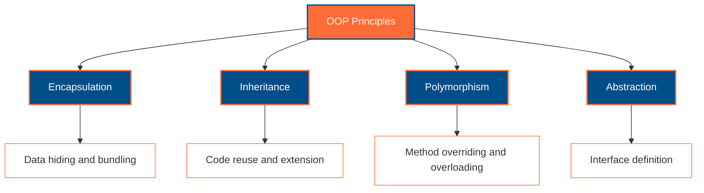
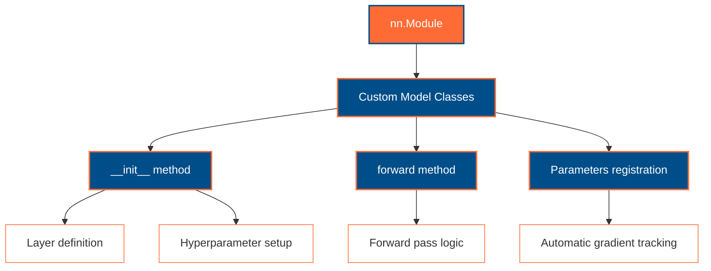
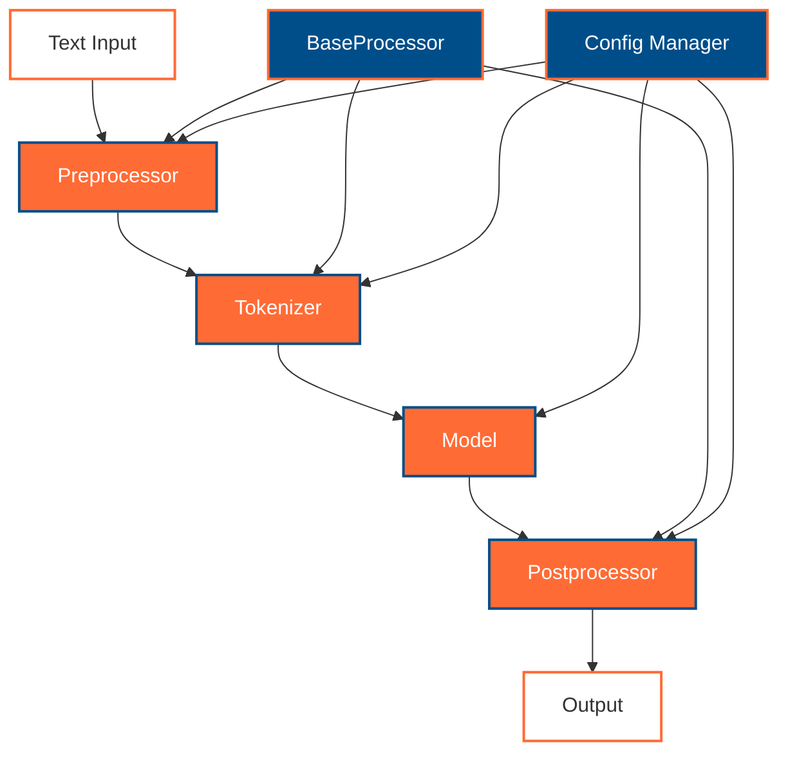

# Object-Oriented Programming (OOP) in Python: A PyTorch and NLP Perspective

Object-Oriented Programming (OOP) is fundamental to modern Python development, especially in deep learning frameworks like PyTorch. This guide explores OOP concepts with practical examples focusing on Australian contexts and English-Vietnamese NLP applications.

## Table of Contents

1. [OOP Implementation in Python](#oop-implementation-in-python)
2. [OOP in PyTorch](#oop-in-pytorch)
3. [OOP in NLP Applications](#oop-in-nlp-applications)
4. [Practical Examples](#practical-examples)
5. [TensorFlow vs PyTorch OOP Comparison](#tensorflow-vs-pytorch-oop-comparison)

---

## OOP Implementation in Python

### Core OOP Concepts

Python's OOP implementation provides four fundamental principles that form the foundation of modern deep learning frameworks:



### Basic Class Structure

```python
class AustralianTourismAnalyzer:
    """
    A class for analyzing Australian tourism data using OOP principles.
    
    Demonstrates encapsulation, inheritance, and polymorphism concepts
    essential for PyTorch model development.
    """
    
    def __init__(self, city_name: str, language: str = "english"):
        """
        Initialize the analyzer with city context.
        
        Args:
            city_name (str): Australian city name (Sydney, Melbourne, etc.)
            language (str): Analysis language ('english' or 'vietnamese')
        """
        # Encapsulation: Private attributes
        self._city_name = city_name
        self._language = language
        self._data = []
        self._model = None
    
    # Public methods for external interaction
    def add_review(self, review_text: str, rating: int) -> None:
        """Add a tourism review to the dataset."""
        self._data.append({
            'text': review_text,
            'rating': rating,
            'city': self._city_name,
            'language': self._language
        })
    
    def get_city_stats(self) -> dict:
        """Return analysis statistics for the city."""
        if not self._data:
            return {'city': self._city_name, 'reviews': 0, 'avg_rating': 0}
        
        total_rating = sum(item['rating'] for item in self._data)
        avg_rating = total_rating / len(self._data)
        
        return {
            'city': self._city_name,
            'reviews': len(self._data),
            'avg_rating': round(avg_rating, 2),
            'language': self._language
        }
    
    # Property decorators for controlled access
    @property
    def city_name(self) -> str:
        """Get the city name (read-only)."""
        return self._city_name
    
    @property
    def review_count(self) -> int:
        """Get the number of reviews."""
        return len(self._data)

# Example usage with Australian cities
sydney_analyzer = AustralianTourismAnalyzer("Sydney", "english")
sydney_analyzer.add_review("The Sydney Opera House is breathtaking!", 5)
sydney_analyzer.add_review("Bondi Beach is perfect for surfing", 4)

melbourne_analyzer = AustralianTourismAnalyzer("Melbourne", "vietnamese")
melbourne_analyzer.add_review("Cà phê Melbourne rất ngon", 5)  # "Melbourne coffee is delicious"
melbourne_analyzer.add_review("Phố nghệ thuật rất thú vị", 4)  # "Art streets are very interesting"

print("Sydney Stats:", sydney_analyzer.get_city_stats())
print("Melbourne Stats:", melbourne_analyzer.get_city_stats())
```

### Inheritance and Polymorphism

```python
class MultilingualAnalyzer(AustralianTourismAnalyzer):
    """
    Extended analyzer supporting English-Vietnamese translation.
    
    Demonstrates inheritance and method overriding - key concepts
    used in PyTorch's nn.Module inheritance pattern.
    """
    
    def __init__(self, city_name: str):
        # Call parent constructor
        super().__init__(city_name, "multilingual")
        self._translations = {}
    
    def add_bilingual_review(self, english_text: str, vietnamese_text: str, rating: int) -> None:
        """Add a bilingual review pair."""
        review_id = len(self._data)
        
        # Store both languages
        self.add_review(english_text, rating)
        self._translations[review_id] = {
            'english': english_text,
            'vietnamese': vietnamese_text,
            'rating': rating
        }
    
    # Method overriding - polymorphism in action
    def get_city_stats(self) -> dict:
        """Extended statistics including translation pairs."""
        base_stats = super().get_city_stats()
        base_stats.update({
            'translation_pairs': len(self._translations),
            'supports_vietnamese': True
        })
        return base_stats
    
    def get_translation_pair(self, index: int) -> dict:
        """Get English-Vietnamese translation pair."""
        return self._translations.get(index, {})

# Polymorphism demonstration
analyzers = [
    AustralianTourismAnalyzer("Brisbane", "english"),
    MultilingualAnalyzer("Perth")
]

# Same method call, different behavior based on object type
for analyzer in analyzers:
    print(f"Analyzer type: {type(analyzer).__name__}")
    print(f"Stats: {analyzer.get_city_stats()}")
    print("-" * 40)
```

---

## OOP in PyTorch

PyTorch's architecture is built around OOP principles, with `nn.Module` as the foundational class for all neural network components. Understanding this pattern is crucial for transitioning from TensorFlow to PyTorch.

### The nn.Module Pattern



### Australian City Classification Model

```python
import torch
import torch.nn as nn
import torch.nn.functional as F
from typing import List, Optional

class AustralianCityClassifier(nn.Module):
    """
    PyTorch model for classifying text as belonging to different Australian cities.
    
    Demonstrates PyTorch OOP patterns:
    - Inheritance from nn.Module
    - Proper parameter registration
    - Forward method implementation
    
    TensorFlow equivalent:
    model = tf.keras.Sequential([
        tf.keras.layers.Embedding(vocab_size, embed_dim),
        tf.keras.layers.LSTM(hidden_dim),
        tf.keras.layers.Dense(len(australian_cities))
    ])
    
    Args:
        vocab_size (int): Size of vocabulary
        embed_dim (int): Embedding dimension
        hidden_dim (int): Hidden layer dimension
        num_cities (int): Number of Australian cities to classify
        dropout_rate (float): Dropout rate for regularization
    
    Example:
        >>> australian_cities = ["Sydney", "Melbourne", "Brisbane", "Perth", "Adelaide"]
        >>> model = AustralianCityClassifier(vocab_size=10000, embed_dim=300, 
        ...                                 hidden_dim=256, num_cities=len(australian_cities))
        >>> # Input: tokenized text about cities
        >>> input_text = torch.randint(0, 10000, (32, 100))  # batch_size=32, seq_len=100
        >>> output = model(input_text)
        >>> print(output.shape)  # torch.Size([32, 5]) - probabilities for 5 cities
    """
    
    def __init__(self, vocab_size: int, embed_dim: int, hidden_dim: int, 
                 num_cities: int, dropout_rate: float = 0.1):
        # CRITICAL: Always call parent constructor
        super(AustralianCityClassifier, self).__init__()
        
        # Layer definition - automatic parameter registration
        self.embedding = nn.Embedding(vocab_size, embed_dim)
        self.lstm = nn.LSTM(embed_dim, hidden_dim, batch_first=True)
        self.dropout = nn.Dropout(dropout_rate)
        self.classifier = nn.Linear(hidden_dim, num_cities)
        
        # Store city mapping for reference
        self.australian_cities = [
            "Sydney", "Melbourne", "Brisbane", "Perth", "Adelaide",
            "Darwin", "Hobart", "Canberra"
        ][:num_cities]
        
        # Initialize weights using OOP method
        self._initialize_weights()
    
    def _initialize_weights(self) -> None:
        """Private method for weight initialization."""
        for name, param in self.named_parameters():
            if 'weight' in name and len(param.shape) > 1:
                nn.init.xavier_uniform_(param)
            elif 'bias' in name:
                nn.init.constant_(param, 0.0)
    
    def forward(self, x: torch.Tensor) -> torch.Tensor:
        """
        Forward pass through the network.
        
        Args:
            x (torch.Tensor): Input tensor of shape (batch_size, sequence_length)
        
        Returns:
            torch.Tensor: Logits for each Australian city class
        """
        # Embedding lookup
        embedded = self.embedding(x)  # (batch_size, seq_len, embed_dim)
        
        # LSTM processing
        lstm_out, (hidden, _) = self.lstm(embedded)
        
        # Use last hidden state for classification
        last_hidden = hidden[-1]  # (batch_size, hidden_dim)
        
        # Apply dropout and classification
        dropped = self.dropout(last_hidden)
        logits = self.classifier(dropped)  # (batch_size, num_cities)
        
        return logits
    
    def predict_city(self, text_tensor: torch.Tensor) -> str:
        """
        Predict the most likely Australian city for input text.
        
        Args:
            text_tensor (torch.Tensor): Tokenized text input
        
        Returns:
            str: Predicted Australian city name
        """
        self.eval()  # Set to evaluation mode
        with torch.no_grad():
            logits = self.forward(text_tensor.unsqueeze(0))  # Add batch dimension
            predicted_idx = torch.argmax(logits, dim=1).item()
            return self.australian_cities[predicted_idx]
    
    def get_model_info(self) -> dict:
        """Return model architecture information."""
        total_params = sum(p.numel() for p in self.parameters())
        trainable_params = sum(p.numel() for p in self.parameters() if p.requires_grad)
        
        return {
            'model_name': 'AustralianCityClassifier',
            'total_parameters': total_params,
            'trainable_parameters': trainable_params,
            'supported_cities': self.australian_cities,
            'architecture': 'Embedding -> LSTM -> Classifier'
        }


class MultilingualCityClassifier(AustralianCityClassifier):
    """
    Extended classifier supporting English-Vietnamese text classification.
    
    Demonstrates inheritance in PyTorch models - extending base functionality
    while maintaining the core nn.Module pattern.
    """
    
    def __init__(self, vocab_size: int, embed_dim: int, hidden_dim: int, 
                 num_cities: int, dropout_rate: float = 0.1):
        super().__init__(vocab_size, embed_dim, hidden_dim, num_cities, dropout_rate)
        
        # Additional layer for language detection
        self.language_detector = nn.Linear(hidden_dim, 2)  # English or Vietnamese
        
        # Language mappings
        self.languages = ["english", "vietnamese"]
    
    def forward(self, x: torch.Tensor, return_language: bool = False) -> torch.Tensor:
        """
        Extended forward pass with optional language detection.
        
        Args:
            x (torch.Tensor): Input tensor
            return_language (bool): Whether to return language predictions
        
        Returns:
            torch.Tensor: City logits, optionally with language logits
        """
        # Get embeddings and LSTM output (reuse parent logic)
        embedded = self.embedding(x)
        lstm_out, (hidden, _) = self.lstm(embedded)
        last_hidden = hidden[-1]
        dropped = self.dropout(last_hidden)
        
        # City classification
        city_logits = self.classifier(dropped)
        
        if return_language:
            # Language detection
            lang_logits = self.language_detector(dropped)
            return city_logits, lang_logits
        
        return city_logits
    
    def predict_with_language(self, text_tensor: torch.Tensor) -> dict:
        """
        Predict both city and language for input text.
        
        Returns:
            dict: Predictions for both city and language
        """
        self.eval()
        with torch.no_grad():
            city_logits, lang_logits = self.forward(text_tensor.unsqueeze(0), return_language=True)
            
            city_idx = torch.argmax(city_logits, dim=1).item()
            lang_idx = torch.argmax(lang_logits, dim=1).item()
            
            return {
                'predicted_city': self.australian_cities[city_idx],
                'predicted_language': self.languages[lang_idx],
                'city_confidence': torch.softmax(city_logits, dim=1).max().item(),
                'language_confidence': torch.softmax(lang_logits, dim=1).max().item()
            }

# Example usage demonstrating OOP principles
if __name__ == "__main__":
    # Create model instances
    basic_model = AustralianCityClassifier(
        vocab_size=10000, embed_dim=300, hidden_dim=256, num_cities=5
    )
    
    multilingual_model = MultilingualCityClassifier(
        vocab_size=10000, embed_dim=300, hidden_dim=256, num_cities=5
    )
    
    # Demonstrate polymorphism - same interface, different behavior
    models = [basic_model, multilingual_model]
    
    for i, model in enumerate(models):
        print(f"\nModel {i+1}: {type(model).__name__}")
        print(f"Info: {model.get_model_info()}")
        
        # Test with dummy data
        dummy_input = torch.randint(0, 1000, (20,))  # 20 tokens
        output = model(dummy_input.unsqueeze(0))
        print(f"Output shape: {output.shape}")
```

### Key PyTorch OOP Patterns

**1. Inheritance from nn.Module:**
- All PyTorch models inherit from `nn.Module`
- Automatic parameter registration and gradient tracking
- Built-in methods for training/evaluation modes

**2. Constructor Pattern:**
- Call `super().__init__()` first
- Define layers as instance attributes
- Initialize weights in separate method

**3. Forward Method:**
- Required method defining forward pass
- Clear separation of computation logic
- Return tensors for further processing

**4. Encapsulation:**
- Private methods for internal operations
- Public interface for model interaction
- Properties for controlled access

---

## OOP in NLP Applications

NLP applications heavily rely on OOP principles for creating reusable, maintainable text processing pipelines. PyTorch's ecosystem, especially Hugging Face transformers, exemplifies excellent OOP design.

### Text Processing Pipeline with OOP



### Australian Tourism NLP Pipeline

```python
import re
import torch
from abc import ABC, abstractmethod
from typing import Dict, List, Tuple, Optional, Union
from dataclasses import dataclass
from transformers import AutoTokenizer, AutoModel

@dataclass
class ProcessingConfig:
    """Configuration class using dataclass for clean OOP design."""
    model_name: str = "bert-base-multilingual-cased"
    max_length: int = 512
    batch_size: int = 32
    device: str = "cuda" if torch.cuda.is_available() else "cpu"
    supported_languages: List[str] = None
    australian_cities: List[str] = None
    
    def __post_init__(self):
        if self.supported_languages is None:
            self.supported_languages = ["english", "vietnamese"]
        if self.australian_cities is None:
            self.australian_cities = [
                "Sydney", "Melbourne", "Brisbane", "Perth", "Adelaide",
                "Darwin", "Hobart", "Canberra"
            ]

class BaseTextProcessor(ABC):
    """
    Abstract base class for text processors.
    
    Demonstrates abstraction - defining interface without implementation.
    Essential pattern for creating extensible NLP pipelines.
    """
    
    def __init__(self, config: ProcessingConfig):
        self.config = config
        self._processed_count = 0
    
    @abstractmethod
    def process(self, text: str) -> Dict:
        """Abstract method that must be implemented by subclasses."""
        pass
    
    @property
    def processed_count(self) -> int:
        """Get number of processed items."""
        return self._processed_count
    
    def _increment_counter(self) -> None:
        """Protected method for internal use."""
        self._processed_count += 1

class AustralianTextPreprocessor(BaseTextProcessor):
    """
    Preprocessor for Australian tourism text with English-Vietnamese support.
    
    Demonstrates inheritance and method implementation.
    """
    
    def __init__(self, config: ProcessingConfig):
        super().__init__(config)
        
        # Australian-specific patterns
        self.city_patterns = {
            city.lower(): city for city in config.australian_cities
        }
        
        # English-Vietnamese landmark mappings
        self.landmark_translations = {
            "opera house": "nhà hát opera",
            "harbour bridge": "cầu cảng",
            "bondi beach": "bãi biển bondi",
            "great barrier reef": "rạn san hô great barrier",
            "uluru": "uluru",
            "blue mountains": "núi xanh"
        }
    
    def process(self, text: str) -> Dict:
        """
        Process and clean Australian tourism text.
        
        Args:
            text (str): Raw text input
        
        Returns:
            Dict: Processed text information
        """
        self._increment_counter()
        
        # Basic cleaning
        cleaned = re.sub(r'[^\w\s\u00C0-\u024F\u1E00-\u1EFF]', ' ', text.lower())
        cleaned = re.sub(r'\s+', ' ', cleaned).strip()
        
        # Detect mentioned cities
        mentioned_cities = []
        for city_key, city_name in self.city_patterns.items():
            if city_key in cleaned:
                mentioned_cities.append(city_name)
        
        # Detect landmarks
        mentioned_landmarks = []
        for landmark_en, landmark_vi in self.landmark_translations.items():
            if landmark_en in cleaned or landmark_vi in cleaned:
                mentioned_landmarks.append({
                    'english': landmark_en,
                    'vietnamese': landmark_vi
                })
        
        # Language detection (simplified)
        vietnamese_chars = re.findall(r'[àáạảãâầấậẩẫăằắặẳẵèéẹẻẽêềếệểễìíịỉĩòóọỏõôồốộổỗơờớợởỡùúụủũưừứựửữỳýỵỷỹđ]', cleaned)
        detected_language = "vietnamese" if vietnamese_chars else "english"
        
        return {
            'original': text,
            'cleaned': cleaned,
            'mentioned_cities': mentioned_cities,
            'mentioned_landmarks': mentioned_landmarks,
            'detected_language': detected_language,
            'word_count': len(cleaned.split()),
            'char_count': len(cleaned)
        }

class TourismSentimentAnalyzer(BaseTextProcessor):
    """
    Sentiment analyzer for Australian tourism reviews.
    
    Demonstrates composition - using external models within OOP structure.
    """
    
    def __init__(self, config: ProcessingConfig):
        super().__init__(config)
        
        # Initialize transformer model and tokenizer
        self.tokenizer = AutoTokenizer.from_pretrained(config.model_name)
        self.model = AutoModel.from_pretrained(config.model_name)
        self.model.to(config.device)
        
        # Sentiment classifier head
        self.sentiment_classifier = torch.nn.Sequential(
            torch.nn.Linear(self.model.config.hidden_size, 256),
            torch.nn.ReLU(),
            torch.nn.Dropout(0.1),
            torch.nn.Linear(256, 3)  # positive, negative, neutral
        ).to(config.device)
        
        self.sentiment_labels = ["negative", "neutral", "positive"]
    
    def process(self, text: str) -> Dict:
        """
        Analyze sentiment of tourism text.
        
        Args:
            text (str): Tourism review text
        
        Returns:
            Dict: Sentiment analysis results
        """
        self._increment_counter()
        
        # Tokenize input
        inputs = self.tokenizer(
            text,
            truncation=True,
            padding='max_length',
            max_length=self.config.max_length,
            return_tensors='pt'
        ).to(self.config.device)
        
        # Get embeddings
        self.model.eval()
        with torch.no_grad():
            outputs = self.model(**inputs)
            pooled_output = outputs.last_hidden_state.mean(dim=1)  # Simple pooling
            
            # Sentiment prediction
            sentiment_logits = self.sentiment_classifier(pooled_output)
            sentiment_probs = torch.softmax(sentiment_logits, dim=1)
            predicted_sentiment = torch.argmax(sentiment_probs, dim=1).item()
        
        return {
            'text': text,
            'sentiment': self.sentiment_labels[predicted_sentiment],
            'confidence': sentiment_probs.max().item(),
            'probabilities': {
                label: prob.item() 
                for label, prob in zip(self.sentiment_labels, sentiment_probs[0])
            }
        }

class TourismNLPPipeline:
    """
    Complete NLP pipeline for Australian tourism analysis.
    
    Demonstrates composition and strategy pattern - combining multiple processors.
    """
    
    def __init__(self, config: ProcessingConfig):
        self.config = config
        
        # Initialize processors
        self.preprocessor = AustralianTextPreprocessor(config)
        self.sentiment_analyzer = TourismSentimentAnalyzer(config)
        
        # Pipeline statistics
        self._pipeline_stats = {
            'total_processed': 0,
            'languages': {'english': 0, 'vietnamese': 0},
            'sentiments': {'positive': 0, 'negative': 0, 'neutral': 0},
            'cities_mentioned': {}
        }
    
    def process_review(self, review_text: str) -> Dict:
        """
        Process a complete tourism review through the pipeline.
        
        Args:
            review_text (str): Raw tourism review
        
        Returns:
            Dict: Complete analysis results
        """
        # Step 1: Preprocessing
        preprocessed = self.preprocessor.process(review_text)
        
        # Step 2: Sentiment analysis
        sentiment_result = self.sentiment_analyzer.process(review_text)
        
        # Update statistics
        self._update_stats(preprocessed, sentiment_result)
        
        # Combine results
        return {
            'preprocessing': preprocessed,
            'sentiment': sentiment_result,
            'pipeline_id': self._pipeline_stats['total_processed'],
            'processing_summary': {
                'detected_language': preprocessed['detected_language'],
                'sentiment': sentiment_result['sentiment'],
                'cities_found': len(preprocessed['mentioned_cities']),
                'landmarks_found': len(preprocessed['mentioned_landmarks'])
            }
        }
    
    def process_batch(self, reviews: List[str]) -> List[Dict]:
        """Process multiple reviews efficiently."""
        return [self.process_review(review) for review in reviews]
    
    def get_pipeline_statistics(self) -> Dict:
        """Get comprehensive pipeline statistics."""
        return {
            'pipeline_config': {
                'model_name': self.config.model_name,
                'supported_languages': self.config.supported_languages,
                'max_length': self.config.max_length
            },
            'processing_stats': self._pipeline_stats,
            'processor_counts': {
                'preprocessor': self.preprocessor.processed_count,
                'sentiment_analyzer': self.sentiment_analyzer.processed_count
            }
        }
    
    def _update_stats(self, preprocessed: Dict, sentiment: Dict) -> None:
        """Update internal pipeline statistics."""
        self._pipeline_stats['total_processed'] += 1
        
        # Language statistics
        lang = preprocessed['detected_language']
        self._pipeline_stats['languages'][lang] += 1
        
        # Sentiment statistics
        sentiment_label = sentiment['sentiment']
        self._pipeline_stats['sentiments'][sentiment_label] += 1
        
        # City statistics
        for city in preprocessed['mentioned_cities']:
            if city not in self._pipeline_stats['cities_mentioned']:
                self._pipeline_stats['cities_mentioned'][city] = 0
            self._pipeline_stats['cities_mentioned'][city] += 1

# Example usage demonstrating OOP principles
if __name__ == "__main__":
    # Configuration setup
    config = ProcessingConfig(
        model_name="bert-base-multilingual-cased",
        max_length=256,
        batch_size=16
    )
    
    # Create pipeline
    nlp_pipeline = TourismNLPPipeline(config)
    
    # Sample Australian tourism reviews (English and Vietnamese)
    sample_reviews = [
        "The Sydney Opera House is absolutely stunning! Best experience ever in Australia.",
        "Nhà hát Opera Sydney thật tuyệt vời! Trải nghiệm tốt nhất ở Úc.",
        "Melbourne's coffee scene is overpriced and disappointing.",
        "Cà phê Melbourne đắt tiền và thất vọng.",
        "Brisbane river cruise was peaceful and scenic.",
        "Du thuyền sông Brisbane rất yên bình và đẹp."
    ]
    
    # Process reviews
    print("🇦🇺 Australian Tourism NLP Pipeline Results")
    print("=" * 50)
    
    results = nlp_pipeline.process_batch(sample_reviews)
    
    for i, result in enumerate(results):
        print(f"\nReview {i+1}:")
        print(f"Original: {result['preprocessing']['original']}")
        print(f"Language: {result['processing_summary']['detected_language']}")
        print(f"Sentiment: {result['processing_summary']['sentiment']}")
        print(f"Cities: {result['preprocessing']['mentioned_cities']}")
        print(f"Landmarks: {len(result['preprocessing']['mentioned_landmarks'])}")
        print("-" * 30)
    
    # Pipeline statistics
    stats = nlp_pipeline.get_pipeline_statistics()
    print("\n📊 Pipeline Statistics:")
    print(f"Total processed: {stats['processing_stats']['total_processed']}")
    print(f"Languages: {stats['processing_stats']['languages']}")
    print(f"Sentiments: {stats['processing_stats']['sentiments']}")
    print(f"Cities mentioned: {stats['processing_stats']['cities_mentioned']}")
```

---

## Practical Examples

### Example 1: Australian City Recommendation System

```python
from typing import Protocol
import numpy as np

class RecommendationStrategy(Protocol):
    """Protocol (interface) for recommendation strategies."""
    
    def recommend(self, user_preferences: Dict, available_cities: List[str]) -> List[str]:
        """Recommend cities based on user preferences."""
        ...

class WeatherBasedRecommendation:
    """Concrete strategy for weather-based recommendations."""
    
    def recommend(self, user_preferences: Dict, available_cities: List[str]) -> List[str]:
        # Sample weather data for Australian cities
        weather_scores = {
            "Sydney": 0.8 if user_preferences.get("likes_beaches") else 0.6,
            "Melbourne": 0.7 if user_preferences.get("likes_culture") else 0.5,
            "Brisbane": 0.9 if user_preferences.get("likes_warm_weather") else 0.4,
            "Perth": 0.8 if user_preferences.get("likes_beaches") else 0.5,
            "Adelaide": 0.6,
        }
        
        # Sort by score
        scored_cities = [(city, weather_scores.get(city, 0.5)) 
                        for city in available_cities if city in weather_scores]
        scored_cities.sort(key=lambda x: x[1], reverse=True)
        
        return [city for city, score in scored_cities[:3]]

class CultureBasedRecommendation:
    """Concrete strategy for culture-based recommendations."""
    
    def recommend(self, user_preferences: Dict, available_cities: List[str]) -> List[str]:
        culture_scores = {
            "Melbourne": 0.9 if user_preferences.get("likes_culture") else 0.7,
            "Sydney": 0.8 if user_preferences.get("likes_landmarks") else 0.6,
            "Adelaide": 0.7 if user_preferences.get("likes_food") else 0.5,
            "Hobart": 0.8 if user_preferences.get("likes_art") else 0.4,
        }
        
        scored_cities = [(city, culture_scores.get(city, 0.5)) 
                        for city in available_cities if city in culture_scores]
        scored_cities.sort(key=lambda x: x[1], reverse=True)
        
        return [city for city, score in scored_cities[:3]]

class AustralianCityRecommender:
    """Main recommender system using strategy pattern."""
    
    def __init__(self, strategy: RecommendationStrategy):
        self.strategy = strategy
        self.australian_cities = [
            "Sydney", "Melbourne", "Brisbane", "Perth", "Adelaide",
            "Darwin", "Hobart", "Canberra"
        ]
    
    def set_strategy(self, strategy: RecommendationStrategy) -> None:
        """Change recommendation strategy at runtime."""
        self.strategy = strategy
    
    def get_recommendations(self, user_preferences: Dict) -> Dict:
        """Get personalized city recommendations."""
        recommendations = self.strategy.recommend(user_preferences, self.australian_cities)
        
        return {
            'recommended_cities': recommendations,
            'strategy_used': type(self.strategy).__name__,
            'user_preferences': user_preferences,
            'total_cities_available': len(self.australian_cities)
        }

# Usage example
if __name__ == "__main__":
    # User preferences
    beach_lover = {
        "likes_beaches": True,
        "likes_warm_weather": True,
        "likes_culture": False
    }
    
    culture_enthusiast = {
        "likes_culture": True,
        "likes_art": True,
        "likes_landmarks": True,
        "likes_beaches": False
    }
    
    # Create recommender with different strategies
    recommender = AustralianCityRecommender(WeatherBasedRecommendation())
    
    print("🏖️ Beach Lover Recommendations:")
    beach_recs = recommender.get_recommendations(beach_lover)
    print(f"Strategy: {beach_recs['strategy_used']}")
    print(f"Recommended: {beach_recs['recommended_cities']}")
    
    # Switch strategy
    recommender.set_strategy(CultureBasedRecommendation())
    
    print("\n🎭 Culture Enthusiast Recommendations:")
    culture_recs = recommender.get_recommendations(culture_enthusiast)
    print(f"Strategy: {culture_recs['strategy_used']}")
    print(f"Recommended: {culture_recs['recommended_cities']}")
```

---

## TensorFlow vs PyTorch OOP Comparison

Understanding the OOP differences between TensorFlow and PyTorch is crucial for successful migration:

### Model Definition Comparison

| Aspect | TensorFlow (Keras) | PyTorch |
|--------|-------------------|---------|
| **Base Class** | `tf.keras.Model` or `tf.keras.layers.Layer` | `torch.nn.Module` |
| **Layer Definition** | Functional API or Sequential | Class-based with explicit `__init__` |
| **Forward Pass** | Automatic via `call()` method | Explicit `forward()` method |
| **Parameter Registration** | Automatic | Automatic when assigned as attributes |
| **Inheritance Pattern** | Optional, can use functional | Required for custom models |

### Code Comparison Example

**TensorFlow Approach:**
```python
import tensorflow as tf

class TensorFlowCityClassifier(tf.keras.Model):
    def __init__(self, vocab_size, embed_dim, num_cities):
        super().__init__()
        self.embedding = tf.keras.layers.Embedding(vocab_size, embed_dim)
        self.lstm = tf.keras.layers.LSTM(128)
        self.classifier = tf.keras.layers.Dense(num_cities, activation='softmax')
    
    def call(self, inputs):
        x = self.embedding(inputs)
        x = self.lstm(x)
        return self.classifier(x)

# Usage
model = TensorFlowCityClassifier(10000, 300, 8)
model.compile(optimizer='adam', loss='sparse_categorical_crossentropy')
```

**PyTorch Approach:**
```python
import torch.nn as nn

class PyTorchCityClassifier(nn.Module):
    def __init__(self, vocab_size, embed_dim, num_cities):
        super().__init__()
        self.embedding = nn.Embedding(vocab_size, embed_dim)
        self.lstm = nn.LSTM(embed_dim, 128, batch_first=True)
        self.classifier = nn.Linear(128, num_cities)
    
    def forward(self, x):
        embedded = self.embedding(x)
        lstm_out, (hidden, _) = self.lstm(embedded)
        return self.classifier(hidden[-1])

# Usage
model = PyTorchCityClassifier(10000, 300, 8)
criterion = nn.CrossEntropyLoss()
optimizer = torch.optim.Adam(model.parameters())
```

### Key Migration Points

**1. Constructor Differences:**
- TensorFlow: Optional `super().__init__()`
- PyTorch: **Required** `super().__init__()`

**2. Method Names:**
- TensorFlow: `call()` method
- PyTorch: `forward()` method

**3. Training Loop:**
- TensorFlow: High-level `model.fit()`
- PyTorch: Explicit loop with `optimizer.zero_grad()`, `loss.backward()`, `optimizer.step()`

**4. Parameter Access:**
- TensorFlow: `model.trainable_variables`
- PyTorch: `model.parameters()`

---

## Summary

Object-Oriented Programming in Python provides the foundation for modern deep learning frameworks:

### **Core OOP Benefits for ML/NLP:**

1. **Encapsulation**: Clean separation of data and methods
2. **Inheritance**: Code reuse and extension (essential for PyTorch models)
3. **Polymorphism**: Flexible interfaces for different model types
4. **Abstraction**: Clear interfaces for complex operations

### **PyTorch OOP Advantages:**

- **Explicit Control**: Clear understanding of what happens when
- **Debugging**: Easier to debug with standard Python tools
- **Flexibility**: Dynamic computation graphs with OOP structure
- **Research-Friendly**: Easy to experiment with new architectures

### **NLP Pipeline Benefits:**

- **Modularity**: Swappable components for different languages/tasks
- **Reusability**: Common base classes for different text processors
- **Maintainability**: Clear separation of concerns
- **Extensibility**: Easy to add new features without breaking existing code

Understanding these OOP patterns is essential for effective PyTorch development and successful transition from TensorFlow to PyTorch for NLP applications.