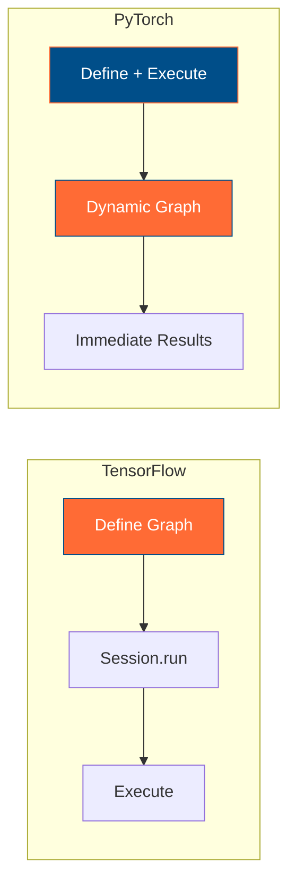

# PyTorch vs TensorFlow: A Practical Guide for TensorFlow Developers

This guide provides a focused comparison between PyTorch and TensorFlow, specifically designed for developers transitioning from TensorFlow to PyTorch for NLP tasks and Hugging Face integration.

## Why PyTorch for NLP?

**PyTorch has become the de facto standard for research and NLP applications**, particularly when working with transformer models and Hugging Face ecosystems. Here's why:

### 🎯 **Key Advantages for NLP**

1. **Dynamic Computation Graphs**: Perfect for variable-length sequences in NLP
2. **Intuitive Debugging**: Python-native debugging experience
3. **Hugging Face Integration**: Seamless compatibility with transformers library
4. **Research-First Design**: Easier experimentation and prototyping
5. **Growing Industry Adoption**: Major tech companies shifting to PyTorch

## Core Differences: TensorFlow vs PyTorch

### **Computation Graphs**



**TensorFlow (Static)**:
```python
# TensorFlow 1.x style (static graph)
import tensorflow as tf

# Define graph
x = tf.placeholder(tf.float32, [None, 784])
W = tf.Variable(tf.random_normal([784, 10]))
y = tf.matmul(x, W)

# Execute in session
with tf.Session() as sess:
    result = sess.run(y, feed_dict={x: data})
```

**PyTorch (Dynamic)**:
```python
# PyTorch - immediate execution
import torch

x = torch.randn(32, 784)
W = torch.randn(784, 10, requires_grad=True)
y = torch.matmul(x, W)  # Executes immediately
print(y.shape)  # Works right away
```

### **Model Definition**

**TensorFlow/Keras**:
```python
import tensorflow as tf

# Sequential API
model = tf.keras.Sequential([
    tf.keras.layers.Dense(128, activation='relu'),
    tf.keras.layers.Dropout(0.2),
    tf.keras.layers.Dense(10, activation='softmax')
])

# Functional API
inputs = tf.keras.Input(shape=(784,))
x = tf.keras.layers.Dense(128, activation='relu')(inputs)
outputs = tf.keras.layers.Dense(10, activation='softmax')(x)
model = tf.keras.Model(inputs=inputs, outputs=outputs)
```

**PyTorch**:
```python
import torch.nn as nn

class NeuralNet(nn.Module):
    def __init__(self):
        super(NeuralNet, self).__init__()
        self.fc1 = nn.Linear(784, 128)
        self.dropout = nn.Dropout(0.2)
        self.fc2 = nn.Linear(128, 10)
        
    def forward(self, x):
        x = torch.relu(self.fc1(x))
        x = self.dropout(x)
        x = self.fc2(x)
        return x

model = NeuralNet()
```

### **Training Loop**

**TensorFlow/Keras (High-level)**:
```python
model.compile(
    optimizer='adam',
    loss='sparse_categorical_crossentropy',
    metrics=['accuracy']
)

model.fit(x_train, y_train, epochs=10, validation_data=(x_val, y_val))
```

**PyTorch (More Explicit)**:
```python
criterion = nn.CrossEntropyLoss()
optimizer = torch.optim.Adam(model.parameters(), lr=0.001)

for epoch in range(10):
    for batch_data, batch_labels in dataloader:
        optimizer.zero_grad()
        outputs = model(batch_data)
        loss = criterion(outputs, batch_labels)
        loss.backward()
        optimizer.step()
```

## NLP-Specific Advantages

### **1. Variable Sequence Length Handling**

**TensorFlow**: Requires padding and masking
```python
# TensorFlow - needs explicit padding
sequences = tf.keras.preprocessing.sequence.pad_sequences(
    tokenized_texts, maxlen=MAX_LEN, padding='post'
)
```

**PyTorch**: Natural dynamic handling
```python
# PyTorch - handles variable lengths naturally
for batch in dataloader:
    # Each batch can have different sequence lengths
    outputs = model(batch)  # No padding required in many cases
```

### **2. Hugging Face Integration**

**PyTorch + Hugging Face** (Primary ecosystem):
```python
from transformers import AutoTokenizer, AutoModel
import torch

# Load pre-trained transformer
tokenizer = AutoTokenizer.from_pretrained('bert-base-uncased')
model = AutoModel.from_pretrained('bert-base-uncased')

# Natural PyTorch workflow
inputs = tokenizer("Hello world", return_tensors="pt")
outputs = model(**inputs)
embeddings = outputs.last_hidden_state
```

**TensorFlow + Hugging Face** (Secondary support):
```python
# Limited TensorFlow support for some models
from transformers import TFAutoModel

model = TFAutoModel.from_pretrained('bert-base-uncased', from_tf=True)
# Fewer models available, less community support
```

### **3. Research and Experimentation**

**PyTorch Benefits**:
- **Immediate feedback**: Debug line by line like regular Python
- **Flexible architecture**: Easy to modify models during training
- **Research papers**: Most NLP papers provide PyTorch implementations
- **Custom operations**: Easier to implement novel architectures

## Practical Migration Tips

### **1. Mindset Shift**

| TensorFlow Thinking | PyTorch Thinking |
|-------------------|------------------|
| Build graph, then execute | Write and execute immediately |
| Sessions and placeholders | Direct tensor operations |
| High-level APIs (Keras) | More explicit control |
| Static shapes | Dynamic shapes |

### **2. Common Patterns Translation**

**Data Loading**:
```python
# TensorFlow
dataset = tf.data.Dataset.from_tensor_slices((x, y))
dataset = dataset.batch(32).shuffle(1000)

# PyTorch
from torch.utils.data import DataLoader, TensorDataset
dataset = TensorDataset(torch.tensor(x), torch.tensor(y))
dataloader = DataLoader(dataset, batch_size=32, shuffle=True)
```

**Model Saving/Loading**:
```python
# TensorFlow
model.save('my_model.h5')
model = tf.keras.models.load_model('my_model.h5')

# PyTorch
torch.save(model.state_dict(), 'model.pth')
model.load_state_dict(torch.load('model.pth'))
```

### **3. Debugging Advantages**

**PyTorch**:
```python
# Set breakpoints anywhere
x = torch.randn(10, 5)
y = model(x)
print(y.shape)  # Works immediately
import pdb; pdb.set_trace()  # Debug naturally
```

**TensorFlow** (traditional):
```python
# Requires session context for debugging
with tf.Session() as sess:
    # Can only inspect in session
    result = sess.run(y, feed_dict={x: data})
```

## Performance Considerations

### **Training Speed**
- **PyTorch**: Slightly faster for research workloads
- **TensorFlow**: Better optimized for production deployment
- **Both**: Similar performance for most NLP tasks

### **Memory Usage**
- **PyTorch**: More memory efficient for dynamic models
- **TensorFlow**: Better memory optimization for static models

### **Deployment**
- **TensorFlow**: Superior production tools (TF Serving, TF Lite)
- **PyTorch**: Growing ecosystem (TorchScript, ONNX)

## Learning Path for TensorFlow Developers

### **Week 1: Fundamentals**
1. **Basic tensor operations**: Replace `tf.Tensor` with `torch.Tensor`
2. **Autograd system**: Understand automatic differentiation
3. **Module system**: Learn `nn.Module` vs Keras layers

### **Week 2: Training**
1. **Training loops**: Write explicit training code
2. **Optimizers**: Similar API to TensorFlow optimizers
3. **Loss functions**: Direct correspondence to TensorFlow losses

### **Week 3: NLP Specifics**
1. **Hugging Face transformers**: Primary reason for PyTorch adoption
2. **Custom datasets**: `torch.utils.data` ecosystem
3. **Variable-length sequences**: Dynamic batching techniques

### **Week 4: Advanced Topics**
1. **Custom layers**: Extending `nn.Module`
2. **Mixed precision**: `torch.cuda.amp`
3. **Distributed training**: `torch.distributed`

## Quick Reference: API Equivalents

| Task | TensorFlow | PyTorch |
|------|------------|---------|
| **Create tensor** | `tf.constant([1, 2, 3])` | `torch.tensor([1, 2, 3])` |
| **Random tensor** | `tf.random.normal([2, 3])` | `torch.randn(2, 3)` |
| **Matrix multiply** | `tf.matmul(a, b)` | `torch.matmul(a, b)` |
| **Reshape** | `tf.reshape(x, [2, -1])` | `x.view(2, -1)` |
| **Softmax** | `tf.nn.softmax(x)` | `torch.softmax(x, dim=-1)` |
| **Cross entropy** | `tf.nn.sparse_softmax_cross_entropy_with_logits` | `nn.CrossEntropyLoss()` |
| **Adam optimizer** | `tf.keras.optimizers.Adam()` | `torch.optim.Adam()` |

## Final Recommendation

**Choose PyTorch if you're focusing on**:
- 🔬 **NLP research and experimentation**
- 🤗 **Hugging Face transformer models**
- 🐍 **Python-first development experience**
- 🔍 **Interactive debugging and development**
- 📚 **Following recent NLP research papers**

**Stick with TensorFlow if you need**:
- 🏭 **Large-scale production deployment**
- 📱 **Mobile and edge device deployment**
- 🔧 **Extensive MLOps infrastructure**
- 👥 **Team already proficient in TensorFlow**

For your journey into NLP and Hugging Face, **PyTorch is the clear choice**. The ecosystem, community, and ease of experimentation make it ideal for learning and implementing modern NLP techniques.

---

*Next Steps: Start with basic PyTorch tutorials, then dive into Hugging Face transformers documentation. The transition will feel natural once you embrace the dynamic computation mindset.*