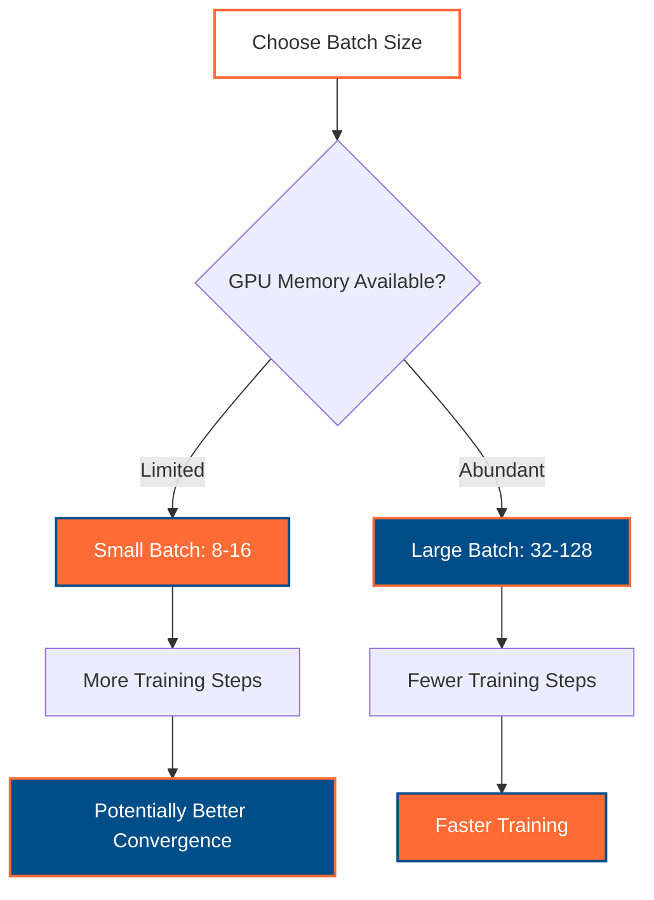
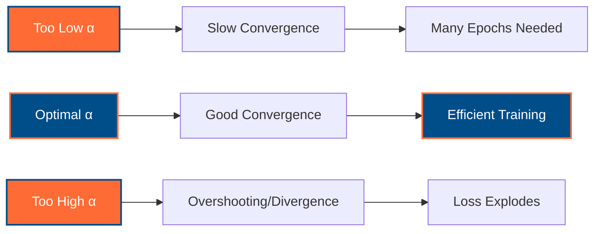
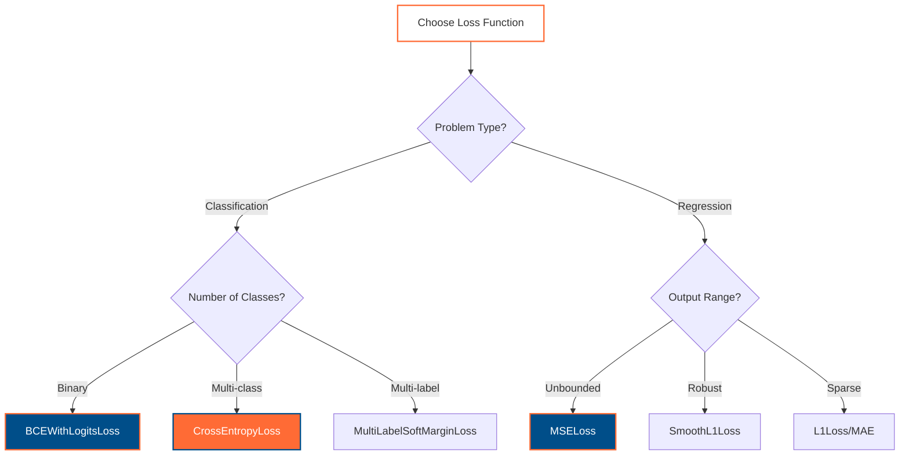
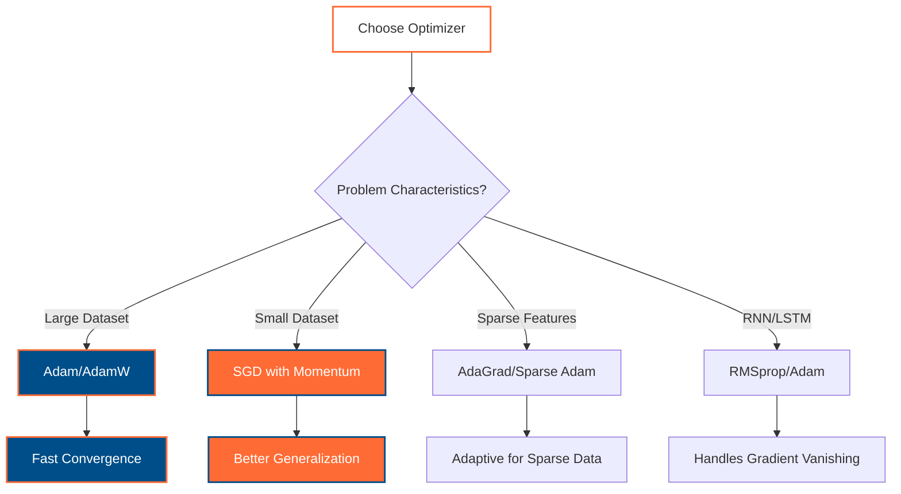
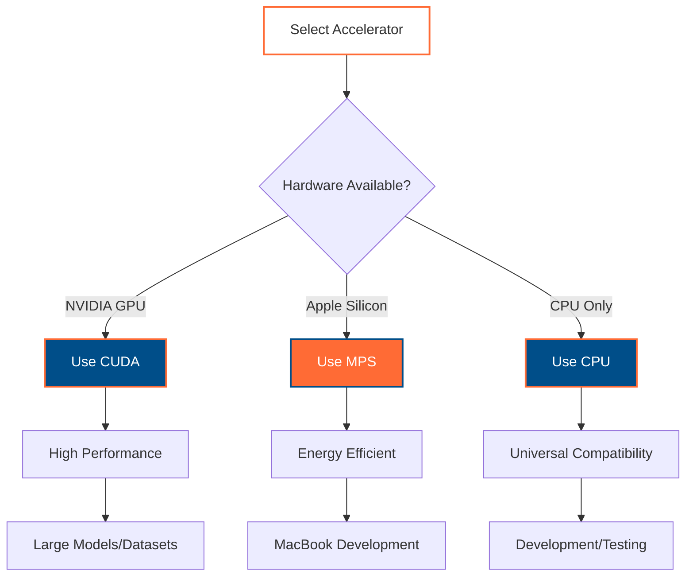

# PyTorch Key Terms: Essential Concepts for Deep Learning

A comprehensive guide to fundamental PyTorch terminology for developers transitioning from TensorFlow to PyTorch, with practical examples using Australian context and English-Vietnamese multilingual support.

## Table of Contents

- [Batch Size](#batch-size)
- [Learning Rate](#learning-rate)
- [Loss Function](#loss-function)
- [Optimizer](#optimizer)
- [Accelerator](#accelerator)

---

## Batch Size

**Batch size** refers to the number of training examples processed simultaneously in a single forward/backward pass through the neural network. It directly impacts memory usage, training speed, and model convergence.

### Mathematical Context

For a dataset with $N$ training examples, using batch size $B$, we have $\lceil N/B \rceil$ batches per epoch:

$$\text{Number of batches} = \left\lceil \frac{N}{B} \right\rceil$$

The gradient for each batch is computed as the average over the batch:

$$\nabla L_{\text{batch}} = \frac{1}{B} \sum_{i=1}^{B} \nabla L_i$$

### PyTorch Implementation

```python
import torch
from torch.utils.data import DataLoader, TensorDataset

# Australian tourism sentiment dataset example
australian_reviews = [
    "The Sydney Opera House tour was absolutely amazing!",
    "Melbourne's coffee scene exceeded all expectations",
    "Bondi Beach is perfect for surfing and relaxation",
    "Perth's beaches are pristine and less crowded"
]

# Convert to tensors (simplified representation)
# In practice, you'd use proper tokenization
X = torch.randn(100, 768)  # 100 samples, 768 features (BERT embeddings)
y = torch.randint(0, 2, (100,))  # Binary sentiment labels

# Create dataset and dataloader with different batch sizes
dataset = TensorDataset(X, y)

# Small batch size - more frequent updates, potentially better convergence
small_batch_loader = DataLoader(dataset, batch_size=8, shuffle=True)

# Large batch size - faster training, more stable gradients
large_batch_loader = DataLoader(dataset, batch_size=32, shuffle=True)

print(f"Small batches: {len(small_batch_loader)} batches of size 8")
print(f"Large batches: {len(large_batch_loader)} batches of size 32")
```

### TensorFlow vs PyTorch Comparison

| Aspect | TensorFlow | PyTorch |
|--------|------------|---------|
| **Batch Definition** | `tf.data.Dataset.batch(batch_size)` | `DataLoader(dataset, batch_size=batch_size)` |
| **Dynamic Batching** | Limited support | Natural dynamic batching |
| **Memory Management** | Automatic | Manual with `DataLoader` |

### Best Practices



---

## Learning Rate

**Learning rate** ($\alpha$ or $\eta$) controls how much model parameters are adjusted during training. It's arguably the most important hyperparameter in deep learning, determining the step size for gradient descent optimization.

### Mathematical Foundation

In gradient descent, parameters are updated using:

$$\theta_{t+1} = \theta_t - \alpha \nabla L(\theta_t)$$

Where:
- $\theta_t$ are model parameters at time step $t$
- $\alpha$ is the learning rate
- $\nabla L(\theta_t)$ is the gradient of the loss function

### Learning Rate Impact



### PyTorch Implementation

```python
import torch
import torch.nn as nn
import torch.optim as optim

# Australian city classifier model
class AustralianCityClassifier(nn.Module):
    def __init__(self, vocab_size=10000, embed_dim=300, num_cities=8):
        super().__init__()
        self.embedding = nn.Embedding(vocab_size, embed_dim)
        self.lstm = nn.LSTM(embed_dim, 128, batch_first=True)
        self.classifier = nn.Linear(128, num_cities)
        
        # Australian cities: Sydney, Melbourne, Brisbane, Perth, Adelaide, Darwin, Hobart, Canberra
        self.city_names = ["Sydney", "Melbourne", "Brisbane", "Perth", 
                          "Adelaide", "Darwin", "Hobart", "Canberra"]
    
    def forward(self, x):
        embedded = self.embedding(x)
        lstm_out, (hidden, _) = self.lstm(embedded)
        return self.classifier(hidden[-1])

model = AustralianCityClassifier()

# Different learning rate strategies
optimizers = {
    'conservative': optim.Adam(model.parameters(), lr=1e-4),  # Safe, slow
    'standard': optim.Adam(model.parameters(), lr=1e-3),     # Common choice
    'aggressive': optim.Adam(model.parameters(), lr=1e-2),   # Fast, risky
}

# Learning rate scheduling
scheduler = optim.lr_scheduler.StepLR(optimizers['standard'], step_size=10, gamma=0.1)

# Adaptive learning rates
adaptive_optimizer = optim.AdamW(model.parameters(), lr=2e-5, weight_decay=0.01)

print("Learning rate examples:")
for name, opt in optimizers.items():
    print(f"{name.capitalize()}: {opt.param_groups[0]['lr']}")
```

### TensorFlow vs PyTorch Comparison

```python
# TensorFlow approach
"""
model.compile(
    optimizer=tf.keras.optimizers.Adam(learning_rate=0.001),
    loss='sparse_categorical_crossentropy'
)
"""

# PyTorch equivalent - explicit optimizer management
criterion = nn.CrossEntropyLoss()
optimizer = optim.Adam(model.parameters(), lr=0.001)

# PyTorch advantage: Easy learning rate scheduling
scheduler = optim.lr_scheduler.ReduceLROnPlateau(optimizer, patience=5)
```

---

## Loss Function

**Loss function** (also called cost function) measures the difference between predicted outputs and actual targets. It provides the optimization objective that guides the learning process through backpropagation.

### Mathematical Formulation

For a dataset with $N$ samples, the loss function $L$ is typically:

$$L(\theta) = \frac{1}{N} \sum_{i=1}^{N} \ell(f(x_i; \theta), y_i)$$

Where:
- $f(x_i; \theta)$ is the model prediction for input $x_i$
- $y_i$ is the true label
- $\ell(\cdot, \cdot)$ is the individual loss function

### Common Loss Functions

#### Classification: Cross-Entropy Loss

For multi-class classification (e.g., Australian city prediction):

$$L_{CE} = -\sum_{i=1}^{N} \sum_{c=1}^{C} y_{i,c} \log(\hat{y}_{i,c})$$

#### Regression: Mean Squared Error

For continuous predictions (e.g., Sydney house prices):

$$L_{MSE} = \frac{1}{N} \sum_{i=1}^{N} (y_i - \hat{y}_i)^2$$

### PyTorch Implementation

```python
import torch
import torch.nn as nn
import torch.nn.functional as F

# Australian tourism rating prediction example
class TourismRatingPredictor(nn.Module):
    def __init__(self, vocab_size=5000, embed_dim=200):
        super().__init__()
        self.embedding = nn.Embedding(vocab_size, embed_dim)
        self.lstm = nn.LSTM(embed_dim, 100, batch_first=True)
        self.rating_head = nn.Linear(100, 1)  # Regression: 1-5 star rating
        self.sentiment_head = nn.Linear(100, 3)  # Classification: positive/neutral/negative
    
    def forward(self, x):
        embedded = self.embedding(x)
        lstm_out, (hidden, _) = self.lstm(embedded)
        last_hidden = hidden[-1]
        
        rating = self.rating_head(last_hidden)
        sentiment = self.sentiment_head(last_hidden)
        return rating, sentiment

model = TourismRatingPredictor()

# Different loss functions for different tasks
loss_functions = {
    # Regression loss for star ratings
    'rating_loss': nn.MSELoss(),
    
    # Classification loss for sentiment
    'sentiment_loss': nn.CrossEntropyLoss(),
    
    # Alternative losses
    'mae_loss': nn.L1Loss(),  # Mean Absolute Error
    'smooth_l1': nn.SmoothL1Loss(),  # Robust regression
    'bce_loss': nn.BCEWithLogitsLoss(),  # Binary classification
}

# Example usage with Australian tourism data
sample_reviews = [
    "The Sydney Harbour Bridge climb was breathtaking!",  # 5 stars, positive
    "Melbourne's weather was quite disappointing",         # 2 stars, negative  
    "Brisbane city tour was decent, nothing special",      # 3 stars, neutral
]

# Simulated model outputs
predicted_ratings = torch.tensor([[4.8], [2.1], [3.2]])
true_ratings = torch.tensor([[5.0], [2.0], [3.0]])

predicted_sentiments = torch.randn(3, 3)  # 3 samples, 3 classes
true_sentiments = torch.tensor([2, 0, 1])  # positive=2, negative=0, neutral=1

# Calculate losses
rating_loss = loss_functions['rating_loss'](predicted_ratings, true_ratings)
sentiment_loss = loss_functions['sentiment_loss'](predicted_sentiments, true_sentiments)

print(f"Rating MSE Loss: {rating_loss.item():.4f}")
print(f"Sentiment CE Loss: {sentiment_loss.item():.4f}")

# Combined loss (multi-task learning)
total_loss = rating_loss + 0.5 * sentiment_loss
print(f"Combined Loss: {total_loss.item():.4f}")
```

### Loss Function Selection Guide



### TensorFlow vs PyTorch Comparison

| Task | TensorFlow | PyTorch |
|------|------------|---------|
| **Multi-class Classification** | `tf.keras.losses.SparseCategoricalCrossentropy()` | `nn.CrossEntropyLoss()` |
| **Binary Classification** | `tf.keras.losses.BinaryCrossentropy()` | `nn.BCEWithLogitsLoss()` |
| **Regression** | `tf.keras.losses.MeanSquaredError()` | `nn.MSELoss()` |
| **Custom Loss** | `@tf.function` decorator | Direct Python functions |

---

## Optimizer

**Optimizer** implements the algorithm that updates model parameters based on computed gradients. It determines how the model learns from the loss function, controlling both the direction and magnitude of parameter updates.

### Gradient Descent Variants

#### Stochastic Gradient Descent (SGD)

Basic parameter update:

$$\theta_{t+1} = \theta_t - \alpha \nabla L(\theta_t)$$

#### Adam (Adaptive Moment Estimation)

Combines momentum and adaptive learning rates:

$$m_t = \beta_1 m_{t-1} + (1-\beta_1) \nabla L(\theta_t)$$
$$v_t = \beta_2 v_{t-1} + (1-\beta_2) (\nabla L(\theta_t))^2$$
$$\theta_{t+1} = \theta_t - \frac{\alpha}{\sqrt{v_t} + \epsilon} m_t$$

### PyTorch Optimizer Ecosystem

```python
import torch
import torch.nn as nn
import torch.optim as optim
from torch.optim.lr_scheduler import StepLR, ReduceLROnPlateau

# Australian restaurant review classifier
class RestaurantReviewClassifier(nn.Module):
    def __init__(self, vocab_size=8000, embed_dim=256):
        super().__init__()
        self.embedding = nn.Embedding(vocab_size, embed_dim)
        self.lstm = nn.LSTM(embed_dim, 128, batch_first=True, dropout=0.3)
        self.classifier = nn.Linear(128, 4)  # 4 cuisines: Asian, European, Australian, Fusion
        
        # Australian cuisine categories
        self.cuisines = ["Asian", "European", "Australian", "Fusion"]
    
    def forward(self, x):
        embedded = self.embedding(x)
        lstm_out, (hidden, _) = self.lstm(embedded)
        return self.classifier(hidden[-1])

model = RestaurantReviewClassifier()

# Comprehensive optimizer comparison
optimizers = {
    # Basic SGD - simple but effective
    'sgd': optim.SGD(model.parameters(), lr=0.01, momentum=0.9, weight_decay=1e-4),
    
    # Adam - adaptive learning rates, good default choice
    'adam': optim.Adam(model.parameters(), lr=0.001, betas=(0.9, 0.999), weight_decay=1e-4),
    
    # AdamW - Adam with improved weight decay
    'adamw': optim.AdamW(model.parameters(), lr=0.001, weight_decay=0.01),
    
    # RMSprop - good for RNNs
    'rmsprop': optim.RMSprop(model.parameters(), lr=0.001, alpha=0.99, eps=1e-8),
    
    # AdaGrad - adaptive learning rates for sparse features
    'adagrad': optim.Adagrad(model.parameters(), lr=0.01, eps=1e-10),
}

# Learning rate scheduling
scheduler_examples = {
    'step': StepLR(optimizers['adam'], step_size=10, gamma=0.5),
    'plateau': ReduceLROnPlateau(optimizers['adam'], mode='min', patience=5),
    'cosine': optim.lr_scheduler.CosineAnnealingLR(optimizers['adam'], T_max=50),
}

# Training loop example with optimizer
def train_restaurant_classifier(model, optimizer, criterion, dataloader, epochs=10):
    """
    Train the restaurant review classifier.
    
    Example reviews:
    - "The Sydney fish market has the freshest seafood" -> Australian cuisine
    - "Pho in Melbourne's Chinatown is authentic and delicious" -> Asian cuisine  
    - "Italian pasta in Brisbane's Italian quarter" -> European cuisine
    """
    model.train()
    
    for epoch in range(epochs):
        total_loss = 0
        for batch_idx, (data, target) in enumerate(dataloader):
            # Essential optimizer steps
            optimizer.zero_grad()  # Clear gradients
            
            output = model(data)
            loss = criterion(output, target)
            
            loss.backward()  # Compute gradients
            optimizer.step()  # Update parameters
            
            total_loss += loss.item()
            
            # Optional: gradient clipping for stability
            torch.nn.utils.clip_grad_norm_(model.parameters(), max_norm=1.0)
        
        avg_loss = total_loss / len(dataloader)
        print(f"Epoch {epoch+1}: Loss = {avg_loss:.4f}")
        
        # Update learning rate if using scheduler
        if hasattr(optimizer, '_scheduler'):
            optimizer._scheduler.step()

# Example: Australian cuisine classification with Vietnamese translations
sample_reviews = {
    'english': [
        "Sydney's meat pies are a true Australian classic",
        "Melbourne's Vietnamese pho is incredibly authentic", 
        "Brisbane's Italian restaurants serve excellent pasta",
        "Perth's fusion cuisine blends Asian and Australian flavors"
    ],
    'vietnamese': [
        "Bánh thịt của Sydney là món ăn Úc truyền thống",
        "Phở Việt Nam ở Melbourne rất chính thống",
        "Nhà hàng Ý ở Brisbane phục vụ mì ống tuyệt vời", 
        "Ẩm thực fusion ở Perth kết hợp hương vị Á-Úc"
    ]
}

print("Optimizer configurations:")
for name, opt in optimizers.items():
    print(f"{name.upper()}: lr={opt.param_groups[0]['lr']}, "
          f"type={type(opt).__name__}")
```

### Optimizer Selection Guide



### TensorFlow vs PyTorch Comparison

| Feature | TensorFlow | PyTorch |
|---------|------------|---------|
| **Basic Usage** | `model.compile(optimizer='adam')` | `optim.Adam(model.parameters())` |
| **Learning Rate Scheduling** | `tf.keras.callbacks.LearningRateScheduler` | `torch.optim.lr_scheduler.*` |
| **Gradient Clipping** | `tf.clip_by_norm()` | `torch.nn.utils.clip_grad_norm_()` |
| **Custom Optimizers** | Inherit from `tf.keras.optimizers.Optimizer` | Inherit from `torch.optim.Optimizer` |

---

## Accelerator

**Accelerator** refers to specialized hardware that speeds up deep learning computations. Common accelerators include GPUs (CUDA), Apple Silicon (MPS), and TPUs. PyTorch provides seamless device management for efficient training and inference.

### Hardware Acceleration Types

#### CUDA (NVIDIA GPUs)
- **Parallel Processing**: Thousands of cores for matrix operations
- **Memory**: High-bandwidth GPU memory (VRAM)
- **Compute Capability**: Different generations support different features

#### MPS (Apple Metal Performance Shaders)
- **Apple Silicon**: M1, M2, M3 chips with unified memory
- **Efficiency**: Optimized for Apple's neural engine
- **Cross-Platform**: Works on macOS devices

### PyTorch Device Management

```python
import torch
import torch.nn as nn

# Comprehensive device detection and management
def detect_accelerators():
    """
    Detect available accelerators for PyTorch training.
    Returns device information for optimal training setup.
    """
    devices = {}
    
    # Check CUDA availability (NVIDIA GPUs)
    if torch.cuda.is_available():
        devices['cuda'] = {
            'available': True,
            'device_count': torch.cuda.device_count(),
            'current_device': torch.cuda.current_device(),
            'device_name': torch.cuda.get_device_name(0),
            'memory_allocated': torch.cuda.memory_allocated(0),
            'memory_cached': torch.cuda.memory_reserved(0),
        }
    else:
        devices['cuda'] = {'available': False}
    
    # Check MPS availability (Apple Silicon)
    if hasattr(torch.backends, 'mps') and torch.backends.mps.is_available():
        devices['mps'] = {
            'available': True,
            'device_name': 'Apple Silicon GPU'
        }
    else:
        devices['mps'] = {'available': False}
    
    # CPU is always available
    devices['cpu'] = {
        'available': True,
        'device_name': 'CPU',
        'logical_cores': torch.get_num_threads()
    }
    
    return devices

# Device selection strategy
def get_optimal_device():
    """Select the best available device for training."""
    if torch.cuda.is_available():
        return torch.device('cuda')
    elif hasattr(torch.backends, 'mps') and torch.backends.mps.is_available():
        return torch.device('mps')
    else:
        return torch.device('cpu')

# Australian sentiment analyzer with device optimization
class AustralianSentimentAnalyzer(nn.Module):
    def __init__(self, vocab_size=10000, embed_dim=300, hidden_dim=256):
        super().__init__()
        
        # Model layers
        self.embedding = nn.Embedding(vocab_size, embed_dim)
        self.lstm = nn.LSTM(embed_dim, hidden_dim, batch_first=True, dropout=0.2)
        self.attention = nn.MultiheadAttention(hidden_dim, num_heads=8, dropout=0.1)
        self.classifier = nn.Linear(hidden_dim, 3)  # positive, neutral, negative
        
        # Australian sentiment labels
        self.sentiment_labels = ["negative", "neutral", "positive"]
    
    def forward(self, x):
        # Input: (batch_size, sequence_length)
        embedded = self.embedding(x)  # (batch_size, seq_len, embed_dim)
        
        lstm_out, _ = self.lstm(embedded)  # (batch_size, seq_len, hidden_dim)
        
        # Apply attention
        attn_out, _ = self.attention(lstm_out, lstm_out, lstm_out)
        
        # Use mean pooling for final representation
        pooled = torch.mean(attn_out, dim=1)  # (batch_size, hidden_dim)
        
        return self.classifier(pooled)

# Device-optimized training setup
device = get_optimal_device()
print(f"Training on device: {device}")

model = AustralianSentimentAnalyzer()
model = model.to(device)  # Move model to accelerator

# Sample Australian tourism reviews in English and Vietnamese
sample_data = {
    'english_reviews': [
        "Sydney Opera House concerts are absolutely magical",      # positive
        "Melbourne weather can be quite unpredictable",           # neutral  
        "Brisbane airport delays ruined our vacation",            # negative
        "Perth beaches are pristine and beautiful",              # positive
    ],
    'vietnamese_reviews': [
        "Buổi hòa nhạc ở Nhà hát Opera Sydney thật kỳ diệu",     # positive
        "Thời tiết Melbourne khá khó đoán",                       # neutral
        "Sự chậm trễ ở sân bay Brisbane đã hủy hoại kỳ nghỉ",    # negative  
        "Bãi biển Perth rất nguyên sơ và đẹp",                   # positive
    ]
}

# Efficient device-aware training function
def train_with_accelerator(model, dataloader, epochs=5):
    """
    Train model with automatic device management and optimization.
    """
    model.train()
    criterion = nn.CrossEntropyLoss()
    optimizer = torch.optim.AdamW(model.parameters(), lr=2e-5)
    
    # Enable mixed precision for CUDA devices
    scaler = torch.cuda.amp.GradScaler() if device.type == 'cuda' else None
    
    print(f"Training on {device} for {epochs} epochs...")
    
    for epoch in range(epochs):
        total_loss = 0
        
        for batch_idx, (data, labels) in enumerate(dataloader):
            # Move data to accelerator
            data = data.to(device, non_blocking=True)
            labels = labels.to(device, non_blocking=True)
            
            optimizer.zero_grad()
            
            # Use automatic mixed precision for CUDA
            if scaler:
                with torch.cuda.amp.autocast():
                    outputs = model(data)
                    loss = criterion(outputs, labels)
                
                scaler.scale(loss).backward()
                scaler.step(optimizer)
                scaler.update()
            else:
                outputs = model(data)
                loss = criterion(outputs, labels)
                loss.backward()
                optimizer.step()
            
            total_loss += loss.item()
            
            # Memory management for CUDA
            if device.type == 'cuda' and batch_idx % 100 == 0:
                torch.cuda.empty_cache()
        
        avg_loss = total_loss / len(dataloader)
        print(f"Epoch {epoch+1}: Loss = {avg_loss:.4f}")
        
        # Memory usage monitoring
        if device.type == 'cuda':
            memory_used = torch.cuda.memory_allocated(device) / 1024**3
            print(f"GPU Memory Used: {memory_used:.2f} GB")

# Performance comparison across devices
def benchmark_devices():
    """Compare training speed across different accelerators."""
    
    # Create dummy data for benchmarking
    batch_size = 32
    seq_length = 128
    vocab_size = 10000
    
    dummy_data = torch.randint(0, vocab_size, (batch_size, seq_length))
    dummy_labels = torch.randint(0, 3, (batch_size,))
    
    devices_to_test = []
    if torch.cuda.is_available():
        devices_to_test.append('cuda')
    if hasattr(torch.backends, 'mps') and torch.backends.mps.is_available():
        devices_to_test.append('mps')
    devices_to_test.append('cpu')
    
    print("Device Performance Benchmark:")
    print("=" * 50)
    
    for device_name in devices_to_test:
        device = torch.device(device_name)
        model = AustralianSentimentAnalyzer().to(device)
        data = dummy_data.to(device)
        labels = dummy_labels.to(device)
        
        # Warm up
        for _ in range(10):
            output = model(data)
        
        # Benchmark
        import time
        start_time = time.time()
        
        for _ in range(100):
            output = model(data)
            if device.type == 'cuda':
                torch.cuda.synchronize()
        
        end_time = time.time()
        avg_time = (end_time - start_time) / 100
        
        print(f"{device_name.upper()}: {avg_time*1000:.2f} ms per batch")

# Run device detection and benchmarking
accelerator_info = detect_accelerators()
print("Available Accelerators:")
for device_type, info in accelerator_info.items():
    if info['available']:
        print(f"✅ {device_type.upper()}: {info.get('device_name', 'Available')}")
    else:
        print(f"❌ {device_type.upper()}: Not available")

print(f"\nSelected device: {device}")
```

### Accelerator Selection Strategy



### TensorFlow vs PyTorch Device Management

| Feature | TensorFlow | PyTorch |
|---------|------------|---------|
| **GPU Detection** | `tf.config.list_physical_devices('GPU')` | `torch.cuda.is_available()` |
| **Device Placement** | `with tf.device('/GPU:0'):` | `tensor.to('cuda')` |
| **Memory Growth** | `tf.config.experimental.set_memory_growth()` | `torch.cuda.empty_cache()` |
| **Mixed Precision** | `tf.keras.mixed_precision.Policy()` | `torch.cuda.amp.autocast()` |

### Performance Optimization Tips

1. **Memory Management**: Use `torch.cuda.empty_cache()` to free unused memory
2. **Mixed Precision**: Enable `autocast()` for CUDA to use FP16 computations
3. **Data Loading**: Use `pin_memory=True` and `non_blocking=True` for faster transfers
4. **Batch Size**: Increase batch size to fully utilize accelerator capabilities
5. **Model Parallelism**: Distribute large models across multiple GPUs

---

## Summary

These five key terms form the foundation of PyTorch deep learning:

- **Batch Size**: Controls memory usage and training dynamics
- **Learning Rate**: Determines optimization step size and convergence
- **Loss Function**: Provides the optimization objective
- **Optimizer**: Implements the parameter update algorithm  
- **Accelerator**: Enables hardware acceleration for faster training

Understanding these concepts is essential for effective PyTorch development, especially when transitioning from TensorFlow to PyTorch for NLP applications with Hugging Face transformers.

For practical applications with Australian context and English-Vietnamese multilingual support, these terms work together to create efficient training pipelines for tasks like sentiment analysis, text classification, and neural machine translation.