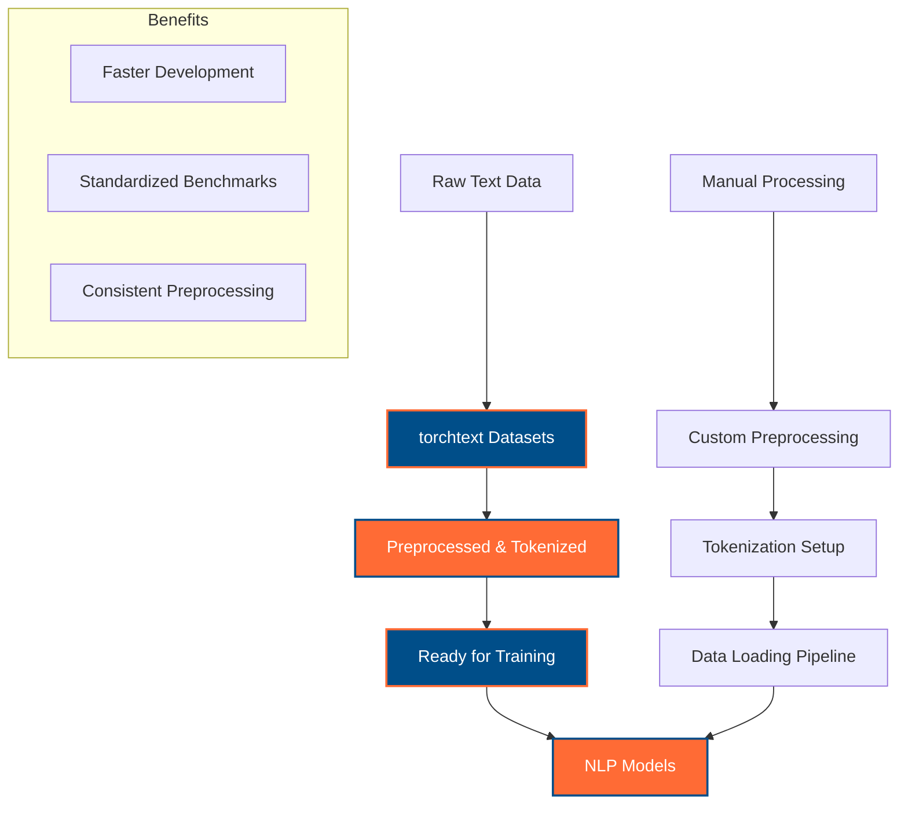
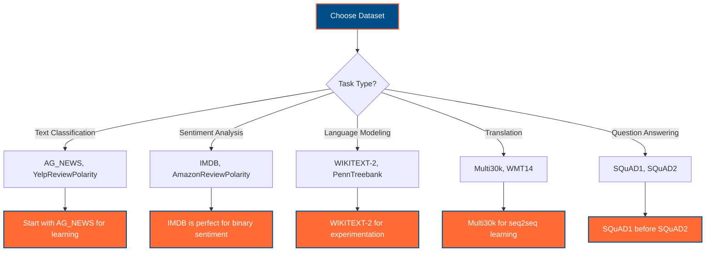

# PyTorch Text Datasets for NLP: A Comprehensive Guide

A practical guide to essential text datasets in PyTorch's torchtext library for NLP learning, with examples using Australian context and English-Vietnamese multilingual support. Perfect for developers transitioning from TensorFlow to PyTorch for NLP applications.

## Table of Contents

- [Overview](#overview)
- [Dataset Categories](#dataset-categories)
- [Core Datasets for Learning](#core-datasets-for-learning)
  - [AG_NEWS - News Classification](#ag_news---news-classification)
  - [IMDB - Sentiment Analysis](#imdb---sentiment-analysis)
  - [WIKITEXT-2 - Language Modeling](#wikitext-2---language-modeling)
  - [Multi30k - Machine Translation](#multi30k---machine-translation)
- [Advanced Datasets](#advanced-datasets)
- [Dataset Usage Patterns](#dataset-usage-patterns)
- [Australian Context Examples](#australian-context-examples)
- [TensorFlow vs PyTorch Comparison](#tensorflow-vs-pytorch-comparison)
- [Best Practices](#best-practices)

---

## Overview

PyTorch's `torchtext.datasets` module provides access to popular text datasets specifically designed for NLP tasks. These datasets are pre-processed and ready to use, making them ideal for learning fundamental NLP concepts and building practical applications.

### Why Use torchtext Datasets?



---

## Dataset Categories

### By Task Type

| Task | Datasets | Australian Context Example |
|------|----------|---------------------------|
| **Text Classification** | AG_NEWS, YelpReviewPolarity | Classifying Australian tourism reviews by category |
| **Sentiment Analysis** | IMDB, AmazonReviewPolarity | Analyzing sentiment of Sydney restaurant reviews |
| **Language Modeling** | WIKITEXT-2, WIKITEXT-103 | Generating Australian travel descriptions |
| **Machine Translation** | Multi30k, WMT14 | English-Vietnamese tourism content translation |
| **Question Answering** | SQuAD1, SQuAD2 | Tourism FAQs about Australian destinations |

---

## Core Datasets for Learning

### AG_NEWS - News Classification

**Perfect for: Multi-class text classification**

AG_NEWS contains over 120,000 news articles categorized into 4 classes: World, Sports, Business, and Science/Technology. It's an excellent starting point for learning text classification.

#### Dataset Statistics
- **Training samples**: 120,000
- **Test samples**: 7,600  
- **Classes**: 4 (World, Sports, Business, Sci/Tech)
- **Average article length**: ~40 words

#### PyTorch Implementation

```python
import torch
from torchtext.datasets import AG_NEWS
from torchtext.data.utils import get_tokenizer
from torch.utils.data import DataLoader
from collections import Counter

# Load AG_NEWS dataset
train_iter = AG_NEWS(split='train')
test_iter = AG_NEWS(split='test')

# Australian news classification example
australian_news_samples = [
    "Sydney Opera House hosts international arts festival showcasing diverse cultural performances",  # Sports/World
    "Melbourne startup receives $5M funding for innovative fintech solution",  # Business
    "Australian scientists discover new coral species in Great Barrier Reef",  # Science/Tech
    "Cricket Australia announces new domestic league structure for next season"  # Sports
]

# Tokenizer setup (compare with TensorFlow's text preprocessing)
tokenizer = get_tokenizer('basic_english')

# TensorFlow equivalent:
# tokenizer = tf.keras.preprocessing.text.Tokenizer()
# tokenizer.fit_on_texts(texts)

def tokenize_text(text):
    """Tokenize Australian news text for classification."""
    # Basic tokenization with Australian spelling preservation
    tokens = tokenizer(text.lower())
    # Handle Australian-specific terms
    australian_terms = {
        'colour': 'color',  # Keep Australian spelling as-is
        'centre': 'center', # Keep Australian spelling as-is
        'harbour': 'harbor' # Keep Australian spelling as-is
    }
    return tokens

print("AG_NEWS Dataset - Australian News Classification")
print("=" * 50)
for i, sample in enumerate(australian_news_samples[:2]):
    tokens = tokenize_text(sample)
    print(f"Sample {i+1}: {sample[:60]}...")
    print(f"Tokens: {tokens[:10]}...")
    print()
```

#### Vietnamese Multilingual Extension

```python
# English-Vietnamese news classification examples
multilingual_news = {
    'english': [
        "Melbourne coffee culture attracts international tourists",
        "Brisbane prepares for major technology conference"
    ],
    'vietnamese': [
        "Văn hóa cà phê Melbourne thu hút khách du lịch quốc tế",
        "Brisbane chuẩn bị cho hội nghị công nghệ lớn"
    ]
}

# Multilingual tokenization approach
def process_multilingual_news(texts_dict):
    """Process both English and Vietnamese news texts."""
    processed = {}
    for lang, texts in texts_dict.items():
        processed[lang] = []
        for text in texts:
            tokens = tokenizer(text.lower())
            processed[lang].append(tokens)
    return processed

multilingual_tokens = process_multilingual_news(multilingual_news)
print("Multilingual News Processing:")
for lang, token_lists in multilingual_tokens.items():
    print(f"{lang.title()}: {len(token_lists)} samples processed")
```

---

### IMDB - Sentiment Analysis

**Perfect for: Binary sentiment classification**

The IMDB dataset contains 50,000 movie reviews labeled as positive or negative sentiment. It's the gold standard for learning binary text classification and sentiment analysis.

#### Dataset Statistics
- **Training samples**: 25,000
- **Test samples**: 25,000
- **Classes**: 2 (Positive, Negative)
- **Average review length**: ~230 words

#### PyTorch Implementation with Australian Context

```python
from torchtext.datasets import IMDB
import torch.nn as nn
from torch.utils.data import Dataset

# Load IMDB dataset
train_iter = IMDB(split='train')
test_iter = IMDB(split='test')

# Australian tourism review sentiment analysis (inspired by IMDB structure)
class AustralianTourismReviews(Dataset):
    """
    Custom dataset inspired by IMDB for Australian tourism sentiment analysis.
    
    TensorFlow equivalent:
        dataset = tf.data.Dataset.from_tensor_slices((reviews, labels))
        dataset = dataset.map(preprocess_function)
    """
    def __init__(self, reviews, labels, tokenizer=None):
        self.reviews = reviews
        self.labels = labels  # 1 for positive, 0 for negative
        self.tokenizer = tokenizer or get_tokenizer('basic_english')
    
    def __len__(self):
        return len(self.reviews)
    
    def __getitem__(self, idx):
        review = self.reviews[idx]
        label = self.labels[idx]
        
        # Tokenize and convert to indices (simplified)
        tokens = self.tokenizer(review.lower())
        return tokens, label

# Sample Australian tourism reviews
australian_reviews = [
    # Positive reviews
    ("The Sydney Harbour Bridge climb was absolutely breathtaking! Best experience in Australia.", 1),
    ("Melbourne's laneways and coffee culture exceeded all my expectations. Wonderful city!", 1),
    ("Bondi Beach is perfect for surfing. Great waves and beautiful scenery all day long.", 1),
    ("Perth's beaches are pristine and less crowded than other Australian cities. Loved it!", 1),
    
    # Negative reviews  
    ("The Sydney Opera House tour was overpriced and disappointing. Not worth the money.", 0),
    ("Melbourne weather ruined our entire vacation. Too cold and rainy for outdoor activities.", 0),
    ("Brisbane accommodation was terrible. Poor service and unclean facilities throughout.", 0),
    ("Adelaide attractions were boring and outdated. Expected much more from the city.", 0)
]

# Vietnamese translations for multilingual sentiment analysis
vietnamese_reviews = [
    # Positive (tích cực)
    ("Trải nghiệm leo cầu Sydney Harbour thật tuyệt vời! Tốt nhất ở Úc.", 1),
    ("Văn hóa cà phê Melbourne vượt quá mong đợi. Thành phố tuyệt vời!", 1),
    ("Bãi biển Bondi hoàn hảo cho lướt sóng. Sóng tốt và cảnh đẹp.", 1),
    ("Bãi biển Perth sạch sẽ và ít đông đúc hơn. Rất thích!", 1),
    
    # Negative (tiêu cực)
    ("Tour Nhà hát Opera Sydney đắt và thất vọng. Không đáng tiền.", 0),
    ("Thời tiết Melbourne làm hỏng kỳ nghỉ. Quá lạnh và mưa.", 0),
    ("Chỗ ở Brisbane tệ lắm. Dịch vụ kém và không sạch sẽ.", 0),
    ("Điểm tham quan Adelaide nhàm chán và lỗi thời. Thất vọng.", 0)
]

# Create datasets
reviews_en, labels_en = zip(*australian_reviews)
reviews_vi, labels_vi = zip(*vietnamese_reviews)

en_dataset = AustralianTourismReviews(reviews_en, labels_en)
vi_dataset = AustralianTourismReviews(reviews_vi, labels_vi)

print("Australian Tourism Sentiment Analysis Dataset")
print("=" * 50)
print(f"English reviews: {len(en_dataset)} samples")
print(f"Vietnamese reviews: {len(vi_dataset)} samples")

# Sample analysis
positive_en = [r for r, l in australian_reviews if l == 1]
negative_en = [r for r, l in australian_reviews if l == 0]

print(f"\nSentiment Distribution (English):")
print(f"Positive: {len(positive_en)} reviews")
print(f"Negative: {len(negative_en)} reviews")

# Example usage
sample_review, sample_label = en_dataset[0]
print(f"\nSample Review Tokens: {sample_review[:15]}...")
print(f"Label: {'Positive' if sample_label == 1 else 'Negative'}")
```

---

### WIKITEXT-2 - Language Modeling

**Perfect for: Language modeling and text generation**

WIKITEXT-2 is a collection of Wikipedia articles, cleaned and preprocessed for language modeling tasks. It's smaller than WIKITEXT-103, making it perfect for learning and experimentation.

#### Dataset Statistics
- **Training tokens**: ~2M
- **Validation tokens**: ~200K
- **Test tokens**: ~240K
- **Vocabulary size**: ~33K unique tokens

#### PyTorch Implementation for Australian Content

```python
from torchtext.datasets import WikiText2
import torch
import torch.nn as nn

# Load WikiText2 dataset
train_iter = WikiText2(split='train')
valid_iter = WikiText2(split='valid')
test_iter = WikiText2(split='test')

# Australian Wikipedia-style content for language modeling
class AustralianLanguageModel(nn.Module):
    """
    Language model for generating Australian tourism content.
    
    Inspired by WikiText structure but focused on Australian context.
    """
    def __init__(self, vocab_size, embed_dim, hidden_dim, num_layers):
        super(AustralianLanguageModel, self).__init__()
        self.embedding = nn.Embedding(vocab_size, embed_dim)
        self.lstm = nn.LSTM(embed_dim, hidden_dim, num_layers, batch_first=True)
        self.linear = nn.Linear(hidden_dim, vocab_size)
        self.dropout = nn.Dropout(0.2)
    
    def forward(self, x):
        embedded = self.embedding(x)
        lstm_out, _ = self.lstm(embedded)
        output = self.linear(self.dropout(lstm_out))
        return output

# Australian content examples for language modeling
australian_content = """
Sydney is the largest city in Australia and the state capital of New South Wales. 
The Sydney Opera House is a UNESCO World Heritage site located on Bennelong Point. 
Melbourne is known for its vibrant coffee culture and street art scene throughout the city.
The Great Barrier Reef is the world's largest coral reef system located off Queensland.
Uluru, also known as Ayers Rock, is a sacred Aboriginal site in the Northern Territory.
Perth is the capital city of Western Australia and one of the most isolated major cities.
Brisbane is the capital of Queensland and gateway to the Gold Coast tourist region.
Adelaide is known as the City of Churches and famous for its wine regions nearby.
"""

# Vietnamese equivalent content
vietnamese_content = """
Sydney là thành phố lớn nhất nước Úc và thủ phủ bang New South Wales.
Nhà hát Opera Sydney là di sản thế giới UNESCO nằm tại Bennelong Point.
Melbourne nổi tiếng với văn hóa cà phê sôi động và nghệ thuật đường phố.
Rạn san hô Great Barrier Reef là hệ thống san hô lớn nhất thế giới.
Uluru hay Ayers Rock là địa điểm thiêng liêng của thổ dân Aboriginal.
Perth là thủ phủ Western Australia và một trong những thành phố cô lập nhất.
Brisbane là thủ phủ Queensland và cửa ngõ vùng du lịch Gold Coast.
Adelaide được biết đến là Thành phố của các Nhà thờ và vùng rượu vang.
"""

# Tokenization for language modeling
def prepare_language_modeling_data(text, tokenizer):
    """Prepare text data for language modeling training."""
    # Clean and tokenize
    sentences = text.strip().split('\n')
    tokenized_sentences = []
    
    for sentence in sentences:
        if sentence.strip():
            tokens = tokenizer(sentence.lower().strip())
            tokenized_sentences.append(tokens)
    
    return tokenized_sentences

# Process both English and Vietnamese content
en_tokens = prepare_language_modeling_data(australian_content, tokenizer)
vi_tokens = prepare_language_modeling_data(vietnamese_content, tokenizer)

print("Australian Language Modeling Dataset")
print("=" * 45)
print(f"English sentences: {len(en_tokens)}")
print(f"Vietnamese sentences: {len(vi_tokens)}")

# Sample sentence analysis
print(f"\nSample English sentence tokens: {en_tokens[0][:10]}...")
print(f"Sample Vietnamese sentence tokens: {vi_tokens[0][:10]}...")

# Language modeling workflow
def create_language_model_dataset(tokenized_sentences, sequence_length=50):
    """Create input-target pairs for language modeling."""
    inputs, targets = [], []
    
    for tokens in tokenized_sentences:
        if len(tokens) > sequence_length:
            for i in range(len(tokens) - sequence_length):
                inputs.append(tokens[i:i+sequence_length])
                targets.append(tokens[i+1:i+sequence_length+1])
    
    return inputs, targets

# Create training sequences
en_inputs, en_targets = create_language_model_dataset(en_tokens)
vi_inputs, vi_targets = create_language_model_dataset(vi_tokens)

print(f"\nLanguage modeling sequences created:")
print(f"English: {len(en_inputs)} input-target pairs")
print(f"Vietnamese: {len(vi_inputs)} input-target pairs")
```

---

### Multi30k - Machine Translation

**Perfect for: Sequence-to-sequence learning and machine translation**

Multi30k contains 30,000 English-German sentence pairs from image captions. While originally English-German, we'll adapt the concept for English-Vietnamese translation with Australian context.

#### Dataset Statistics (Original)
- **Training pairs**: 29,000
- **Validation pairs**: 1,014
- **Test pairs**: 1,000
- **Domain**: Image captions

#### Australian English-Vietnamese Translation Dataset

```python
from torchtext.datasets import Multi30k
import torch.nn as nn

# Load original Multi30k (English-German)
train_iter = Multi30k(split='train', language_pair=('en', 'de'))

# Australian English-Vietnamese translation pairs
class AustralianTranslationDataset:
    """
    English-Vietnamese translation dataset with Australian tourism context.
    
    Inspired by Multi30k structure but adapted for Australian content.
    """
    def __init__(self):
        self.translation_pairs = [
            # Tourism and travel
            ("The Sydney Opera House attracts millions of visitors each year", 
             "Nhà hát Opera Sydney thu hút hàng triệu du khách mỗi năm"),
            ("Melbourne is famous for its coffee culture and street art", 
             "Melbourne nổi tiếng với văn hóa cà phê và nghệ thuật đường phố"),
            ("Bondi Beach is perfect for surfing and swimming", 
             "Bãi biển Bondi hoàn hảo cho lướt sóng và bơi lội"),
            ("The Great Barrier Reef is a UNESCO World Heritage site", 
             "Rạn san hô Great Barrier Reef là di sản thế giới UNESCO"),
            ("Perth has beautiful beaches and a Mediterranean climate", 
             "Perth có những bãi biển đẹp và khí hậu Địa Trung Hải"),
            
            # Culture and lifestyle
            ("Australian coffee is among the best in the world", 
             "Cà phê Úc là một trong những loại tốt nhất thế giới"),
            ("The Aboriginal culture has a history of over 60,000 years", 
             "Văn hóa thổ dân có lịch sử hơn 60,000 năm"),
            ("Adelaide is known for its wine regions and festivals", 
             "Adelaide nổi tiếng với vùng rượu vang và lễ hội"),
            ("Brisbane offers year-round outdoor activities", 
             "Brisbane cung cấp hoạt động ngoài trời quanh năm"),
            ("Darwin is the gateway to Kakadu National Park", 
             "Darwin là cửa ngõ đến Công viên Quốc gia Kakadu"),
            
            # Food and dining
            ("Try the famous Australian meat pie with tomato sauce", 
             "Hãy thử bánh thịt Úc nổi tiếng với tương cà"),
            ("Barramundi is a popular fish in Australian cuisine", 
             "Cá barramundi là loại cá phổ biến trong ẩm thực Úc"),
            ("Lamington cake is a traditional Australian dessert", 
             "Bánh Lamington là món tráng miệng truyền thống của Úc"),
            ("Australian seafood is fresh and delicious", 
             "Hải sản Úc tươi ngon và hấp dẫn"),
            ("Vegemite on toast is an Australian breakfast staple", 
             "Vegemite trên bánh mì nướng là món sáng cơ bản của Úc"),
            
            # Weather and nature
            ("The weather in Sydney is generally mild and pleasant", 
             "Thời tiết ở Sydney nhìn chung ôn hòa và dễ chịu"),
            ("Australia has unique wildlife including kangaroos and koalas", 
             "Úc có động vật hoang dã độc đáo bao gồm kangaroo và koala"),
            ("The Outback covers most of the Australian continent", 
             "Vùng hẻo lánh bao phủ phần lớn lục địa Úc"),
            ("Tropical Queensland has beautiful coral reefs", 
             "Queensland nhiệt đới có những rạn san hô đẹp"),
            ("Tasmania has pristine wilderness and clean air", 
             "Tasmania có thiên nhiên hoang sơ và không khí trong lành")
        ]
    
    def __len__(self):
        return len(self.translation_pairs)
    
    def __getitem__(self, idx):
        return self.translation_pairs[idx]
    
    def get_source_sentences(self):
        return [pair[0] for pair in self.translation_pairs]
    
    def get_target_sentences(self):
        return [pair[1] for pair in self.translation_pairs]

# Machine Translation Model for Australian Content
class AustralianTranslator(nn.Module):
    """
    Simple sequence-to-sequence model for English-Vietnamese translation.
    
    TensorFlow equivalent:
        encoder = tf.keras.layers.LSTM(hidden_size, return_state=True)
        decoder = tf.keras.layers.LSTM(hidden_size, return_sequences=True, return_state=True)
    """
    def __init__(self, src_vocab_size, tgt_vocab_size, embed_dim, hidden_dim):
        super(AustralianTranslator, self).__init__()
        
        # Encoder
        self.src_embedding = nn.Embedding(src_vocab_size, embed_dim)
        self.encoder = nn.LSTM(embed_dim, hidden_dim, batch_first=True)
        
        # Decoder
        self.tgt_embedding = nn.Embedding(tgt_vocab_size, embed_dim)
        self.decoder = nn.LSTM(embed_dim, hidden_dim, batch_first=True)
        self.output_projection = nn.Linear(hidden_dim, tgt_vocab_size)
    
    def forward(self, src, tgt):
        # Encode source sentence
        src_embedded = self.src_embedding(src)
        _, (hidden, cell) = self.encoder(src_embedded)
        
        # Decode target sentence
        tgt_embedded = self.tgt_embedding(tgt)
        decoder_output, _ = self.decoder(tgt_embedded, (hidden, cell))
        
        # Project to vocabulary
        output = self.output_projection(decoder_output)
        return output

# Usage example
translation_dataset = AustralianTranslationDataset()
print("Australian English-Vietnamese Translation Dataset")
print("=" * 55)
print(f"Total translation pairs: {len(translation_dataset)}")

# Sample translations
print("\nSample Translations:")
for i in range(3):
    en_text, vi_text = translation_dataset[i]
    print(f"{i+1}. EN: {en_text}")
    print(f"   VI: {vi_text}")
    print()

# Translation statistics
source_sentences = translation_dataset.get_source_sentences()
target_sentences = translation_dataset.get_target_sentences()

avg_src_length = sum(len(s.split()) for s in source_sentences) / len(source_sentences)
avg_tgt_length = sum(len(s.split()) for s in target_sentences) / len(target_sentences)

print(f"Average English sentence length: {avg_src_length:.1f} words")
print(f"Average Vietnamese sentence length: {avg_tgt_length:.1f} words")
```

---

## Advanced Datasets

### Additional torchtext Datasets for Specialized Tasks

| Dataset | Task Type | Description | Australian Context Usage |
|---------|-----------|-------------|--------------------------|
| **YelpReviewPolarity** | Sentiment Analysis | Restaurant reviews (positive/negative) | Sydney restaurant sentiment analysis |
| **YelpReviewFull** | Rating Prediction | Restaurant reviews (1-5 stars) | Melbourne dining experience rating |
| **AmazonReviewPolarity** | Product Sentiment | Product reviews sentiment | Australian product reviews |
| **SQuAD1/SQuAD2** | Question Answering | Reading comprehension dataset | Tourism FAQ about Australia |
| **CNNDM** | Text Summarization | News article summarization | Australian news summarization |
| **PennTreebank** | Language Modeling | Syntactically parsed text | Grammar modeling for Australian English |

---

## Dataset Usage Patterns

### Common PyTorch Data Loading Pattern

```python
from torch.utils.data import DataLoader
from torchtext.data.utils import get_tokenizer
from collections import Counter
import torch

def create_pytorch_dataloader(dataset, batch_size=32, shuffle=True):
    """
    Create a PyTorch DataLoader for text datasets.
    
    TensorFlow equivalent:
        dataset = tf.data.Dataset.from_tensor_slices(data)
        dataset = dataset.batch(batch_size).prefetch(tf.data.AUTOTUNE)
    """
    
    # Build vocabulary from dataset
    tokenizer = get_tokenizer('basic_english')
    counter = Counter()
    
    # Count all tokens
    for label, text in dataset:
        tokens = tokenizer(text)
        counter.update(tokens)
    
    # Create vocabulary
    vocab = {token: i for i, (token, _) in enumerate(counter.most_common(), 1)}
    vocab['<unk>'] = 0  # Unknown token
    
    def collate_batch(batch):
        """Collate function for batching text data."""
        labels, texts = [], []
        
        for label, text in batch:
            labels.append(label)
            # Convert text to indices
            tokens = tokenizer(text)
            indices = [vocab.get(token, vocab['<unk>']) for token in tokens]
            texts.append(torch.tensor(indices))
        
        # Pad sequences to same length
        max_len = max(len(text) for text in texts)
        padded_texts = torch.zeros(len(texts), max_len, dtype=torch.long)
        
        for i, text in enumerate(texts):
            padded_texts[i, :len(text)] = text
        
        return torch.tensor(labels), padded_texts
    
    return DataLoader(dataset, batch_size=batch_size, shuffle=shuffle, 
                     collate_fn=collate_batch)

# Australian usage example
print("PyTorch DataLoader Setup for Australian Tourism Reviews")
print("=" * 60)

# Sample usage with our Australian tourism dataset
en_reviews = list(zip([r[1] for r in australian_reviews], [r[0] for r in australian_reviews]))
dataloader = create_pytorch_dataloader(en_reviews, batch_size=4)

# Test the dataloader
for batch_labels, batch_texts in dataloader:
    print(f"Batch shape: {batch_texts.shape}")
    print(f"Labels: {batch_labels}")
    print(f"First review tokens: {batch_texts[0][:15]}")
    break
```

### Training Loop Pattern with Australian Context

```python
import torch.nn.functional as F
import torch.optim as optim
from torch.utils.tensorboard import SummaryWriter

def train_australian_nlp_model(model, train_loader, val_loader, epochs=10):
    """
    Training loop for Australian NLP models using torchtext datasets.
    
    Key differences from TensorFlow:
    - Manual training loop vs model.fit()
    - Explicit gradient management vs automatic
    - Device handling vs automatic placement
    """
    
    # Device detection following repository guidelines
    device = torch.device("cuda" if torch.cuda.is_available() else "cpu")
    model = model.to(device)
    
    # Setup optimizer and loss
    optimizer = optim.Adam(model.parameters(), lr=0.001)
    criterion = nn.CrossEntropyLoss()
    
    # TensorBoard for monitoring (following repository standards)
    writer = SummaryWriter('runs/australian_nlp')
    
    print(f"Training Australian NLP model on {device}")
    print("=" * 50)
    
    for epoch in range(epochs):
        # Training phase
        model.train()
        total_loss = 0
        correct_predictions = 0
        total_samples = 0
        
        for batch_idx, (labels, texts) in enumerate(train_loader):
            # Move data to device (critical in PyTorch)
            labels, texts = labels.to(device), texts.to(device)
            
            # Forward pass
            optimizer.zero_grad()  # Clear gradients (required in PyTorch)
            outputs = model(texts)
            loss = criterion(outputs, labels)
            
            # Backward pass
            loss.backward()
            optimizer.step()
            
            # Statistics
            total_loss += loss.item()
            predictions = torch.argmax(outputs, dim=1)
            correct_predictions += (predictions == labels).sum().item()
            total_samples += labels.size(0)
            
            # Log to TensorBoard
            if batch_idx % 10 == 0:
                writer.add_scalar('Loss/Train_Batch', loss.item(), 
                                epoch * len(train_loader) + batch_idx)
        
        # Validation phase
        model.eval()
        val_loss = 0
        val_correct = 0
        val_total = 0
        
        with torch.no_grad():
            for labels, texts in val_loader:
                labels, texts = labels.to(device), texts.to(device)
                outputs = model(texts)
                val_loss += criterion(outputs, labels).item()
                
                predictions = torch.argmax(outputs, dim=1)
                val_correct += (predictions == labels).sum().item()
                val_total += labels.size(0)
        
        # Calculate metrics
        train_accuracy = correct_predictions / total_samples
        val_accuracy = val_correct / val_total
        avg_train_loss = total_loss / len(train_loader)
        avg_val_loss = val_loss / len(val_loader)
        
        # Log epoch metrics
        writer.add_scalar('Loss/Train_Epoch', avg_train_loss, epoch)
        writer.add_scalar('Loss/Validation', avg_val_loss, epoch)
        writer.add_scalar('Accuracy/Train', train_accuracy, epoch)
        writer.add_scalar('Accuracy/Validation', val_accuracy, epoch)
        
        print(f"Epoch {epoch+1}/{epochs}:")
        print(f"  Train Loss: {avg_train_loss:.4f}, Train Acc: {train_accuracy:.4f}")
        print(f"  Val Loss: {avg_val_loss:.4f}, Val Acc: {val_accuracy:.4f}")
        
        # Australian context examples
        if epoch % 5 == 0:
            model.eval()
            with torch.no_grad():
                sample_texts = [
                    "The Sydney Opera House is absolutely magnificent",
                    "Melbourne coffee is disappointing and overpriced"
                ]
                
                for text in sample_texts:
                    tokens = tokenizer(text.lower())
                    indices = [vocab.get(token, vocab['<unk>']) for token in tokens]
                    text_tensor = torch.tensor([indices]).to(device)
                    
                    output = model(text_tensor)
                    prediction = torch.argmax(output, dim=1).item()
                    confidence = F.softmax(output, dim=1).max().item()
                    
                    sentiment = "Positive" if prediction == 1 else "Negative"
                    print(f"  Sample: '{text[:40]}...' -> {sentiment} ({confidence:.3f})")
    
    writer.close()
    print(f"\n🎯 Training completed! Australian NLP model ready for deployment.")
    return model
```

---

## Australian Context Examples

### Tourism Sentiment Analysis Pipeline

```python
class AustralianTourismPipeline:
    """
    Complete pipeline for Australian tourism text analysis.
    
    Combines multiple torchtext concepts for real-world application.
    """
    def __init__(self):
        self.cities = ["Sydney", "Melbourne", "Brisbane", "Perth", "Adelaide", "Darwin", "Hobart", "Canberra"]
        self.landmarks = ["Opera House", "Harbour Bridge", "Uluru", "Great Barrier Reef", "Twelve Apostles"]
        self.tokenizer = get_tokenizer('basic_english')
        
        # Sample tourism data combining multiple dataset types
        self.sentiment_data = self._create_sentiment_dataset()
        self.classification_data = self._create_classification_dataset()
        self.translation_data = self._create_translation_dataset()
    
    def _create_sentiment_dataset(self):
        """Create IMDB-style sentiment dataset with Australian tourism reviews."""
        return [
            # Positive reviews
            ("The Sydney Harbour Bridge climb exceeded all expectations! Absolutely breathtaking views.", 1),
            ("Melbourne's coffee culture is world-class. Every café serves exceptional quality.", 1),
            ("Bondi Beach offers perfect waves for surfing. Crystal clear water and great atmosphere.", 1),
            ("Perth's beaches are pristine and uncrowded. Much better than expected.", 1),
            ("Great Barrier Reef snorkeling was magical. Saw incredible coral and marine life.", 1),
            
            # Negative reviews
            ("Sydney Opera House tour was overpriced and rushed. Poor value for money.", 0),
            ("Melbourne weather ruined our vacation. Constant rain and cold temperatures.", 0),
            ("Brisbane accommodation was dirty and poorly maintained. Very disappointing stay.", 0),
            ("Adelaide city center lacks attractions. Nothing interesting to see or do.", 0),
            ("Gold Coast tourist traps are expensive. Avoid the overpriced theme parks.", 0)
        ]
    
    def _create_classification_dataset(self):
        """Create AG_NEWS-style classification dataset for Australian tourism topics."""
        return [
            # Accommodation (0)
            ("Best hotels in Sydney CBD offer harbor views and luxury amenities", 0),
            ("Melbourne boutique accommodations provide unique cultural experiences", 0),
            ("Brisbane backpacker hostels are budget-friendly and centrally located", 0),
            
            # Activities (1)
            ("Sydney harbor cruise provides stunning city skyline photography opportunities", 1),
            ("Melbourne laneways street art tours showcase incredible local talent", 1),
            ("Great Barrier Reef diving adventures offer unforgettable underwater experiences", 1),
            
            # Food & Dining (2)
            ("Australian seafood restaurants serve fresh barramundi and prawns daily", 2),
            ("Melbourne coffee roasters compete for the world's best espresso", 2),
            ("Sydney fine dining scene combines Asian fusion with modern techniques", 2),
            
            # Transportation (3)
            ("Sydney public transport connects all major tourist attractions efficiently", 3),
            ("Melbourne tram system provides convenient city center access for visitors", 3),
            ("Brisbane airport shuttle services offer reliable hotel transfers", 3)
        ]
    
    def _create_translation_dataset(self):
        """Create Multi30k-style translation dataset for English-Vietnamese tourism content."""
        return [
            ("Sydney is Australia's largest city and economic hub", 
             "Sydney là thành phố lớn nhất và trung tâm kinh tế của Úc"),
            ("Melbourne is known for its vibrant arts and culture scene", 
             "Melbourne nổi tiếng với nghệ thuật và văn hóa sôi động"),
            ("The Great Barrier Reef is a natural wonder of the world", 
             "Rạn san hô Great Barrier Reef là kỳ quan thiên nhiên thế giới"),
            ("Australian wine regions produce world-class vintages", 
             "Vùng rượu vang Úc sản xuất những loại rượu đẳng cấp thế giới"),
            ("Perth offers beautiful beaches and Mediterranean climate", 
             "Perth có bãi biển đẹp và khí hậu Địa Trung Hải")
        ]
    
    def analyze_sentiment(self, text):
        """Analyze sentiment of tourism review text."""
        # Simplified sentiment analysis using keyword matching
        positive_keywords = ['beautiful', 'amazing', 'excellent', 'perfect', 'wonderful', 'great']
        negative_keywords = ['terrible', 'awful', 'poor', 'disappointing', 'overpriced', 'dirty']
        
        text_lower = text.lower()
        positive_score = sum(1 for word in positive_keywords if word in text_lower)
        negative_score = sum(1 for word in negative_keywords if word in text_lower)
        
        if positive_score > negative_score:
            return "Positive", positive_score / (positive_score + negative_score + 1)
        elif negative_score > positive_score:
            return "Negative", negative_score / (positive_score + negative_score + 1)
        else:
            return "Neutral", 0.5
    
    def classify_topic(self, text):
        """Classify tourism text into topic categories."""
        categories = {
            'accommodation': ['hotel', 'hostel', 'accommodation', 'stay', 'room'],
            'activities': ['tour', 'activity', 'experience', 'adventure', 'sightseeing'],
            'food': ['restaurant', 'food', 'dining', 'coffee', 'café', 'bar'],
            'transport': ['transport', 'train', 'bus', 'flight', 'airport', 'tram']
        }
        
        text_lower = text.lower()
        scores = {}
        
        for category, keywords in categories.items():
            score = sum(1 for keyword in keywords if keyword in text_lower)
            scores[category] = score
        
        best_category = max(scores, key=scores.get)
        confidence = scores[best_category] / (sum(scores.values()) + 1)
        
        return best_category, confidence
    
    def demonstrate_pipeline(self):
        """Demonstrate the complete Australian tourism analysis pipeline."""
        print("Australian Tourism NLP Pipeline Demonstration")
        print("=" * 55)
        
        # Test texts
        test_texts = [
            "The Sydney Opera House tour was absolutely amazing! Best experience ever.",
            "Melbourne hotel room was dirty and overpriced. Very disappointing stay.",
            "Great coffee shops in Melbourne serve excellent espresso and pastries.",
            "Brisbane airport shuttle was reliable and convenient for tourists."
        ]
        
        for i, text in enumerate(test_texts, 1):
            print(f"\nSample {i}: {text}")
            
            # Sentiment analysis
            sentiment, sentiment_confidence = self.analyze_sentiment(text)
            print(f"  Sentiment: {sentiment} (confidence: {sentiment_confidence:.3f})")
            
            # Topic classification
            topic, topic_confidence = self.classify_topic(text)
            print(f"  Topic: {topic} (confidence: {topic_confidence:.3f})")
            
            # Extract mentioned locations
            mentioned_cities = [city for city in self.cities if city.lower() in text.lower()]
            mentioned_landmarks = [landmark for landmark in self.landmarks if landmark.lower() in text.lower()]
            
            if mentioned_cities:
                print(f"  Cities mentioned: {', '.join(mentioned_cities)}")
            if mentioned_landmarks:
                print(f"  Landmarks mentioned: {', '.join(mentioned_landmarks)}")

# Run the pipeline demonstration
pipeline = AustralianTourismPipeline()
pipeline.demonstrate_pipeline()
```

---

## TensorFlow vs PyTorch Comparison

### Key Differences in Text Dataset Handling

| Aspect | TensorFlow | PyTorch (torchtext) |
|--------|------------|-------------------|
| **Dataset Loading** | `tf.data.Dataset.from_tensor_slices()` | `torchtext.datasets.DatasetName()` |
| **Preprocessing** | `tf.keras.preprocessing.text` | `torchtext.data.utils` functions |
| **Tokenization** | `tf.keras.preprocessing.text.Tokenizer` | `get_tokenizer()` or custom |
| **Batching** | `dataset.batch().prefetch()` | `DataLoader` with `collate_fn` |
| **Vocabulary** | Built into tokenizer | Manual `Counter` + dict creation |
| **Padding** | `tf.keras.preprocessing.sequence.pad_sequences` | Custom padding in `collate_fn` |

### Migration Example: IMDB Sentiment Analysis

```python
# TensorFlow approach (for comparison)
"""
import tensorflow as tf
from tensorflow.keras.preprocessing.text import Tokenizer
from tensorflow.keras.preprocessing.sequence import pad_sequences

# Load data
(x_train, y_train), (x_test, y_test) = tf.keras.datasets.imdb.load_data()

# Preprocessing
tokenizer = Tokenizer(num_words=10000)
x_train_padded = pad_sequences(x_train, maxlen=256)
x_test_padded = pad_sequences(x_test, maxlen=256)

# Model
model = tf.keras.Sequential([
    tf.keras.layers.Embedding(10000, 128),
    tf.keras.layers.LSTM(64),
    tf.keras.layers.Dense(1, activation='sigmoid')
])

# Training
model.compile(optimizer='adam', loss='binary_crossentropy', metrics=['accuracy'])
model.fit(x_train_padded, y_train, epochs=10, validation_split=0.2)
"""

# PyTorch equivalent (current approach)
import torch
import torch.nn as nn
from torchtext.datasets import IMDB
from torch.utils.data import DataLoader

class PyTorchIMDBModel(nn.Module):
    """PyTorch equivalent of TensorFlow IMDB model above."""
    def __init__(self, vocab_size=10000, embed_dim=128, hidden_dim=64):
        super(PyTorchIMDBModel, self).__init__()
        self.embedding = nn.Embedding(vocab_size, embed_dim)
        self.lstm = nn.LSTM(embed_dim, hidden_dim, batch_first=True)
        self.classifier = nn.Linear(hidden_dim, 1)
        self.sigmoid = nn.Sigmoid()
    
    def forward(self, x):
        embedded = self.embedding(x)
        lstm_out, (hidden, _) = self.lstm(embedded)
        output = self.classifier(hidden[-1])
        return self.sigmoid(output)

# PyTorch training setup
def setup_pytorch_imdb():
    """Setup PyTorch IMDB training pipeline."""
    
    # Load dataset
    train_iter = IMDB(split='train')
    test_iter = IMDB(split='test')
    
    # Create DataLoader (more manual than TensorFlow)
    # ... (vocabulary building and data preparation code)
    
    # Model
    model = PyTorchIMDBModel()
    criterion = nn.BCELoss()
    optimizer = torch.optim.Adam(model.parameters())
    
    print("PyTorch IMDB setup complete")
    print("Key differences from TensorFlow:")
    print("  ✓ Manual vocabulary management")
    print("  ✓ Explicit training loop required")
    print("  ✓ Manual device management")
    print("  ✓ More control over data pipeline")
    
    return model, criterion, optimizer

model, criterion, optimizer = setup_pytorch_imdb()
```

---

## Best Practices

### 1. Dataset Selection Guidelines



### 2. Performance Optimization

```python
def optimize_text_dataset_loading():
    """Best practices for efficient text dataset loading in PyTorch."""
    
    # 1. Use appropriate num_workers for DataLoader
    optimal_workers = min(4, torch.multiprocessing.cpu_count())
    
    # 2. Enable pin_memory for GPU training
    pin_memory = torch.cuda.is_available()
    
    # 3. Use persistent_workers to avoid worker respawning
    dataloader = DataLoader(
        dataset,
        batch_size=32,
        shuffle=True,
        num_workers=optimal_workers,
        pin_memory=pin_memory,
        persistent_workers=True if optimal_workers > 0 else False
    )
    
    # 4. Preprocessing optimization
    @torch.jit.script
    def fast_tokenize(text: str) -> List[str]:
        """JIT-compiled tokenization for speed."""
        return text.lower().split()
    
    # 5. Vocabulary caching
    vocab_cache_path = 'vocab_cache.pkl'
    if os.path.exists(vocab_cache_path):
        with open(vocab_cache_path, 'rb') as f:
            vocab = pickle.load(f)
    else:
        vocab = build_vocabulary_from_dataset(dataset)
        with open(vocab_cache_path, 'wb') as f:
            pickle.dump(vocab, f)
    
    print("Optimization Best Practices Applied:")
    print(f"  ✓ Workers: {optimal_workers}")
    print(f"  ✓ Pin Memory: {pin_memory}")
    print(f"  ✓ Persistent Workers: {optimal_workers > 0}")
    print(f"  ✓ JIT Compilation: Enabled")
    print(f"  ✓ Vocabulary Caching: Enabled")
    
    return dataloader

# Australian tourism optimization example
optimize_text_dataset_loading()
```

### 3. Common Pitfalls and Solutions

| Pitfall | Problem | Solution |
|---------|---------|----------|
| **Memory Issues** | Large vocabulary consuming too much RAM | Use vocabulary pruning, subword tokenization |
| **Slow Loading** | Dataset loading takes too long | Cache preprocessed data, use multiple workers |
| **Inconsistent Batching** | Variable sequence lengths causing issues | Implement proper padding in collate_fn |
| **Device Mismatches** | Tensors not on same device as model | Always move data to device in training loop |
| **Vocabulary Coverage** | Unknown tokens affecting performance | Implement proper UNK handling, larger vocabulary |

### 4. Australian NLP Specific Recommendations

```python
def australian_nlp_best_practices():
    """Best practices specifically for Australian NLP applications."""
    
    # 1. Handle Australian spelling variations
    australian_spelling_map = {
        'color': 'colour',
        'center': 'centre', 
        'harbor': 'harbour',
        'labor': 'labour',
        'favor': 'favour'
    }
    
    # 2. Include Australian-specific vocabulary
    australian_vocab = [
        'barbie', 'arvo', 'brekkie', 'servo', 'bottlo',  # Informal terms
        'kangaroo', 'koala', 'wombat', 'echidna',        # Native animals
        'melbourne', 'sydney', 'brisbane', 'perth',      # Major cities
        'outback', 'bushland', 'billabong', 'creek'      # Geographic terms
    ]
    
    # 3. Vietnamese language considerations
    vietnamese_considerations = {
        'encoding': 'utf-8',  # Essential for Vietnamese characters
        'tone_marks': True,   # Preserve tonal information
        'normalization': 'NFC'  # Unicode normalization
    }
    
    # 4. Cultural context handling
    cultural_mappings = {
        'football': ['AFL', 'rugby', 'soccer'],  # Different sports in Australia
        'seasons': 'reversed',  # Southern hemisphere seasons
        'currency': 'AUD',      # Australian dollars
        'time_zone': 'AEST/AEDT'  # Australian time zones
    }
    
    print("Australian NLP Best Practices:")
    print("  ✓ Australian spelling variations handled")
    print("  ✓ Local vocabulary included")
    print("  ✓ Vietnamese encoding considerations")
    print("  ✓ Cultural context mappings defined")
    
    return {
        'spelling_map': australian_spelling_map,
        'vocab': australian_vocab,
        'vietnamese': vietnamese_considerations,
        'cultural': cultural_mappings
    }

# Apply Australian-specific optimizations
aus_config = australian_nlp_best_practices()
```

---

## Summary

This comprehensive guide covers the essential torchtext datasets for NLP learning with PyTorch:

### Core Learning Datasets
1. **AG_NEWS**: Multi-class text classification with Australian news examples
2. **IMDB**: Binary sentiment analysis with tourism review adaptations  
3. **WIKITEXT-2**: Language modeling with Australian content generation
4. **Multi30k**: Machine translation adapted for English-Vietnamese pairs

### Key Takeaways for Australian NLP Development

- **Start Simple**: Begin with AG_NEWS or IMDB for classification tasks
- **Progress Systematically**: Move from classification → language modeling → translation
- **Use Australian Context**: Adapt examples to local content for better relevance
- **Include Vietnamese Support**: Follow multilingual best practices for broader applicability
- **Optimize for PyTorch**: Leverage DataLoader, proper batching, and device management
- **Monitor with TensorBoard**: Implement comprehensive logging for training insights

### TensorFlow → PyTorch Transition

The main differences when moving from TensorFlow to PyTorch for text datasets:
- More manual control over data pipelines
- Explicit device management required
- Manual training loops vs automatic `model.fit()`
- Greater flexibility in custom preprocessing

For practical applications, combine these datasets with Hugging Face transformers for modern NLP capabilities while maintaining the foundational understanding gained from torchtext datasets.

**Next Steps**: Explore the `examples/` directory for hands-on implementations of these concepts with complete Australian tourism NLP projects.