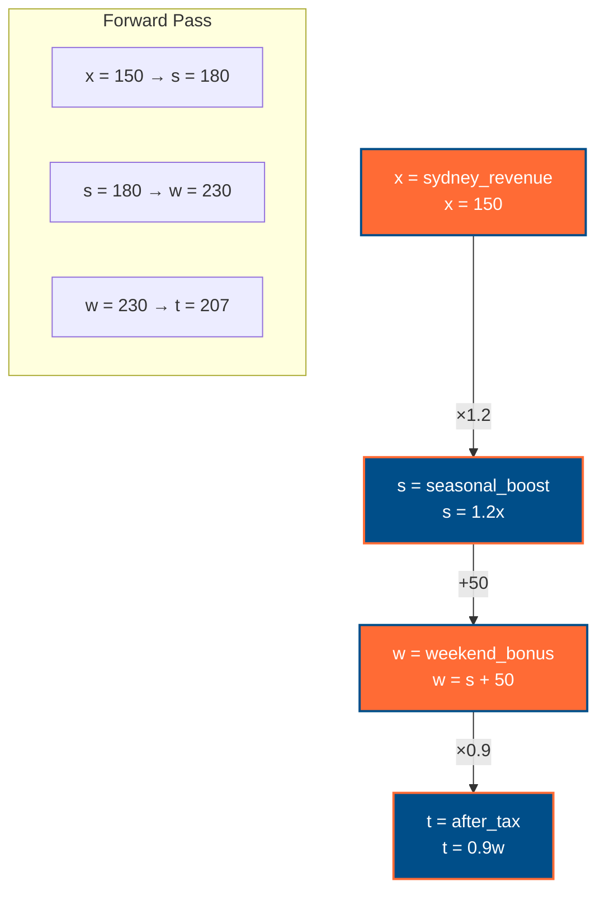
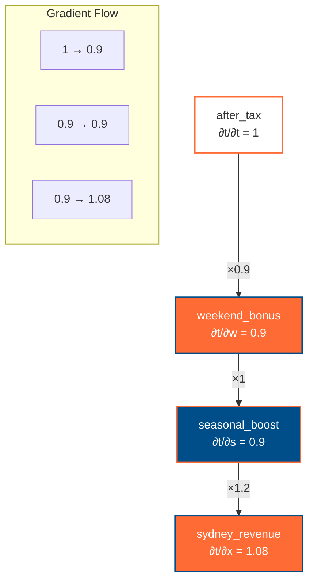

# Mathematical Explanation of PyTorch Autograd: Sydney Tourism Revenue Analysis

This document provides a detailed mathematical explanation of how PyTorch's automatic differentiation (autograd) works using the Sydney tourism revenue example from the autograd tutorial.

## Overview

PyTorch autograd computes gradients automatically using the **chain rule** of calculus. We'll demonstrate this with a real-world Australian tourism revenue calculation that involves multiple sequential transformations.

## The Sydney Tourism Revenue Problem

Let's define our problem mathematically. We start with a base revenue from Sydney tourism and apply three sequential transformations:

1. **Seasonal Boost**: Apply a 20% summer increase
2. **Weekend Bonus**: Add a fixed $50k weekend bonus  
3. **After Tax**: Apply a 10% tax reduction

## Mathematical Function Definitions

Let $x$ represent the initial Sydney revenue. We define our transformation functions as follows:

### Function 1: Seasonal Boost
$$s(x) = 1.2x$$

Where:
- $x$ = `sydney_revenue` (base tourism revenue in thousands AUD)
- $s(x)$ = `seasonal_boost` (revenue after 20% summer increase)
- The coefficient $1.2$ represents a 20% increase ($1 + 0.2 = 1.2$)

### Function 2: Weekend Bonus  
$$w(s) = s + 50$$

Where:
- $s$ = `seasonal_boost` (output from previous function)
- $w(s)$ = `weekend_bonus` (revenue after adding weekend premium)
- The constant $50$ represents $50k AUD additional weekend revenue

### Function 3: After Tax
$$t(w) = 0.9w$$

Where:
- $w$ = `weekend_bonus` (output from previous function)  
- $t(w)$ = `after_tax` (final revenue after tax deduction)
- The coefficient $0.9$ represents a 10% tax ($1 - 0.1 = 0.9$)

## Composite Function

The complete transformation can be expressed as a composite function:

$$f(x) = t(w(s(x))) = 0.9(s(x) + 50) = 0.9(1.2x + 50)$$

Expanding this:

$$f(x) = 0.9 \cdot 1.2x + 0.9 \cdot 50 = 1.08x + 45$$

## PyTorch Computation Graph



## Revenue Calculation

Given the initial Sydney revenue $x = 150$ (thousand AUD), let's calculate each step:

### Step 1: Seasonal Boost
$$s(150) = 1.2 \times 150 = 180 \text{ thousand AUD}$$

### Step 2: Weekend Bonus
$$w(180) = 180 + 50 = 230 \text{ thousand AUD}$$

### Step 3: After Tax
$$t(230) = 0.9 \times 230 = 207 \text{ thousand AUD}$$

### Final Result
The final tourism revenue after all transformations: **$207k AUD**

## Gradient Calculation Using Chain Rule

To find how sensitive the final revenue is to changes in the base revenue, we need to compute:

$$\frac{\partial t}{\partial x} = \frac{\partial}{\partial x}[t(w(s(x)))]$$

Using the **chain rule**:

$$\frac{\partial t}{\partial x} = \frac{\partial t}{\partial w} \cdot \frac{\partial w}{\partial s} \cdot \frac{\partial s}{\partial x}$$

### Individual Partial Derivatives

#### 1. Derivative of After Tax with respect to Weekend Bonus
$$\frac{\partial t}{\partial w} = \frac{\partial}{\partial w}(0.9w) = 0.9$$

#### 2. Derivative of Weekend Bonus with respect to Seasonal Boost  
$$\frac{\partial w}{\partial s} = \frac{\partial}{\partial s}(s + 50) = 1$$

#### 3. Derivative of Seasonal Boost with respect to Base Revenue
$$\frac{\partial s}{\partial x} = \frac{\partial}{\partial x}(1.2x) = 1.2$$

### Final Gradient Calculation

$$\frac{\partial t}{\partial x} = 0.9 \times 1 \times 1.2 = 1.08$$

## Interpretation of the Gradient

The gradient $\frac{\partial t}{\partial x} = 1.08$ tells us:

> **For every $1k AUD increase in base Sydney tourism revenue, the final after-tax revenue increases by $1.08k AUD.**

This makes economic sense:
- The seasonal boost amplifies the increase by 20% (×1.2)
- The weekend bonus is a fixed amount, so doesn't affect the rate of change
- The tax reduces the effective increase by 10% (×0.9)
- Net effect: $1.2 \times 0.9 = 1.08$

## PyTorch Autograd Implementation

Here's how PyTorch automatically computes this gradient:

```python
import torch

# Create tensor with gradient tracking
sydney_revenue = torch.tensor([150.0], requires_grad=True)

# Build computation graph (forward pass)
seasonal_boost = sydney_revenue * 1.2  # s(x) = 1.2x
weekend_bonus = seasonal_boost + 50.0  # w(s) = s + 50  
after_tax = weekend_bonus * 0.9       # t(w) = 0.9w

# Compute gradients (backward pass)
after_tax.backward()

# PyTorch automatically computed: ∂t/∂x = 1.08
gradient = sydney_revenue.grad.item()
print(f"Gradient: {gradient}")  # Output: 1.08
```

## Backward Pass Visualization



## Comparison with Manual Calculation

Let's verify our gradient calculation by manually computing the derivative of the composite function:

$$f(x) = 1.08x + 45$$

$$\frac{df}{dx} = 1.08$$

✅ **Perfect match!** PyTorch's autograd computed the exact same gradient as our manual calculus.

## Why This Matters for Machine Learning

In neural networks:
- $x$ represents model parameters (weights, biases)
- $f(x)$ represents the loss function  
- $\frac{\partial f}{\partial x}$ tells us how to adjust parameters to minimize loss

The same chain rule principle applies to complex neural networks with millions of parameters, making PyTorch autograd incredibly powerful for deep learning.

## Key Takeaways

1. **Chain Rule Automation**: PyTorch automatically applies the chain rule to compute gradients through any sequence of differentiable operations.

2. **Computational Efficiency**: Instead of computing symbolic derivatives, PyTorch builds a computational graph and uses reverse-mode automatic differentiation.

3. **Dynamic Graphs**: The computation graph is built dynamically during the forward pass, making it flexible for varying model architectures.

4. **Memory Efficiency**: PyTorch only stores intermediate values necessary for gradient computation.

## Australian Tourism Context Application

This revenue model could be extended for real Australian tourism scenarios:

- **Multi-city Analysis**: Apply similar transformations to Melbourne, Brisbane, Perth revenues
- **Seasonal Variations**: Different boost factors for summer/winter seasons
- **Currency Exchange**: Add AUD/USD conversion rates as additional transformations
- **Economic Factors**: Include inflation, interest rates as multiplicative factors

Each additional transformation would add another link in the chain rule, but PyTorch autograd would handle the complexity automatically.

---

*This mathematical explanation demonstrates how PyTorch's autograd system uses fundamental calculus principles to enable efficient gradient-based optimization in machine learning models.*
