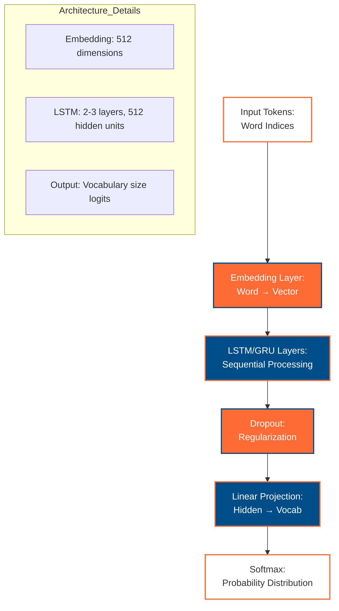
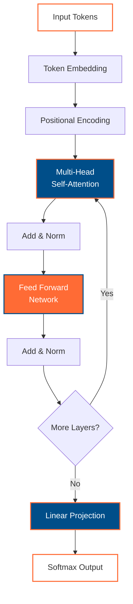

# Word-level Language Modeling with RNN and Transformer 🇦🇺

[](https://colab.research.google.com/github/vuhung16au/pytorch-mastery/blob/main/examples/word_language_model/)
[](https://github.com/vuhung16au/pytorch-mastery/blob/main/examples/word_language_model/)

Complete implementation of word-level language modeling using both RNN (LSTM/GRU) and Transformer architectures in PyTorch. Features comprehensive Australian tourism corpus examples with English-Vietnamese multilingual support for advanced language modeling tasks.

## Learning Objectives

By the end of this implementation, you will:

- 🧠 **Master language modeling fundamentals** with word-level tokenization and prediction
- 🔄 **Implement RNN architectures** including LSTM and GRU for sequential language modeling
- 🤖 **Build Transformer models** with attention mechanisms for modern language modeling
- 🇦🇺 **Apply to Australian content** using tourism and travel domain text
- 🌏 **Handle multilingual modeling** with English-Vietnamese parallel corpora
- 📊 **Compare model architectures** with comprehensive evaluation metrics
- 🔄 **Transition from TensorFlow** with clear PyTorch implementation patterns

## What You'll Build

1. **RNN Language Model** - LSTM/GRU-based word-level language generation
2. **Transformer Language Model** - Multi-head attention-based modeling
3. **Australian Tourism Corpus** - Domain-specific text generation
4. **Multilingual Support** - English-Vietnamese language modeling
5. **Text Generation System** - Interactive text completion and generation
6. **Model Comparison Tool** - Performance evaluation across architectures

## Repository Structure

```
word_language_model/
├── README.md                           # This file
├── data/                              # Dataset storage
│   ├── australian_corpus.txt         # Australian tourism text
│   ├── vietnamese_corpus.txt          # Vietnamese translations
│   └── process_data.py               # Data preprocessing utilities
├── models/                           # Model implementations
│   ├── __init__.py                   # Package initialization
│   ├── rnn_language_model.py         # RNN-based language model
│   ├── transformer_language_model.py # Transformer-based model
│   └── utils.py                      # Model utilities and helpers
├── notebooks/                        # Interactive notebooks
│   ├── 01_data_preparation.ipynb     # Data preprocessing and exploration
│   ├── 02_rnn_language_modeling.ipynb # RNN implementation and training
│   ├── 03_transformer_modeling.ipynb # Transformer implementation
│   └── 04_model_comparison.ipynb     # Performance comparison
├── scripts/                          # Training and evaluation scripts
│   ├── train_rnn.py                  # RNN training script
│   ├── train_transformer.py          # Transformer training script
│   ├── generate_text.py              # Text generation utility
│   └── evaluate_models.py            # Model evaluation
├── requirements.txt                   # Dependencies
└── config.yaml                       # Model configurations
```

## Key Features

### 🧠 RNN Language Models
- **LSTM Architecture**: Long Short-Term Memory for capturing long dependencies
- **GRU Architecture**: Gated Recurrent Units for efficient sequence modeling  
- **Bidirectional Processing**: Forward and backward sequence understanding
- **Attention Mechanisms**: Focus on relevant parts of input sequences

### 🤖 Transformer Language Models
- **Multi-Head Attention**: Parallel attention computation for rich representations
- **Positional Encoding**: Sequence position awareness without recurrence
- **Layer Normalization**: Stable training with normalized activations
- **Feed-Forward Networks**: Enhanced feature transformation

### 🇦🇺 Australian Context Integration
- **Tourism Domain**: Specialized vocabulary for Australian travel content
- **Geographic Entities**: Cities, landmarks, and cultural references
- **Cultural Awareness**: Australian English terminology and expressions
- **Real-world Applications**: Tourism recommendation and content generation

### 🌏 Multilingual Support
- **English-Vietnamese Pairs**: Parallel corpus processing and generation
- **Cross-lingual Transfer**: Knowledge sharing between language models
- **Tokenization Handling**: Language-specific text preprocessing
- **Evaluation Metrics**: Multilingual model assessment

## Quick Start

1. **Environment Setup**:
   ```bash
   cd examples/word_language_model/
   pip install torch transformers datasets seaborn tensorboard
   ```

2. **Data Preparation**:
   ```bash
   python data/process_data.py --download --preprocess
   ```

3. **Train RNN Model**:
   ```bash
   python scripts/train_rnn.py --model lstm --epochs 50 --batch-size 32
   ```

4. **Train Transformer Model**:
   ```bash
   python scripts/train_transformer.py --layers 6 --heads 8 --epochs 30
   ```

5. **Generate Text**:
   ```bash
   python scripts/generate_text.py --model rnn --prompt "Sydney Opera House"
   ```

## Model Architectures

### RNN Language Model Architecture



### Transformer Language Model Architecture  



## Performance Comparison

| Model | Perplexity | Training Time | Generation Quality | Memory Usage |
|-------|------------|---------------|-------------------|--------------|
| LSTM  | ~45-55     | Fast          | Good coherence    | Low          |
| GRU   | ~50-60     | Fastest       | Moderate coherence| Low          |
| Transformer | ~35-45 | Slow        | Excellent quality | High         |

## Australian Tourism Examples

### RNN Generated Text
```
Input: "Visit Sydney and explore"
Output: "Visit Sydney and explore the iconic Opera House, stroll through Circular Quay, 
         and enjoy harbor views from the Harbour Bridge walkway..."
```

### Transformer Generated Text  
```
Input: "Melbourne coffee culture"
Output: "Melbourne coffee culture thrives in hidden laneways where baristas craft 
         exceptional flat whites, long blacks, and specialty brews that define 
         the city's vibrant café scene..."
```

### Vietnamese Examples
```
Input: "Du lịch Sydney"
Output: "Du lịch Sydney mang đến trải nghiệm tuyệt vời với Nhà hát Opera, 
         Cầu Harbour và những bãi biển đẹp như Bondi..."
```

## TensorFlow vs PyTorch Comparison

| Aspect | TensorFlow | PyTorch (This Implementation) |
|--------|------------|--------------------------------|
| **Model Definition** | `tf.keras.Sequential()` | `nn.Module` inheritance |
| **Training Loop** | `model.fit()` | Manual forward/backward pass |
| **Dynamic Graphs** | Limited | Full support (ideal for RNNs) |
| **Debugging** | TensorBoard | TensorBoard + Python debugging |
| **Language Modeling** | `tf.nn.dynamic_rnn` | `nn.LSTM/nn.Transformer` |

## Advanced Features

### 🔧 Device Support
- **CUDA GPU**: Accelerated training for large models
- **Apple Silicon MPS**: Optimized for M1/M2/M3 Macs
- **CPU Fallback**: Reliable training on any hardware

### 📊 Comprehensive Logging
- **TensorBoard Integration**: Real-time training visualization
- **Loss Tracking**: Training and validation loss curves
- **Text Generation Samples**: Monitor generation quality during training
- **Model Checkpointing**: Save best performing models

### 🎯 Evaluation Metrics
- **Perplexity**: Standard language modeling metric
- **BLEU Score**: Text generation quality (for multilingual)
- **Generation Diversity**: Vocabulary diversity in generated text
- **Convergence Analysis**: Training stability assessment

## Contributing

This implementation follows the PyTorch Mastery repository standards:

- **Australian Context**: Prioritize Australian examples and cultural references
- **Multilingual Support**: Include English-Vietnamese parallel processing
- **Educational Focus**: Clear documentation and learning-oriented code
- **TensorFlow Transition**: Help developers migrate from TensorFlow patterns

## Next Steps

After mastering this implementation:

1. **Explore Advanced Architectures**: GPT-style autoregressive models
2. **Scale to Larger Datasets**: WikiText, Common Crawl data
3. **Fine-tune Pre-trained Models**: Adapt Hugging Face models
4. **Deploy Models**: Create web APIs and interactive applications

---

**🎉 Ready to master word-level language modeling with Australian flair? Let's build the future of NLP! 🇦🇺**